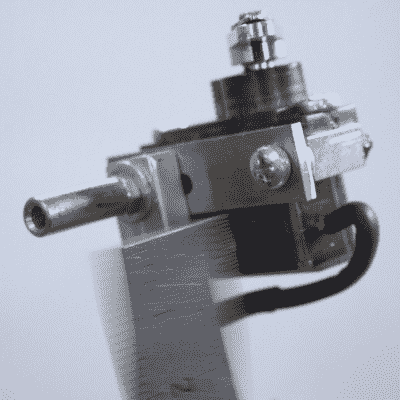

# 独特的乐器在尺子上拉出音符

> 原文：<https://hackaday.com/2020/08/10/unique-instrument-plucks-out-notes-on-a-ruler/>

一个人如何描述尺子一端被固定，然后被拨动的音符？我们能想到的最好的词是“wubulation”。那么，这是否会使[这个拨片合成器](https://vtol.cc/filter/works/RBS-20-cm)成为一个“wubulator”？或者一个“wubatron”？

 无论我们决定叫它什么，【 Dmitry Morozov 】将其命名为 RBS-20，或“20 厘米尺子低音合成器”，这是一把 20 厘米的不锈钢尺子，构成了乐器的心脏。尺子附在一个线性滑轨上，该滑轨可以改变簧上部分的长度。一对伺服系统可以在两个不同的地方拨动尺子的自由部分，在不同的音域提供音符，而另一对伺服系统控制金属手指，可以抑制振动，改变延音，并改变音符。没有共鸣器。声音被压电麦克风拾取。乐器底部的 12 个键可以被编程为不同的长度，有机发光二极管显示器给音乐家反馈。下面的视频展示了乌布拉廷乐器，将我们带回了小学时代的桌面即兴演奏——至少在尺子被没收之前是这样。

我们之前已经介绍过大量类似的独特乐器，比如这个[混合合成器-小提琴](https://hackaday.com/2017/02/13/its-a-synthesizer-its-a-violin-its-a-modulin/)、[汽水瓶交响乐](https://hackaday.com/2020/04/23/pouring-creativity-into-musical-upcycling-of-plastic-bottles/)，还有令人费解的[一把腿吉他](https://hackaday.com/2020/05/23/rocking-out-on-a-limb-with-le-strum/)。

[https://player.vimeo.com/video/443862849](https://player.vimeo.com/video/443862849)