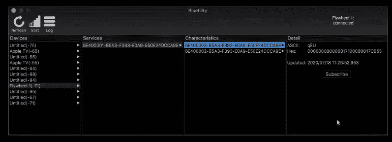

# 一辆价值 2000 美元的健身自行车，配有树莓派 Zero 和蓝牙技术

> 原文：<https://hackaday.com/2020/08/04/unbricking-a-2000-exercise-bike-with-a-raspberry-pi-zero-and-bluetooth-hacks/>

真的，我们怎么会知道健身车可以用砖砌成呢？Peloton 收购 Flywheel Home Sports 后，他们价值 2000 美元的自行车失去了参与虚拟骑行的基本功能，这就是[ptx2]面临的困境。解决办法？[逆向工程自行车，让它与另一个在线自行车模拟器](https://ptx2.net/posts/unbricking-a-bike-with-a-raspberry-pi/)一起工作。

Sniffing Flywheel Bluetotooth packets with [Bluetility](https://github.com/jnross/Bluetility)

我们必须承认，我们没有意识到虚拟自行车市场提供的一系列选择。[ptx2]与 [Zwift](https://zwift.com/) 一起使用，Zwift 像大多数这些平台一样，让你与数百名其他虚拟骑手的化身一起驾驶智能自行车穿过虚拟景观。使用[bluetity](https://github.com/jnross/Bluetility)进行一点蓝牙窥探，让【ptx2】识别飞轮自行车数据包中的字节，这些字节编码了骑手的节奏和施加的功率，这是 Zwift 需要的，以及磁制动器的当前电阻设置。

集成到 Zwift 是一个模仿已经被程序支持的智能自行车的问题。这需要对自行车动力服务进行一些黑客攻击，这是一种蓝牙服务，Zwift 使用它来与自行车对话。最终配置在飞轮自行车和 Zwift 应用程序之间有一个 Raspberry Pi Zero W，并记录了大约 2000 英里的日常使用。它仍然需要一个马达来控制沿着虚拟山丘和山谷的阻力，但这是另一天的工作。

向[ptx2]致敬，他以 Pi 的价格和一些高质量的黑客时间挽救了一辆 2000 美元的自行车，并对这个人有点坚持。我们不得不说，我们在这里看到的大多数自行车黑客都是为了让骑车人少做点工作，而不是多做点。这个项目是一个令人耳目一新的变化。

【特色图片: [Zwift](https://zwift.com/) 、[飞轮运动](https://www.flywheelsports.com/)

[通过 [r/gadgets](https://www.reddit.com/r/gadgets/comments/i2glh7/unbricking_a_2000_bike_with_a_10_raspberry_pi/)