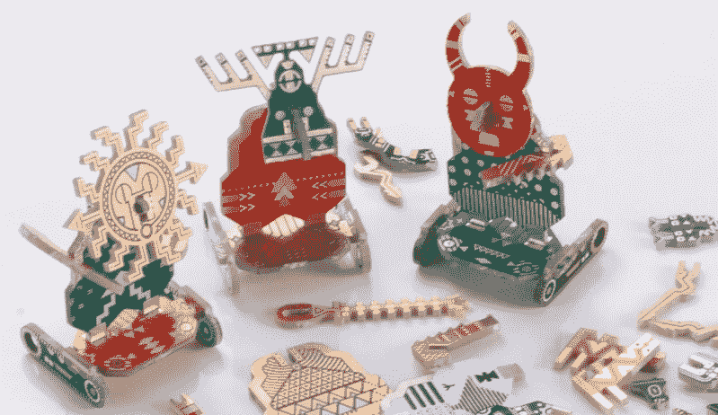
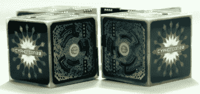
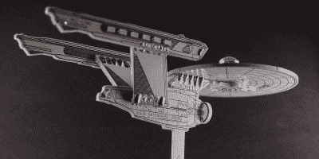

# 由印刷电路板制成的模块化振动机器人

> 原文：<https://hackaday.com/2020/08/10/modular-vibrating-bots-made-from-pcbs/>

印刷电路板是一种介质，主要用于安装电子元件，导线本身作为铜迹线放置在电路板上。为了适应几十年来出现的各种需求，板房在布线和电镀方面发展了各种先进技术。对我们有利的是，这也使得利用高度优化的制造工艺，以完全艺术的方式利用 PCB 成为可能。[GeeekClub]就是这么做的，[用定制的印刷电路板创造出令人敬畏的振动机器人](https://www.reddit.com/r/EngineeringPorn/comments/i43t5o/made_my_pcb_in_a_way_that_you_can_assemble_and/)。

“机器人”是一个单一的 PCB，零件被折断，类似于从塑料模型套件的浇口中取出零件。然后可以将它们组装起来，安装一对寻呼机振动马达来提供动力。但是真正使这些令人难以置信的是这些板的美感，而不是功能。

该设计在每个机器人的底部安置了一个硬币电池，提供动力并利用重量帮助它们保持直立。船上有少量的发光二极管，机器人的艺术风格受到了霍皮印第安人、亚洲人和南美人的影响。

[Cyphercon 2017](https://hackaday.com/2017/04/09/the-cubic-cyphercon-badge/) featured these exciting cubic badges, created from PCBs and soldered by hand.

[This Star Trek inspired piece](https://hackaday.com/2019/10/19/beam-me-up-to-the-pcb-space-ship/) shows just how far you can go with the right color soldermask and some creativity.

这种“扁平封装”风格的 PCB 设计通过创造性地使用角度和层而变得栩栩如生，正在成为艺术的一个分支。[另一个很好的例子是受《星际迷航》企业启发而构建的](https://hackaday.com/2019/10/19/beam-me-up-to-the-pcb-space-ship/)。我们也看到了使用 PCB 作为外壳的增长趋势，以 2017 年的 [Cyphercon badge](https://hackaday.com/2017/04/09/the-cubic-cyphercon-badge/) 和 [Queercon badge](https://hackaday.com/2017/08/07/inside-this-years-queercon-badge/) 项目为例。从[Voja Antonic 的]深度指南中了解使用 FR4 作为外壳的[设计技术。](https://hackaday.com/2015/06/03/how-to-build-beautiful-enclosures-from-fr4-aka-pcbs/)