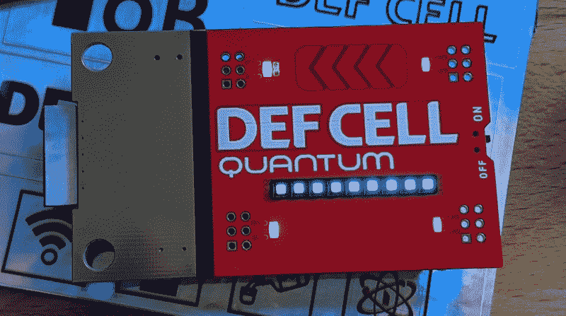
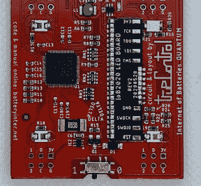
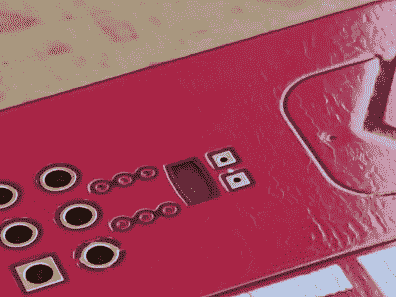
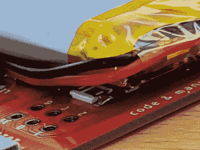
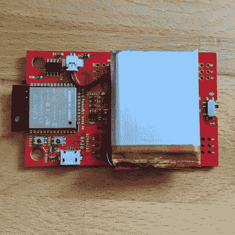
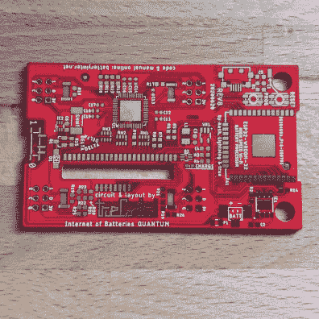
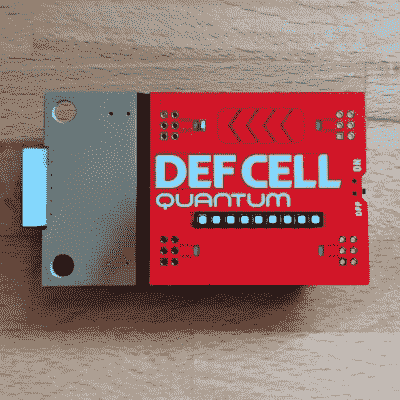

# 实践:电池互联网量子徽章为 Badgelife 插件带来他们渴望的电力和互联网

> 原文：<https://hackaday.com/2020/08/09/hands-on-internet-of-batteries-quantum-badge-brings-badgelife-add-ons-the-power-and-internet-they-crave/>

我们在威士忌海盗队的朋友发给我他们今年制作的非官方 DEF CON 徽章。电池量子网络为 DC28 所有重要的附加徽章提供电力和连接。徽章的正面绝对是华丽的，我真的不想焊接在我的附加头上，破坏这种美感。

镀金铜与占据正面大部分的红色阻焊膜形成统一的反光对比。在这里，我们可以看到[TrueControl]在他的徽章中包含了对细节的极大关注。分隔两种颜色的白色丝网条纹被一些看起来比白色好得多的黑色细节胶带覆盖。

ESP32 模块的天线从徽章金色封面末端的下侧伸出，获得自己的矩形全息贴纸材料，与包装盒中包含的贴纸相同。这两个贴花都是小细节，但对你的眼睛来说却有很大的不同。

九个 RGB 发光二极管的线条具有黑色挡板，与黑色条纹图案相呼应，突出了徽章名称的印刷字体。这些灯安装在焊接在徽章底部的子板上，有一个插槽供 led 穿过。它们在 2×15 矩阵中寻址，由驱动徽章的 PSoC5 在低端扫描。这张低分辨率图像显示的是放置锂电池前的子板。

用户控制由多个电容触摸板提供，一个在单词 DEF 下面，另一个在单词 CELL 下面，最后一排五个人字形触摸板就在这些单词上面。徽章的作用是为附加设备供电，因此通过微型 USB 端口进行充电是有意义的。

    

值得一提的一个商标设计选择是对四个白色 led 的处理，每个 SAO(“劣质附加”)足迹旁边一个。起初我以为这些使用了电路板上的剪切块，就像 RGB 条一样，但事实并非如此。相反，铜被保留在该区域之外，以暴露 FR4 基板。一个普通的表面贴装 LED 是用手工焊接的，将 PCB 设计中的这一禁止区域作为漫射体，使其朝向电路板发光。这是[TrueControl]在去年的 Space Force 徽章上使用的一个技巧，虽然我个人觉得很难掌握焊接它们的技巧，但这比采购合适的底部安装的 led 更具成本效益。

    

与许多 badgelife 产品一样，这仍然是一项正在进行的工作。徽章附带的固件仍处于“Hello World”阶段。开发仍在进行中，但在该项目的 GitHub 页面上有许多大胆的功能声明。计划中的无线功能包括一个“专属街机”，可以通过 ESP32 提供的 WiFi 接入点登录。这使得显示四个 SAO 端口上的电力使用分析成为可能，甚至还有计划建立一个网状网络，该网络集成了聊天室和私人消息等社交互动功能。用电池吗？！

 说起那些骚港口，男女头都有提供。这个想法是 DEF 电池不仅可以用来给一个附加设备供电，也可以给一个徽章供电。当配备了~~母~~遮蔽引脚接头时，它实际上成为了另一个徽章的附件，重要的区别是，这个附件有一个锂电池，将通过 SAO 端口为主机徽章“反向供电”。[规格](https://hackaday.com/2019/03/20/introducing-the-shitty-add-on-v1-69bis-standard/)里有吗？不，这就是为什么这个标准被称为“低劣”，使用这些端口连接不同制造商的设备存在固有的风险。但它可能没有问题，这真的取决于主机徽章。

通过 ESP32 提供蓝牙和 WiFi，并且 I2C pin 作为每个 SAO 足迹的一部分，应该可以使用 DEF CELL 根据来自互联网或徽章无线范围内的设备的触发在附加板上显示有意义的变化。这是一个面向未来的技术，也是我们希望在明年的 DEF CON 上看到的东西。