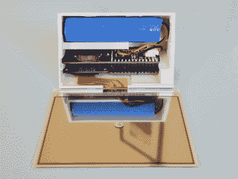

# E-Ink 月相观测器保持兴趣不减

> 原文：<https://hackaday.com/2020/08/16/e-ink-moon-phase-viewer-keeps-interest-from-waning/>

夜空中发生这么多很酷的事情，我们却因为云层或者光污染而看不到，真是太可惜了。如果你错过了 NEOWISE 彗星或今年夏天的英仙座流星雨，除了看看其他人的照片，也没什么可做的。但是如果你一直错过的是月亮和它的相位，这些信息可以很容易地获得和可视化。

 这个项目包括一系列【雅各布·塔尔】的第一次，比如设计一个定制的印刷电路板，利用三色电子墨水屏幕[显示当前月相的月亮以及日期和时间](https://hackaday.io/project/174149-moon-phase-display)。

[Jacob]的月相观察器运行在一个 ItsyBitsy M4 快车上，它保存了美国宇航局提前获取的数据以节省电池。每天早上，公告板根据实时时钟模块保存的时间表发布每日信息。

我们特别喜欢极简的外壳设计，尤其是放锂离子电池的小架子。这只是一个开始，Jacob 计划为任何想要拥有它的人添加更多细节。

如果你想要更像月亮的东西，[这里有一个印刷版本，随着时间的推移，它会变得更亮。或者你可以把](https://hackaday.com/2016/11/19/3d-printed-moon-phase-clock/)[变成一个巨大的发光满月](https://hackaday.com/2019/03/29/caleb-kraft-brings-us-the-moon-on-a-budget/)，就像哈卡代超级校友【凯勒·卡夫】一样。