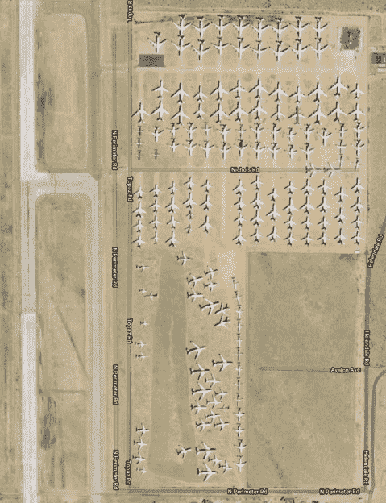
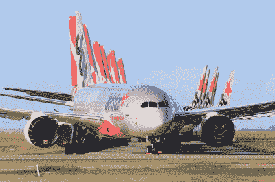
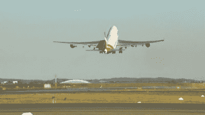

# 航空公司寻求因新冠肺炎停飞机队的存储

> 原文：<https://hackaday.com/2020/08/19/airlines-seek-storage-for-grounded-fleets-due-to-covid-19/>

问任何一位航空公司高管，他们在 2020 年 1 月的计划是什么，你可能会得到预期的关于增加市场份额和提高股东回报的长篇大论。当然，coronovirus 疫情在短短几个月内迅速改变了这一切。边境关闭，全球航空旅行停止。

突然间，世界上的航空公司有了成千上万架飞机，而且几乎无处可去。显然，把飞机放在露天不会对它们有任何好处。那么封存一架现代客机到底涉及到什么呢？

## 位置，位置，位置

 

停靠在维克多维尔附近南加州物流机场的飞机【via [谷歌地图卫星视图](https://goo.gl/maps/is8J8T2iCxR7cuja8)

停放现代客机首先需要的是空间。机场存放飞机的空间有限，因为它们主要是为不断进出的航班设计的，而不是长期停留。取而代之的是，专门的设施被用来存放从航线上休假的航班。最受欢迎的地方是凉爽干燥的气候，那里的环境条件对飞机的材料和系统影响最小。高湿度会加速零件的腐蚀，也有助于飞机内部和燃油箱中真菌和微生物的生长。高温还会导致橡胶部件更快损坏，如果管理不当，紫外线会损坏内部。

[美国的热门地点包括加利福尼亚州的维克托维尔和亚利桑那州的设施](https://www.airplaneboneyards.com/grounded-airliners-in-storage-due-to-covid19-2020.htm)，这些地方条件优越。类似的设施在海外也有，欧洲的航空公司将目光投向西班牙，澳大利亚的航空公司将一些飞机存放在气候干燥的爱丽斯泉。通常，如果凉的和干的不在桌子上，热的和干的是一个好的第二选择。与位置同样重要的是有熟练的维护人员来执行工作。[许多航空公司更愿意将飞机存放在他们可以依靠自己的工程人员来照看他们宝贵资产的地方。](https://www.executivetraveller.com/news/qantas-to-send-most-of-its-boeing-787-to-the-desert-for-storage)

## 停车与存储

当一家航空公司决定一架飞机暂时不飞商业航线时，必须决定这架飞机退役多久。具体做法各不相同，但大多数都区分了主动停车和长期存储。

Covering engines is key to minimising corrosion and damage from pests. Photo credit: [Nicholas Kimura](https://www.jetphotos.com/photo/9748219)

[主动停放是指飞机被保持在准备飞行或几乎准备飞行的状态](https://www.flightradar24.com/blog/a-covid-19-logistical-puzzle-how-airlines-safely-store-their-aircraft/)。这些飞机最典型地存放在相对靠近其典型操作路线的机场或设施中。处于主动停机状态的飞机在需要时，将在 24-48 小时内准备好重新加入航线。在这种状态下，像起落架这样的部件将被特别润滑，发动机罩将被安装以防止昆虫和鸟类以及腐蚀。其他孔，如皮托管孔和通风孔，也将被类似地密封。飞机也将每隔几周稍微移动一下，以避免轮胎出现平点。发动机、液压系统和电子设备将每隔几周定期通电，以确保飞机保持功能状态。这避免了负面影响，如电容器因缺乏使用而失效或轴承因长时间放置而出现平点。飞机也将定期进行短途飞行，以确保适航性。

[长期储存是为那些在被再次调用前几个月不工作的飞机准备的](https://thepointsguy.com/news/how-planes-are-put-in-storage/)。在当前的环境下，这对大容量宽体飞机尤其重要，因为在可预见的未来，需求较低将导致较小的双引擎喷气式飞机服务于大多数航线。在这种情况下，需要做更多的工作来准备飞机的存放。发动机可能会被“酸洗”,用特殊的防腐剂代替正常的润滑剂，以尽量减少时间的影响。对于长期储存，可将发动机完全拆除并运回制造商处。

更多的努力可能放在更劳动密集型的保存方法上，旨在减少维护飞机存储所需的持续努力。避免了常规的发动机启动、起落架检查和液压测试，代价是飞机需要经历更长的过程才能在存储结束时重新加入航线。在某些情况下，像空中客车这样的公司要求任何储存的飞机必须在两年后，在进一步储存之前，恢复到飞行就绪状态。有了这些限制，许多航空公司将选择退役或回收飞机，而不是继续支付高昂的储存费用。许多大型飞机，如 747，正因为这个原因面临着提前退役。

## 在好转之前会变得更糟

A Qantas 747 sets off on its final flight to Mohave, California. The type’s retirement was brought forward as a result of the 2020 pandemic.

随着疫情的肆虐和看不到尽头，航空旅行似乎将在未来几年保持低迷。目前的估计预计该行业最早将在 2024 年回到疫情之前的水平。这导致了流动问题，现有飞机不再是唯一的问题。波音公司在错误的时间达到了 787 梦想飞机创纪录的产量水平，[,现在陷入了未交付飞机过剩的困境。](https://apps.theedgemarkets.com/article/boeing-faces-financial-drag-dozens-undelivered-787-jets)这是该公司已经面临的问题的延续，[试图为停飞的 737 MAX 飞机找到足够的停车位。](https://www.forbes.com/sites/jeremybogaisky/2019/07/25/see-the-boeing-737-max-pile-up-in-storage-in-these-time-lapse-satellite-images/#7b8c1cf427f2)

令人欣慰的是，以清单为中心的高度努力的航空航天工业准备了适当的程序来处理这种情况。真正的障碍仅仅是在空间和时间上克服这个问题的严重程度。在未来几年，随着航空公司转向新交付的飞机，取代在沙漠中飞行时间稍长的老式飞机，预计将会看到机队的巨大更替。

为昔日伟大的飞行巨人倒一杯，也许请你当地的墓地大亨在飞行员酒吧里喊下一轮。