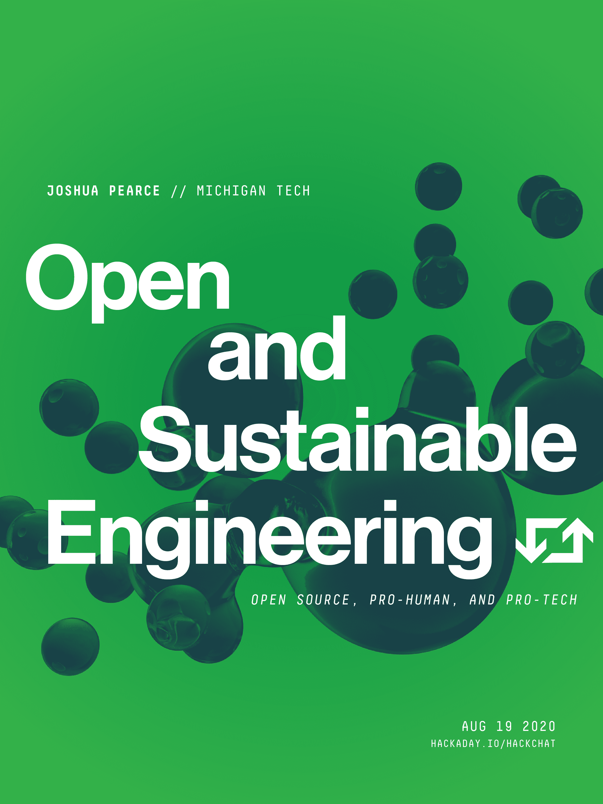

# 开放和可持续的工程黑客聊天

> 原文：<https://hackaday.com/2020/08/17/open-and-sustainable-engineering-hack-chat/>

加入我们太平洋时间 8 月 19 日星期三中午与[约书亚·皮尔斯](https://hackaday.io/MOST)的[开放和可持续工程黑客聊天](https://hackaday.io/event/173637-open-and-sustainable-engineering-hack-chat)！

自从我们的第一个人类祖先学会捡起一块石头并把它做成一件工具，我们人类就一直在用我们的工程技能来改变世界。自第一次技术飞跃以来的 200 万年左右的大部分时间里，石头和木材等自然材料是我们工程项目的重点，除了少数诱人的残余物，大多数被建造的东西都回到了它来的地方。

然后我们发现了其他材料；我们学会了从岩石中提炼金属，以及如何采集古代植物的碳氢化合物化石。铁、铝、塑料和硅成了我们的贸易储备，这个星球现在被这些材料和获取它们的副产品覆盖得如此之厚，以至于一个新的地质时期，即人类世，已经被提出来涵盖这一时期的人类活动及其对地质记录的影响。

但是，如果我们人类足够聪明，能够产生这样的影响，我们就应该足够聪明，能够想出摆脱困境的办法，也应该足够聪明，能够看到这种需要。这就是皮尔斯博士在密歇根理工大学开放可持续发展技术(MOST)实验室的研究重点。皮尔斯博士设想了一个可持续的未来，由普及的太阳能光伏系统提供动力，并使用 3D 打印等开源技术来驱动新的制造模式。我们最近看到了他实验室的有趣工作，比如这个研磨机为塑料回收制造定制的压缩螺钉。Hackaday.io 上的 [MOST 页面充满了支持他们使命的技术的其他伟大例子，从](https://hackaday.io/MOST)[低成本环境测试仪器](https://hackaday.io/project/27047-open-source-mobile-water-quality-testing-platform)到 [3D 打印微流体](https://hackaday.io/project/26998-wax-reprap-3-d-printer-for-microfluidics)。

皮尔斯博士将加入我们的黑客聊天，谈论开放和可持续工程。一定要带着你的问题停下来，看看你能做些什么来创造一个更光明的未来，就从你自己的店开始。

 我们的黑客聊天是 [Hackaday.io 黑客聊天群发消息](https://hackaday.io/messages/room/2369)中的社区直播活动。本周，我们将于太平洋时间 8 月 19 日星期三中午 12:00 坐下来讨论。如果时区让你和我们一样困惑，我们有[一个方便的时区转换器](https://www.timeanddate.com/countdown/generic?iso=20200819T12&p0=224&msg=Open+Sustainable+Engineering+Hack+Chat&font=cursive)。

点击右边的那个发言气泡，你会被直接带到 Hackaday.io 上的黑客聊天群，不用等到周三；随时加入，你可以看到社区在谈论什么。

