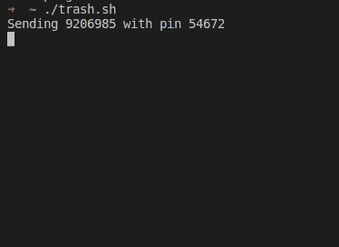

# 给一个人一个费西合唱团，你可以娱乐他一天

> 原文：<https://hackaday.com/2020/08/16/give-a-man-a-phish-and-you-entertain-him-for-a-day/>

每天都有数百万次网络钓鱼尝试，我们可能都遇到过。对于训练有素或天生多疑的眼睛来说，通常很容易发现它们——也许一路上会被那些可笑的坏眼睛逗得咯咯直笑——然后干脆忽略它们。不幸的是，如果他们在大背景下不够成功，他们就不会存在，所以通知目标服务有关尝试可能是一个好主意，希望他们会通知用户谨慎行事。然后是[Christian Haschek]，他决定[找点乐子，并试图通过简单地用垃圾淹没钓鱼数据来使其变得无用。](https://blog.haschek.at/2020/stopping-phishing-campaigns-with-bash.html)

 在他的妻子收到一条来自“他们银行”的短信后，【克里斯蒂安】仔细查看了它所指向的网址，并在一个略有拼写错误的地址找到了你的真实登录表单的典型副本。由于通常的目标是窃取受害者的凭据，他只需编写一个 shell 脚本，通过 cURL 永久发送随机生成的帐号和 pin，从而潜在地降低攻击者从他们的尝试中可能获得的任何价值。

由于表单字段限制帐号和 PIN 的输入长度，他最终想知道服务器端是否也会这样做，或者如果向它发送更长的数据，它是否会崩溃。可悲的是，他永远也不会知道，因为在他修改了脚本之后，网站本身返回了一个 404 并消失了。

在对抗网络钓鱼攻击的过程中，这应该算作一次成功，但由于[Christian]似乎很享受，他渴望更多，并决定看看他之前在 Reddit 上看到的类似尝试。尽管目标是同一家银行，但服务器端的实现更加复杂，暗示着不同的攻击，这次他绝对物有所值——但我们不想在这里放弃一切。

请放心，[克里斯蒂安·哈斯切克]将继续这场正义的战斗，无论是骚扰攻击者[就像他用 ZIP-bombing 随机 WordPress 登录尝试](https://hackaday.com/2017/07/08/dropping-zip-bombs-on-vulnerability-scanners/)还是[用树莓 Pi 集群打击儿童色情](https://hackaday.com/2018/07/06/solar-pi-cluster-scours-internet-for-nudes/)。嗯，除非他正忙着[搜寻一个连接在他自己网络中的不明设备](https://hackaday.com/2019/01/20/sly-guy-nabs-pi-spy/)。

(横幅图片由 [Tumisu](https://pixabay.com/users/tumisu-148124/) 提供)