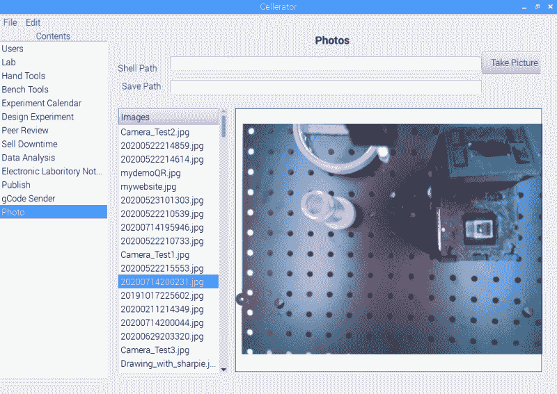

# Cellerator 希望成为您的自动化桌面生物技术实验室

> 原文：<https://hackaday.com/2020/08/17/cellerator-wants-to-be-your-automated-desktop-biotech-lab/>

Cellerator 真的让我们在“制作名牌啤酒”上受益匪浅，但当然这个多功能生物技术实验室还能提供更多。它寻求降低有用的科学设备自动化的成本和复杂性，并希望为材料科学领域的更多创新铺平道路。

Cellerator 采用的方法是利用现有的实验室工具，使用任何使用过 3D 打印机的人都熟悉的组件来自动化常见的研究任务。带有为移液器等不同工具设计的末端执行器的机架系统可自动处理样品。相机(带或不带显微镜)可用于通过计算机视觉进行反馈，或简单地记录快照。

该软件的一些截图显示了该系统计划的深度。它们包括一些小部件，用于告诉系统各种夹具(如热板、离心机和生物反应器)的位置。每个工具的子菜单为它们的操作设置参数，带有用于定制每个实验以及记录过程中所有数据的调度和指令系统。

The [HackadayPrize2020](https://prize.supplyframe.com) is Sponsored by: