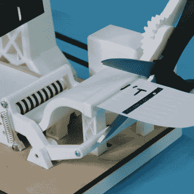

# 鼓励机器与你内心的恶霸战斗

> 原文：<https://hackaday.com/2020/08/18/encouragement-machine-battles-your-inner-bully/>

如果我们告诉你，当面对未知领域新项目的挑战时，恐惧是行动杀手，那我们就是在向唱诗班说教。每个阅读 Hackaday 的人都知道，当我们将自己推向新的工程高度时，克服自我怀疑需要勇气。

[JBV 创意]也听到了这个声音:那个说你不能造那个东西，它太难/没用了。他知道创造力和反创造力都源于同一个源头——最初构思这些项目的强大人类思维。

 它首先承认最基本的令人沮丧的想法——这是过程中的重要一步——然后它简单地修剪掉消极的想法。

这台机器使用步进电机将收据纸放在一个印有“你不能这样做”的自定义图章下面。然后，它将纸通过一把伺服驱动的剪刀，剪下撇号 t。

讽刺或不讽刺的是，[JBV 创意]在这个版本中遇到了一些问题，但设法召集了足够的莫邪来解决这些问题，而没有出现令人鼓舞的问题。我们不得不怀疑下一个项目会进行得多顺利，因为他现在需要所有的积极性。

[JBV]没有深入研究电子产品，但在我们看来它像一个 Arduino 和一个电机驱动器。我们完全喜欢这个设计——它看起来像一个变电站或碰巧有一个摩天轮的火箭发射台。休息之后，请上来看看构建视频。

一般的鼓励是万能的态度调节器，但是如果你想要更具体的情感呢？这里有一面肯定镜，它将帮助你相信你在滚动显示中输入的任何东西。

 [https://www.youtube.com/embed/PB54du9MYBE?version=3&rel=1&showsearch=0&showinfo=1&iv_load_policy=1&fs=1&hl=en-US&autohide=2&wmode=transparent](https://www.youtube.com/embed/PB54du9MYBE?version=3&rel=1&showsearch=0&showinfo=1&iv_load_policy=1&fs=1&hl=en-US&autohide=2&wmode=transparent)

