# 在疫情经营一个成功的黑客营:博恩哈克 2020

> 原文：<https://hackaday.com/2020/08/24/running-a-successful-hacker-camp-in-a-pandemic-bornhack-2020/>

你可以说 2020 年是没有发生的一年，或者甚至可能是所有事情都发生在网上的一年。所有的国际会议和夏令营都被取消了，我们把时间花在了看望我们在 Jitsi 或 Zoom 的朋友上。

但是有一个营地没有被取消。一年一度的丹麦黑客训练营 [BornHack](https://bornhack.dk/bornhack-2020/) 今年已经开始，人数大幅减少，社交距离也越来越远，这使它从通常较小和更亲密的事件之一变成了 2020 年只有 T2 才有的真实世界事件。

我是在年初买的票，那时候新冠肺炎还远没有成为全球性的疫情，所以在 8 月一个阳光明媚的日子里，我和来自伯明翰 FizzPop hackerspace 的朋友 Dani 坐在车里，乘渡船长途跋涉，穿过荷兰和德国，来到丹麦。

## 玩得开心，别传播病毒

 [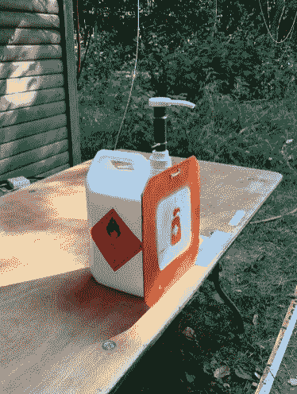](https://i0.wp.com/hackaday.com/wp-content/uploads/2020/08/botnhack-2020-hand-wash.jpg?ssl=1) Hand sanitiser points were all around the site. [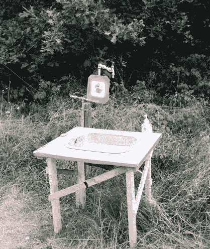](https://i0.wp.com/hackaday.com/wp-content/uploads/2020/08/botnhack-2020-hand-wash-2.jpg?ssl=1) One of many hand washing points. [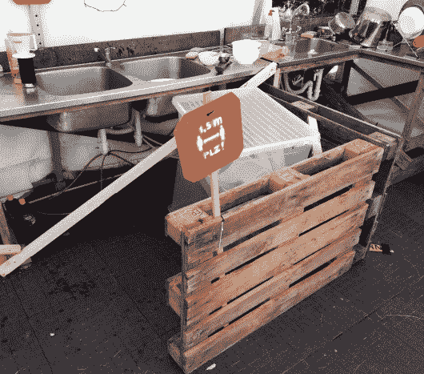](https://i0.wp.com/hackaday.com/wp-content/uploads/2020/08/botnhack-2020-social-distance-2.jpg?ssl=1) Social distanching was enforced in the kitchen area [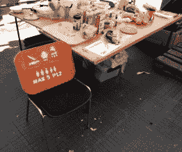](https://i0.wp.com/hackaday.com/wp-content/uploads/2020/08/botnhack-2020-social-distance-1.jpg?ssl=1) A maximum capacity for the kitchen area [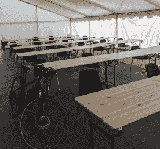](https://i0.wp.com/hackaday.com/wp-content/uploads/2020/08/bornhack2020-tent-buildup.jpg?ssl=1) Socially distanced seating in the speaker’s tent.

任何人在 2020 年旅行的第一个想法是疫情，虽然我们更愿意带你直接进入我们社区常见的酷东西，但最好是深入这个，我们是否喜欢它对整个事件有最大的影响。

最明显的是在活动本身，这是一个比平常小得多的聚会，被丹麦政府规定限制为只有 150 人参加的户外活动，而不是通常的更多人。去年他们有大约 450 人，该网站有空间容纳更多人，所以各个部分比我们习惯的黑客营地要稀疏得多。在正常年份，Hylkedam 童子军营地是一个很好的场地，但在 2020 年，它的扩展地形是社交距离的额外奖励。

与此同时，疫情带来了我们所期待的所有规则。整个场地周围都有清洗和消毒站 BornHack 2020 标志反映了这一点，带有“Make clean”标语以及洗手液和洗手图标。公共区域远离社交，室内建议戴口罩，演讲人的帐篷减少到一个小得多的观众，观众分散在帐篷的两排。令人欣慰的是，orga 和参与者都认真对待整件事。

有报道称，一名来访者来到营地一天，在此期间，他们收到了早期测试的阳性结果。到目前为止，我们还没有发现任何与 camp 相关的感染。这就是为什么每个人都严格遵守所有这些预防措施是如此重要。

## 一个奇怪的黑客阵营

 [![Clever use by [Myrtle] of a 2019 BornHack badge as a beacon for the token hunt game.](img/ec47bbb622c89b89b7a2c608aa711d20.png "botnhack-2020-badge-beacon")](https://i0.wp.com/hackaday.com/wp-content/uploads/2020/08/botnhack-2020-badge-beacon.jpg?ssl=1) Clever use by [Myrtle] of a 2019 BornHack badge as a beacon for the token hunt game. [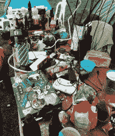](https://i0.wp.com/hackaday.com/wp-content/uploads/2020/08/botnhack-2020-hack-table.jpg?ssl=1) It’s good to be back at a hacker camp. [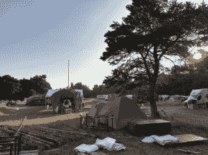](https://i0.wp.com/hackaday.com/wp-content/uploads/2020/08/botnhack-2020-camp-site.jpg?ssl=1) Plenty of space for distancing on the camp site. [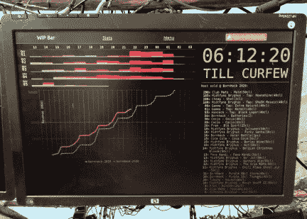](https://i0.wp.com/hackaday.com/wp-content/uploads/2020/08/botnhack-2020-bar-tracker.jpg?ssl=1) It’s a bar graph! [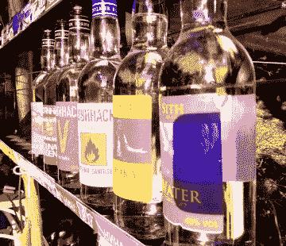](https://i0.wp.com/hackaday.com/wp-content/uploads/2020/08/botnhack-2020-vodka-aquavit.jpg?ssl=1) A BornHack tradition comes in specially made spirits from a distillery on Bornholm.

奇怪的是，对于今年唯一的黑客阵营来说，并没有你想象的那么多黑客。当 150 人在一年的禁闭限制中度过，只有一周的正常夏季时，他们更倾向于在八月的丹麦森林的阳光下度假，而不是我们在正常年份所期望的，这一点也不奇怪。

因此，气氛更加喜庆，因为每个人都有机会放松一下，同时也更加安静，因为他们从前几个月的压力中恢复了一些。这并不是说没有很多常见的黑客营活动，如代币狩猎游戏、CTF 或黑客危险问答，但与俱乐部队友一起躺在树下的吊床上或在大热天开车去海滩的诱惑很大。库存丰富的酒吧和来自现场食品车的[美味的丹麦街头食品](https://scsb.dk/)让我们都很开心，我可以诚实地说，在我需要的时候，从来没有一个黑客营像这个一样满足我。

 [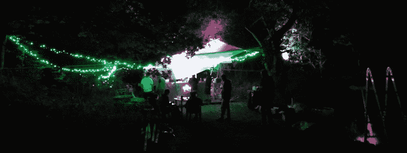](https://i0.wp.com/hackaday.com/wp-content/uploads/2020/08/bornhack-2020-bar.jpg?ssl=1) The bar was a centre of activity through the night. [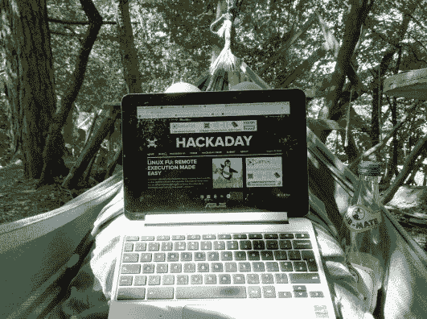](https://i0.wp.com/hackaday.com/wp-content/uploads/2020/08/bornhack-hammock-office.jpg?ssl=1) It’s a tough job, the badge-write-up and part of this one were written here. [![Thanks to [Renze], a Tindie badge becomes an SAO for the BornHack badge.](img/1893d4242cb1eccb95b7974b80471dd3.png "bornhack-badge-tindie-SAO")](https://i0.wp.com/hackaday.com/wp-content/uploads/2020/08/bornhack-badge-tindie-SAO.jpg?ssl=1) Thanks to [Renze], a Tindie badge becomes an SAO for the BornHack badge. [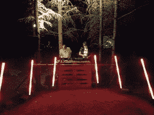](https://i0.wp.com/hackaday.com/wp-content/uploads/2020/08/bornhack-2020-aol.jpg?ssl=1) An Otter Lounge, a pop-up dancefloor in the woods courtesy of my friends Niklas and Jan-Henrik. (Thanks @CosmoGecko for the image!) [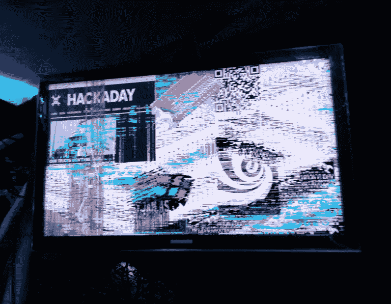](https://i0.wp.com/hackaday.com/wp-content/uploads/2020/08/botnhack-2020-buy-beer-get-pixels.jpg?ssl=1) Buy beer, get Pixelflood pixels.

## 还有很多东西需要你去啃

我将在另一篇文章中详细介绍徽章，可以说这是一个非常出色的 LED 阵列，采用 ARM Cortex M0+微控制器运行电路 Python。这次活动有一个完整的演讲节目，多亏了[高效的视频系统](https://hackaday.com/2019/08/18/an-all-in-one-conference-video-streaming-box/)，他们能够很快在 YouTube 上发布，所以[有必要浏览一下其中的一些节目](https://www.youtube.com/c/BornHack/videos?view=0&sort=dd&shelf_id=1)。信息安全/软件讲座似乎比硬件讲座更多，其中一些讲座是用丹麦语进行的，因此国际观众可能不太容易接触到，但我仍想让您注意到一些讲座。它们是从实时流中自动生成的，其中一些是在剪辑开始几分钟后开始的，所以我们的链接会在演讲开始时跳转。

如果你曾经去过节日或黑客营地，并使用过 WiFi 或其他 IT 服务，那么你可能会对 Lasse Leegaard 的演讲感兴趣，他为我们展示了罗斯基勒节日 IT 基础设施的迷人景象。为 10 万音乐爱好者提供连接的挑战让最大的黑客阵营也相形见绌。与此同时，BornHack 的常客 Mike mikjr Christensen 带着“[丹麦制造](https://www.youtube.com/watch?v=oO9S6Mr886k&t=832)”回到了他的专业主题，回顾了他在 20 世纪 70 年代和 80 年代对丹麦微型计算机行业的研究，展示了一些有趣而非常罕见的硬件。

Ramón Soto Mathiesen 同时满足了逆向游戏和逆向工程的幻想，他关于[操纵 PKF 文件](https://www.youtube.com/watch?v=T_3JeI5R8gA)的演讲实际上是一个引人入胜的关于文件格式逆向工程的初级读本，以 20 世纪 90 年代的一个西班牙 PC 足球游戏为例。以一个令人满意的射频技术结束我在营地期间目睹有人在一次谈话中要求从食物准备区借用微波炉作为射频干扰源。马克-简·巴斯特正在[调查伽利略卫星导航对 23 厘米业余无线电用户的潜在影响](https://www.youtube.com/watch?v=84wN7E_In0U&t=383)。这个演讲精彩地介绍了卫星定位系统是如何工作的，以及各种系统之间的一些差异。

 [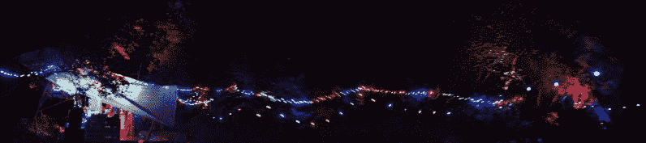](https://hackaday.com/2020/08/24/running-a-successful-hacker-camp-in-a-pandemic-bornhack-2020/bornhack-night-panorama/) There were plenty of lights in the trees throughout the camp. [![A stroopwafel masterclass, courtesy of [Moem].](img/5968556200d3935633d5c0c68b968ecc.png "bornhack-stroopwafel")](https://hackaday.com/2020/08/24/running-a-successful-hacker-camp-in-a-pandemic-bornhack-2020/bornhack-stroopwafel/) A stroopwafel masterclass, courtesy of [Moem]. [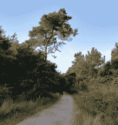](https://hackaday.com/2020/08/24/running-a-successful-hacker-camp-in-a-pandemic-bornhack-2020/bornhack-tree/) This really is a beautiful place to spend a week. [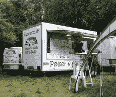](https://hackaday.com/2020/08/24/running-a-successful-hacker-camp-in-a-pandemic-bornhack-2020/bornhack-street-food/) 

一周的时间比大多数营地都要长，这次由于疫情的原因，很少有机会像去年一样去乐高乐园和乐高屋。但额外的时间一如既往地让我们有更多的机会了解我们的与会者，并在一年的封锁和大流行相关的限制后休假。Hylkedam 营地周围的森林是放松的理想场所，幸运的一周好天气意味着它和任何更传统的阳光假期一样好。

我现在被困在英国政府实施的为期两周的隔离期内写这篇文章，当时营地正在为途经荷兰返回的旅行者进行，但我认为这是为我认为是今年的机会付出的小小代价。明年我会回来参加一个更传统的 BornHack，但与此同时，我会永远记住这一年:我们唯一的国际黑客营。