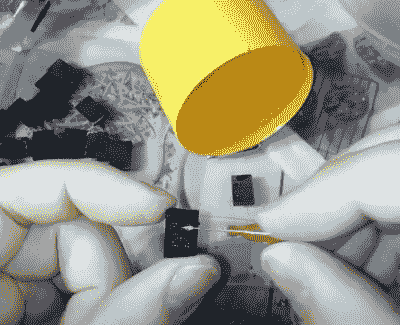

# 受战斗机仪表盘启发的独特 LED 显示屏

> 原文：<https://hackaday.com/2020/08/22/unique-led-display-inspired-by-fighter-jet-dashboard/>

去年，几个朋友邀请[Mangy_Dog]为他们正在进行的一个项目提供咨询。目标是建造一个真实的 F-18 驾驶舱复制品，显然是为了创作一部电影。该项目从未实现，但它确实激励他认真研究了 1970 年代真正飞机上使用的字母数字显示器。一件事接着一件事，最后他用自己的想法建造了自己的“星爆”数字显示器。

正如[Mangy_Dog]解释的那样，虽然这些原始展示的面孔可能很小，但幕后发生了很多事情。由于当时的技术限制，每个字母数字字符都是由一排白炽灯泡和光缆组成的。这已经足够好了，但是体积大，制造复杂。

 今天，我们可以做得更好，即使是在业余爱好者的层面上。事实证明，0402 个发光二极管的大小正好可以重现最初的星爆显示屏。所以[Mangy_Dog]想出了一个简单的 PCB 设计，不仅可以正确对齐 led，还可以用 74HC595 移位寄存器和 MOSFETs 阵列来驱动它们。虽然组装并非没有挑战，但[他很好地利用了他定制的回流焊炉](https://hackaday.com/2020/07/16/touch-screen-reflow-oven-pulls-out-all-the-stops/)，将所有的小部件安装到位。

他经历了几个不同的扩散器的想法，但最终决定在黑色塑料上用他的激光切割机钻一些小孔。在每组三个孔的后面是一个小口袋，从两侧填充透明 UV 树脂，固化后用砂纸打磨。最终的结果不是*完美的*，因为你仍然可以告诉中心点比它的同龄人更亮，但整体效果仍然非常好，绝对有一种仿复古的吸引力。

军方自然能够获得一些难以置信的技术，尽管他们倾向于让 T2 掌握这些技术几十年。一个预算微薄、拥有自制工具的人能够改进安装在一架价值 6000 多万美元的飞机上的一个硬件，这证明了事情发展的速度有多快。

 [https://www.youtube.com/embed/AqO4O9PZuTc?version=3&rel=1&showsearch=0&showinfo=1&iv_load_policy=1&fs=1&hl=en-US&autohide=2&wmode=transparent](https://www.youtube.com/embed/AqO4O9PZuTc?version=3&rel=1&showsearch=0&showinfo=1&iv_load_policy=1&fs=1&hl=en-US&autohide=2&wmode=transparent)

