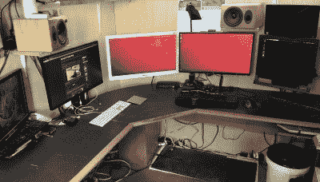

# 四年后，离网办公棚仍在晃动

> 原文：<https://hackaday.com/2020/08/21/four-years-later-off-grid-office-shed-still-rocks/>

大约四年前，拉塞尔·格雷夫斯(Russell Graves)创造了对他来说终极的在家工作环境:一个脱离电网的办公室。这个小屋可能看起来有点小，但它比办公室里大多数人的工作空间大得多。四年后，在全球化的疫情中，在家工作已经变得越来越普遍，[Russel] [分享了一些在家工作的想法，并特别反思了他的离网太阳能棚办公室(或他喜欢称之为“sho office”)是如何工作的](https://syonyk.blogspot.com/2020/05/on-working-from-home-and-joys-of-shed.html)。简而言之，四年后，它让*变得坚硬*，是他想要的一切，甚至更多。

 它隔热良好的胶合板墙让他可以在任何他想去的地方安装监视器臂和任何其他东西，太阳能系统让他可以整天工作(如果他想的话，可以工作到晚上，但他不想这样)，除了在冬天阳光太稀少的时候，一台发电机可以代替他。最重要的是，它提供了坚实的工作与生活的分离——这是[拉塞尔]确信对人类基本健康至关重要的。

这并不是说离网太阳能棚对每个人都是完美的解决方案。不是每个人都可以在家工作，但是对于那些可以在家工作的人和那些至少认同[Russell]在我们报道[最初是如何创建他的办公棚](https://hackaday.com/2016/08/27/working-in-peace-with-an-off-grid-office-shed/)时所表达的一些动机的人来说，他鼓励大家认真思考一下。

他唯一没有明确推荐的是离网太阳能部分。需要说明的是，[拉塞尔]对他的设置非常满意，甚至喜欢脱离电网，但他承认，除非有人对太阳能特别感兴趣，否则像任何其他结构一样，简单地将一个棚屋办公室接入电网更有意义。太阳能似乎是一颗神奇的子弹，但四年的经验告诉他，它确实需要大量的工作和维护。决心使用太阳能？也许可以看一下[太阳强度传感器](https://hackaday.com/2019/09/07/is-solar-right-for-you-find-out/)，在冒险尝试之前，看看你所在的位置是否适合太阳能。