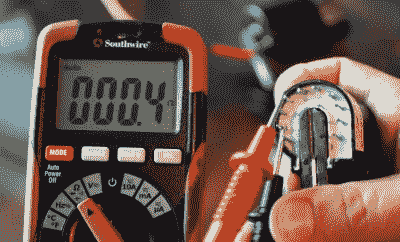

# 一种小型高压黑客电源

> 原文：<https://hackaday.com/2020/08/23/a-miniature-power-supply-for-high-voltage-hacking/>

如果你想用等离子体做实验，你需要一个高压电源。通常这意味着一些大的、复杂的和(自然地)昂贵的东西。但不一定非要这样。正如[Jay Bowles]在他最新的*等离子频道*视频中展示的，你可以[组装一个能够产生高达 20，000 伏](https://www.youtube.com/watch?v=qaGmNRZG-Yg)的低成本电源，放在你的手掌中。虽然你可能应该在使用的时候把它放在桌子上…

Finding the feedback coil with a multimeter.

建造的秘密是反激式变压器。在 CRT 电视时代，这些设备是家庭的必需品，现在仍然可以在网上找到，甚至可以从一台坏电视中抢救出来。我们建议在易贝搜索新老库存(NOS)变压器，而不是冒险在路边找到一台旧电视时被炸穿墙壁，但实际上这完全取决于你对这种事情的经验水平。

在任何情况下，一旦你有了反激变压器在手，其余的建设是非常简单的。[Jay]演示了即使找不到数据手册，如何确定变压器的引脚排列，然后组装驱动变压器所需的一些辅助器件。这个小电源安装在一块废弃的纸板上，并安装在一块塑料上，以防止杂散物体远离下面的火花，对于任何想要开始高压实验的人来说，它都是一个可靠的工作工具。[也许你将来会有一个离子升降机](https://hackaday.com/2016/07/13/expanding-horizons-with-the-ion-propelled-lifter/)？

记忆力超强的读者可能还记得[杰伊]在他最近完成的水基马克思发电机中使用了同样的小型电源。

 [https://www.youtube.com/embed/qaGmNRZG-Yg?version=3&rel=1&showsearch=0&showinfo=1&iv_load_policy=1&fs=1&hl=en-US&autohide=2&wmode=transparent](https://www.youtube.com/embed/qaGmNRZG-Yg?version=3&rel=1&showsearch=0&showinfo=1&iv_load_policy=1&fs=1&hl=en-US&autohide=2&wmode=transparent)

