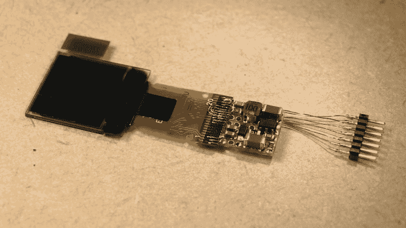

# 模型铁路工程师在展示整洁的原型技术时得到了一个小小的有机发光二极管滚动标志

> 原文：<https://hackaday.com/2020/08/19/model-railroad-engine-gets-a-tiny-oled-rollsign-while-showing-off-tidy-protoboard-skills/>

乘坐公共交通工具时，如果公共汽车或火车有一个大显示屏指示路线或目的地，这将非常有帮助。虽然许多公交线路现在依赖于 flipdot 或 LED 显示屏，但经典的 rollsign 仍然可以完成这项工作。他想在铁路模型上模仿这一点，并着手建造一个微小比例的拟像。

为了适合 HO 比例的模型火车，该建筑使用了一个 0.6 英寸的微型 NHD-0.6-6464G 有机发光二极管显示器。它与一个升压转换器相连，并连接到一个由 ATMEGA328p 和红外接收器组成的微型电路上。微控制器负责接收来自遥控器的命令，并在屏幕上显示适当的图像。下面的视频很好地展示了这种隐藏的美，因为[diorama111]只用一个熨斗和镊子干净而细致地在原板上组装电路。

这个项目之所以伟大，是因为它巧妙地融入了火车的车体。依偎在火车头内，它看起来几乎像模型的股票部分。虽然有机发光二极管显示的本质确实有点不合时宜，但实现垂直滚动确实为最终效果增加了很多。

我们喜欢看到有创意的比例模型项目，过去我们也看到过一些来自[立体布景]的伟大作品。休息后的视频。

 [https://www.youtube.com/embed/tC_t22RfQ0c?version=3&rel=1&showsearch=0&showinfo=1&iv_load_policy=1&fs=1&hl=en-US&autohide=2&wmode=transparent](https://www.youtube.com/embed/tC_t22RfQ0c?version=3&rel=1&showsearch=0&showinfo=1&iv_load_policy=1&fs=1&hl=en-US&autohide=2&wmode=transparent)

