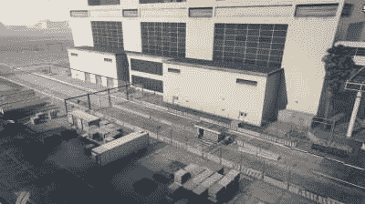

# GTA V Mod 展示(和欺骗)那些特技跳圈

> 原文：<https://hackaday.com/2020/08/21/gta-v-mod-shows-and-cheats-those-stunt-jump-hoops/>

虽然最近宣布即将推出的下一代游戏机《侠盗猎车手 V》让那些热切期待这一臭名昭著的视频游戏系列的继任者感到失望，但它表明，在最初发布近七年后，这款史诗般的游戏仍然很强劲——也理所当然如此。但是像 GTA V 这样复杂多变的游戏也不是没有一些怪癖，尤其是如果你想要 100%完整的话。

特技跳跃似乎是一个特别棘手的难题，所以[Anthony Som]通过对系统进行逆向工程并编写一个显示着陆区的模型和一个即时成功的秘籍来阐明什么是成功的跳跃。

 如果你不熟悉这款游戏，其广阔的开放世界地图提供了各种各样的支线任务，其中之一是特技跳跃，在某些位置你可以将你驾驶的车辆发射到空中，希望降落在邻近的道路或区域——无论是为了躲避追赶你的人，还是仅仅为了好玩。虽然没有告诉你如何真正成功，游戏只是告诉你之后你是否成功了，造成一定程度的挫败感。作为一个狂热的速度赛跑者(就像在尽可能短的时间内完成一场比赛一样)，[Anthony]正在寻找一种方法来提高特技跳跃的成功率，并决定钻研代码来找出如何实现这一点。当然，作为一个专有游戏，他不得不求助于逆向工程，并利用 GTA 的生动[修改](https://en.wikipedia.org/wiki/Modding_in_Grand_Theft_Auto)场景来做到这一点。

他最初的成果是一个 mod，在游戏中以矩形显示发射和着陆区域，这是一个很大的帮助。但是，在已经走了*那么远*之后，【安东尼】认为他还不如继续并添加一个作弊模式，将汽车传送到预期的着陆区域内，并彻底结束对他尝试的事后批评。

如果你对自己改装 GTA 感兴趣，他的文章对此有一些很好的建议，当然还有一些真实的例子。对于使用 GTA 作为学习环境的自动驾驶人工智能来说，这是否是一个好主意？这可能是一个不同的故事。