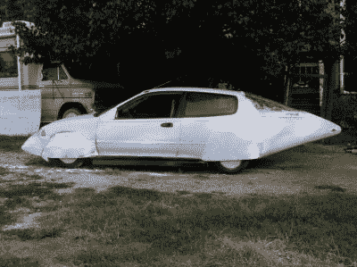
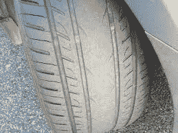
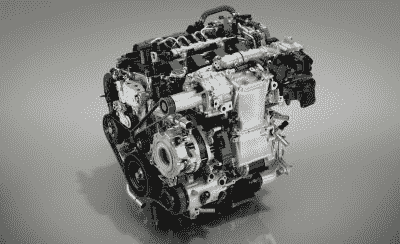

# 如何进入汽车:超级链接

> 原文：<https://hackaday.com/2020/10/02/how-to-get-into-cars-hypermiling-mods/>

虽然我们目前处于一个相对较低的天然气价格时代，但在过去的几十年里，石油市场波动很大。这可能会严重打击臀部口袋，特别是对于那些驾驶饥渴车辆的人。谢天谢地，如果你知道你在做什么，修改可以帮助每加仑恐龙汁多挤出几英里。

努力获得最佳燃油经济性的艺术被称为“超级省油”,它涉及一系列技巧和技术来最大限度地利用一滴燃油。让我们深入探讨如何建造一艘更高效的巡逻车，以便在城镇中穿行。

## 第一步:了解你的敌人

The MPGuino is a great solution for monitoring fuel consumption in older cars without a trip computer.

如果你想提高你的燃油经济性，第一步是测量它。没有精确的测量，就不可能量化任何收益或优化最佳性能。对于那些拥有现代汽车的人来说，仪表板上可能已经安装了行车电脑。用这个来跟踪你的燃油经济性是最简单的解决方案。瞬时模式有助于改善驾驶习惯，而平均模式则有助于确定汽车的长期经济性。

然而，许多老的车辆没有安装这种功能作为股票。谢天谢地，有几种方法可以解决这个问题。对于那些驾驶配备了 OBD-II 端口的 1996 年后的车辆的人来说，像 [Kiwi](https://www.plxdevices.com/Kiwi-OBD-OBDII-Interface-Gauges-Scan-tool-Diagnostics-s/195.htm) 或 [Scangauge](https://www.scangauge.com/) 这样的工具通常可以跟踪燃油经济性。如果做不到这一点，大多数燃油喷射汽车可以安装像[MPGuino](http://mpguino.wiseman.ee/eng)这样的装置来监控燃油喷射以计算油耗。从根本上说，所有这些工具都涉及到跟踪每行驶一段距离所消耗的燃料量。工厂工具和 OBD-II 仪表通过使用汽车的标准硬件来实现这一点，而 MPGuino 则通过接合车速表信号和注射器触发器来实现 Arduino 的相同功能。如果你决定安装一个定制的设备，确保你正确地校准它，否则你的数字将不会与现实中发生的事情有太多的相似之处。

当然，只要你的车有一个正常工作的里程表和一个不漏油的油箱，总会有笔和纸的方法。将油箱加满后，只需将里程表归零即可。然后，当重新加满油箱时，一直加到顶部，除以加回油箱的燃料加仑数所行驶的英里数。这不是最准确的方法，因为加油站泵和汽车油箱的性质意味着油箱不会总是准确地加满，这是由于气穴和用于防止过满的装置。尽管如此，这是一个便捷的方式来获得一些你的车的性能随着时间的大概数字。

很好地掌握了你的车的燃料数量，科学地测试你的改装也很重要。扔在一些“改进”和做了一圈的街区，同时读取即时 MPG 读数不会削减它。理想情况下，最好将几个油箱的平均 MPG 读数与改装前汽车的既定基线进行比较。如果你想在超级里程牌中拥有最终的炫耀权利，路线、燃料等级和其他因素应该尽可能的相似。

## 第二步:Mods

既然你知道你的车有多大的能力，是时候考虑改装一下，让每一滴油都能多跑几码了。修改的范围从简单和容易到极端都有，实用性的考虑意味着一些对于普通司机来说是遥不可及的。

### 空气动力学–光滑圆滑

Despite not looking particularly aerodynamic, the Mercedes A-Class has the lowest coefficient of drag of any production car, Cd=0.22.

可以提高燃油经济性的最大领域之一是改善汽车的空气动力学。不像我们之前的文章，讨论了通过增加下压力来改善空气动力学以获得更多抓地力，这里的重点是减少阻力。阻力随着速度的平方而增加。这意味着你行驶的速度越快，你需要使用更多的燃料来克服车辆的阻力。这方面的 Mods 在高速行驶时效果会最大，比如在高速公路行驶时。重要的是要注意，任何显著改变车辆空气动力学特性的改装都可能对操控产生不利影响，所以要小心行事。此外，值得记住的是，一些车辆可能已经具有令人难以置信的低阻力，尽管它们看起来很好。例如，[它可能看起来不是特别流线型，但最新的梅赛德斯 A 级车是低阻力设计的领导者](https://www.motortrend.com/news/mercedes-a-class-sedan-claims-the-lowest-drag-of-any-production-car/#:~:text=You%20may%20not%20think%20an,by%20the%20Mercedes%2DBenz%20CLA.)。如果没有风洞和 20-30 名世界级工程师的帮助，改进这样的设计可能很难甚至不可能。

早在 2008 年，[巴斯朱]就宣称这款经过大量改装的本田思域平均每加仑行驶 70 英里。注意突出的船尾和轮罩。

这方面最基本的修改就是简单地平滑车辆的轮廓。在裂缝上贴胶带，用更小、更光滑的物品替换大的后视镜，以及去除多余的附加物，如装饰性的机翼和大天线，都可以起到作用。更严重的超级里程牌车已经试验过堵住烤架，提高燃油经济性，但是在冬天最冷的日子之外有过热的危险。使用前唇来引导轮胎周围的空气，而不是车身下方的空气，也可以获得一些好处。

在更极端的情况下，身体模型会变得很严重，而且非常不切实际。许多超级英里深入结构工作与材料，如 coroplast 和铝，[创造“船尾巴”以平稳气流，减少 MPG。](https://www.wired.com/2008/01/more-details-ab/)这些通常会影响后部储物空间的使用，但会对减少阻力产生重大影响。底架改装也能有所帮助，冒着与你的工艺项目缠绕在驱动轴或悬挂臂上的风险。有些人甚至安装了轮罩来进一步改善他们汽车的流线型轮廓。

### 重量

汽车越重，加速所需的燃料就越多。因此，减轻汽车重量是提高燃油效率的一个很好的方法，美国环保署估计，减轻 100 磅的重量平均可以提高 1-2%的经济性。

有很多方法可以减轻普通汽车的重量，尤其是对有创造力的人来说。例如，如果你没有朋友，没有理由在你的家庭旅行车中携带所有 5 个座位。取消后排座椅和前排乘客座椅可以轻松节省 100 磅或更多，净收益为零。更极端的方法包括不带备胎开车，或者拆除地毯和隔音材料。对于真正专注的人来说，玻璃窗可以用更轻的 lexan 面板代替，重型库存车轮可以换成轻型售后车轮。

### 轮胎

Uneven wear on an overinflated tyre. The pattern of wear shown indicates most of the tyre is contributing no grip, making the car dangerous to drive at any speed.

虽然不是最令人兴奋的改装，但轮胎在燃油经济性方面还是有一定作用的。克服滚动阻力需要消耗燃料，所以换一个滚动阻力较低的轮胎会有所帮助。对于那些寻求更多的人来说，改用比标准轮胎更薄的轮胎也有帮助，尽管改变车辆的操控特性存在风险。做出激烈的改变可能是危险的，所以通常最好还是谨慎一点，在合适尺寸的车轮上安装一套漂亮的环保轮胎。

此外，增加轮胎压力也有帮助。通过给轮胎增加更多的空气，它减小了接触面积。这降低了滚动阻力，从而提高了燃油经济性。然而，它也降低了抓地力，并可能导致井喷和其他灾难性的后果。这样的措施在雨天更危险。另外，在现代汽车中，它会从你的轮胎压力监测系统中抛出各种错误和警告。

### 发动机

[Mazda has spent a small fortune](https://www.roadandtrack.com/new-cars/future-cars/a13092719/mazda-skyactiv-x-compression-ignition-gasoline-engine/#:~:text=Essentially%2C%20a%202.0%2Dliter%20Skyactiv,current%202.0%2Dliter%20gasoline%20engine.) on their unique gasoline compression ignition technology to gain up to 20% improvement in fuel economy. Making gains in engine efficiency is a big-money sport.

作为一名家庭游戏玩家，发动机可能是最难获得显著燃油经济性收益的地方。汽车公司投资数百万美元开发发动机，重点关注燃油经济性和效率。在这一领域，廉价的一刀切的易贝零件不会比定制设计的 OEM 零件有所改进。这也适用于调校——在你家附近的 dyno 待一天，也不会得到比本田花了几年时间在所有可以想象的大气条件下测试的调校更有效的调校。

然而，这并不是说桌子上永远不会剩下任何东西。它只是需要一个非常聪明的考虑引擎作为一个整体，和一个现实的方法去做什么是可能的。制造商不得不妥协的一个地方是价格。20 世纪 90 年代中期的经济型汽车可能会有限制性排气，这是因为制造成本高于效率。用一个流动更好的零件来替换它，可能会净得一些额外的马力，让引擎更自由地呼吸，提高效率。通常，清楚地查看成本削减的地方会发现库存马达可能会发现一些效率提高的地方。然而，如果你在汽油上的花费不超过你省下的钱，就很难在这里做出改进。

## 结论

超级英里是一个伟大的方式来节省一些钱，但随着汽油价格处于历史低点，电动汽车在市场上，这不是什么大不了的事，因为它可能是十年前。许多人现在投身于精确驾驶技术和先进改装的世界，不仅仅是为了节省油泵，而是纯粹的工程挑战。虽然我们开始看到汽油技术日薄西山，但收益仍有待获得，总会有黑客寻求从每滴汽油中榨出最后一点能量。对于那些努力追求这一目标的人，我们向你们致敬！