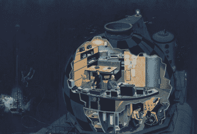
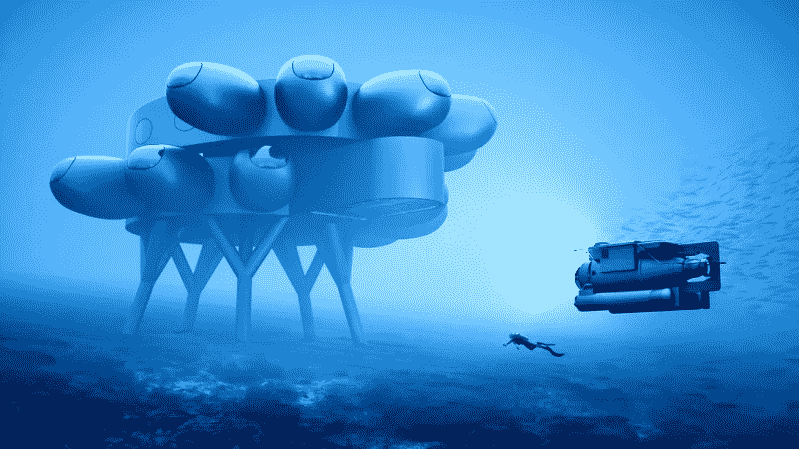
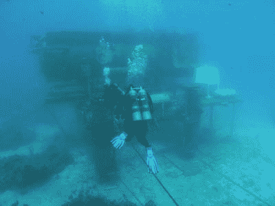

# 库斯托的普罗透斯将成为海洋的 ISS

> 原文：<https://hackaday.com/2020/09/07/cousteaus-proteus-will-be-the-iss-of-the-seas/>

地球的海洋是一片广阔的边疆，充满了未来医学、海洋保护和食品生产的可能性。由于水肺潜水的物理限制，它们在很大程度上仍未被探索。人类每天只能潜水几个小时，在深海呼吸压缩空气的每一分钟都必须以更慢的浮出水面作为代价。否则，潜水员可能会因氮气在血液中膨胀而患上减压病。

An illustration of the Conshelf 3 habitat. Image via [Medium](https://medium.com/predict/historical-underwater-habitat-showcase-continental-shelf-station-three-90830d2ff0be)

20 世纪 60 年代，世界著名的海洋学家雅克·库斯托建造了一系列小型水下栖息地，以延长他和其他研究人员的工作时间。这些海洋实验室被一条提供空气和动力的电缆拴在一艘补给船上。

库斯托的第一个海洋实验室，Conshelf 1(大陆架站)可容纳两人，位于法国马赛海岸 33 英尺深处。Conshelf 2 庇护了六个人，在红海下两个不同的深度总共呆了六个星期。

康塞尔夫 3 号是库斯托最雄心勃勃的栖息地设计，因为与前两个相比，它几乎可以自给自足。它一次可容纳六名潜水员三周，位于尼斯附近法国海岸 336 英尺深处。Conshelf 3 是与一家法国石化公司合作建造的，目的是研究人类在水下石油钻井的可行性(在我们有机器人之前)，包括在附近的海底进行演习的模拟石油钻井平台。

自从康塞尔夫系列以来，几个水下栖息地来来去去，但每个都是为一个特定的研究项目或一组任务而建造的。从来没有真正为海洋生物化学的一般研究建立过永久的栖息地。

A render of Proteus. Image via [CNET](https://www.cnet.com/news/proteus-is-an-underwater-research-lab-worthy-of-a-bond-villain/)

雅克·库斯托的孙子杨奇煜认为豪华实验室的时代已经到来。他正在筹集 1 . 35 亿美元来建造和启动现存最大的水下栖息地之一。库斯托和他的合作伙伴正在寻求建立一个海洋版的国际空间站——一个长期宜居的栖息地，可以连续几周支持十几名研究人员。新实验室将被命名为普罗透斯，以变形的希腊神命名，他能预见未来，但只对那些能抓住他的人负责。

Swimming towards the moon pool of Aquarius Reef Base. Image via [Business Insider](https://www.businessinsider.com/aquarius-reef-base-fiu-nasa-underwater-lab-2016-5)

现存最大的水下栖息地是宝瓶礁基地，它建于 1986 年，大约有一辆校车那么大。水瓶号停泊在 62 英尺深，距离佛罗里达州基拉戈海岸大约 5.5 英里，这使得美国宇航局可以方便地利用它来为宇航员准备恶劣的环境和太空的毁灭性隔离。

几年前，杨奇煜·库斯托和他的潜水员团队在宝瓶座连续呆了 31 天，收集了大量的研究资料，他估计用日常潜水需要两年才能收集到这些资料。

库斯托的实验室大约有水瓶号的十倍大，占地 4000 平方英尺，一次可以容纳 12 个人舒适地生活几个星期。普罗秋斯号将位于加勒比海库拉索岛海岸 60 英尺深处。网站地图计划于今年秋天完成，预计将于 2023 年开放。

Yves Béhar 的工业设计公司 Fuseproject 正在设计这个看起来很未来的实验室。这个想法是建立一个模块化的栖息地，将来有扩展的空间。除了研究实验室、生活区和睡眠区，Proteus 还将拥有一个视频制作室和一个水培温室，以确定食物是否可以在水下更快地生长。它将由风能、太阳能和海洋热能的组合提供动力，这些能量将通过一条脐带与互联网接入一起输送到水面，大概是输送到一艘支援船。

Proteus 可能看起来像一个两栖邦德恶棍的巢穴，但它只会被用来做好事。预计每年 300 万美元的运营成本将被来访的研究人员、大学和公司抵消，他们将被允许租用 Proteus 来研究除战争以外的任何东西。观看杨奇煜·库斯托在下面的视频中讨论他对普罗透斯的希望。

 [https://www.youtube.com/embed/bOgeCfRRXJE?version=3&rel=1&showsearch=0&showinfo=1&iv_load_policy=1&fs=1&hl=en-US&autohide=2&wmode=transparent](https://www.youtube.com/embed/bOgeCfRRXJE?version=3&rel=1&showsearch=0&showinfo=1&iv_load_policy=1&fs=1&hl=en-US&autohide=2&wmode=transparent)

