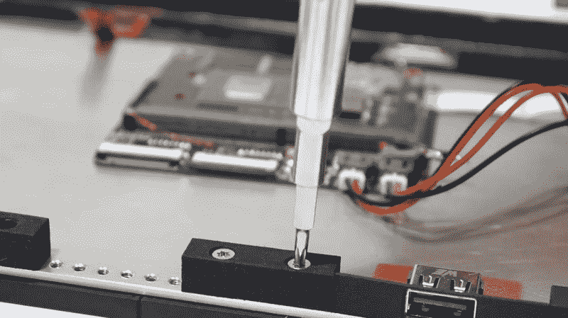
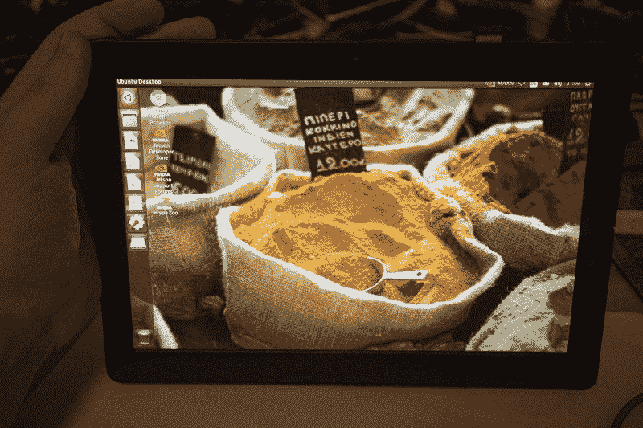

# 查看该死的 Linux 平板电脑

> 原文：<https://hackaday.com/2020/08/25/checking-in-on-the-damn-linux-tablet-one/>

平板电脑、平板电脑、手机和 fablets，不缺少像星际迷航那样的手持矩形玻璃形状的电子产品，将你与一切连接起来。这就是我们生活的世界，但不幸的是，目前这个世界没有很多 Linux 选项，当然也没有模块化设计概念。这就是[丁满]设计*该死的 Linux Table one*，[围绕英伟达杰特森纳米板](https://hackaday.io/project/164845-dlt-one-a-damn-linux-tablet)构建的“合适的 Linux 平板电脑”的动机。

这个设计真的很受欢迎，因为谁会对升级和定制平板电脑的能力不感兴趣呢？在去年的 Hackaday Supercon 上，我们在丁满获得 DLT 一号最佳设计奖的第二天早上采访了他。看看下面的视频，休息后加入我们，了解项目的最新进展。

只剩下一周时间[让你的项目进入 2020 年黑客日大奖](https://prize.supplyframe.com/)。在今年 11 月黑客日活动开始之前，我们不会知道今年的获胜者。虚拟会议的[提案征集](https://hackaday.com/2020/08/04/hackaday-remoticon-our-2020-conference-is-packed-with-workshops-and-were-calling-for-proposals/)仍在进行中！

 [https://www.youtube.com/embed/OE7RkuM9ehk?version=3&rel=1&showsearch=0&showinfo=1&iv_load_policy=1&fs=1&hl=en-US&autohide=2&wmode=transparent](https://www.youtube.com/embed/OE7RkuM9ehk?version=3&rel=1&showsearch=0&showinfo=1&iv_load_policy=1&fs=1&hl=en-US&autohide=2&wmode=transparent)

[Timon]对模块化设计的局限性持现实态度。他欣然承认，你不会升级移动设备上的显卡，但说到外设，为什么不呢？你可能想在微型 USB、USB-C、桶形插孔之间进行选择，或者做一些完全定制的东西。一个黑客的 NFC 设备可能会被另一个黑客的 SDR 或 LoRa 所取代。在这个平板电脑设计中，将 PCIe 组件连接到您的移动设备是完全可行的。关键是要做出一个基础模型，它能很好地工作，但有潜力成为每个不同用户希望他们的设备成为的样子。

关注[Timon]的该死的 Linux Table one 获得了 2019 年 Hackaday 奖的最佳设计，这对每个人来说应该都不奇怪。他讲述了这个设计的故事，这是一个极好的概述视频，其中包括原型的拆卸。在这篇文章中，我们介绍了构成平板电脑中央部分的铝板，屏幕连接到正面，统一的模块化安装孔围绕背面的边缘铣出，使组件和垫片可以轻松定位。

在板的中心是“主板”，旨在突破杰特森纳米系统模块(SOM)的 IO。扁平电缆将主板与您选择使用的外围设备连接起来。关于 Jetson 真正有趣的事情是，它使用了 SO-DIMM 模块，而[Timon]使用了反向安装连接器。这样，主板上的一个切口允许模块的芯片穿过电路板，并与作为散热器的铝板接触。

10，000 美元的奖金使他能够继续迭代设计。上个月，我们有幸得到了关于平板电脑显示屏进展的更新。让 DisplayPort 屏幕工作是一场斗争，因为在处理双线屏幕时，驱动程序中有一个错误。此处显示的 10.1 英寸四通道屏幕的分辨率为 2560×1440。随着技术障碍被排除在外，[再次开始改进配件，完成并开始电池管理系统的工作。](https://hackaday.io/project/164845-dlt-one-a-damn-linux-tablet/log/182676-next-steps)

像这样的项目是曾经需要整个公司的技能的杰作。这可以由一个人设计的事实证明了黑客社区共享反馈和技能，设计工具的可用性，个人供应链的可访问性，以及最重要的是 Timon 看到项目继续进行的决心。前往[他的项目页面](https://hackaday.io/project/164845-dlt-one-a-damn-linux-tablet)，那里有一周的阅读价值，还有机会发送赞扬和建设性的反馈。

The [HackadayPrize2020](https://prize.supplyframe.com) is Sponsored by: