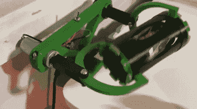

# 3D 打印颜料混合器

> 原文：<https://hackaday.com/2020/08/31/a-3d-printed-paint-mixer/>

为了让你的颜料得到完美的混合，你需要尽可能随意的摇动。[Mark Rhodes]想要自动化混合颜料的过程，所以他建造了一个 [3D 打印的摇动器](https://twitter.com/mrhodes/status/1298068971220942848)来彻底摇动小颜料瓶。只用一个马达，它就能沿着三个旋转轴和一个平移轴摇动瓶子。

一个圆柱形容器的两端连接到一个 U 形支架上，支架又连接到一个旋转轴上。这些轴中只有一根是有动力的，另一根实际上是空转的。启用时，它会围绕俯仰和偏航轴部分旋转圆柱体，围绕滚动轴旋转 360 度，并使其来回往复运动。该设计似乎是基于一种被称为“ [Turbula](https://www.wab-group.com/en/mixing-technology/3d-shaker-mixer/product/turbula/) ”的工业混合器。另一个有趣的特点是它如何将颜料瓶固定在圆筒中。几个带子沿着圆柱体的内部伸展，通过旋转末端的一个环，它创建了一个沙漏形的网，可以紧紧地抓住颜料瓶。

该机构安装在 3d 打印的框架上，可以快速夹在桌子上。下面嵌入的 Twitter 帖子是[Mark]正在为他的[Youtube 频道](https://www.youtube.com/channel/UCO-XgXlpr98e4C9rHMpz9_Q)制作的视频的预览，同时他还将发布 3D 文件。

搅拌机有各种形状和大小，我们已经看到了许多 3D 打印版本，包括一个[静态混合器](https://hackaday.com/2018/07/08/this-3d-printed-syringe-static-mixer-does-it-all/)和一个[磁力搅拌器](https://hackaday.com/2018/03/21/3d-printed-magnetic-stirrer-could-hardly-be-simpler/)。

> 所以我一直在做一些小东西来帮我混合颜料。它完全是为了解决这个问题而过度设计的，这就是为什么它让我想起了 [@donttrythis](https://twitter.com/donttrythis?ref_src=twsrc%5Etfw) 和 [@Laura_kampf](https://twitter.com/laura_kampf?ref_src=twsrc%5Etfw) 做的开瓶器🤣。虽然它看起来很酷！【pic.twitter.com/2EatMGfC5j 
> 
> —马克·罗兹(@ mrhodes)[2020 年 8 月 25 日](https://twitter.com/mrhodes/status/1298068971220942848?ref_src=twsrc%5Etfw)