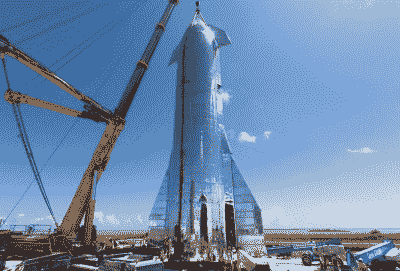
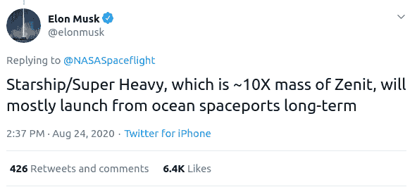
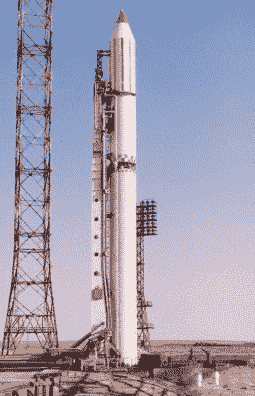
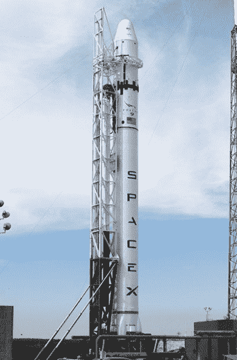
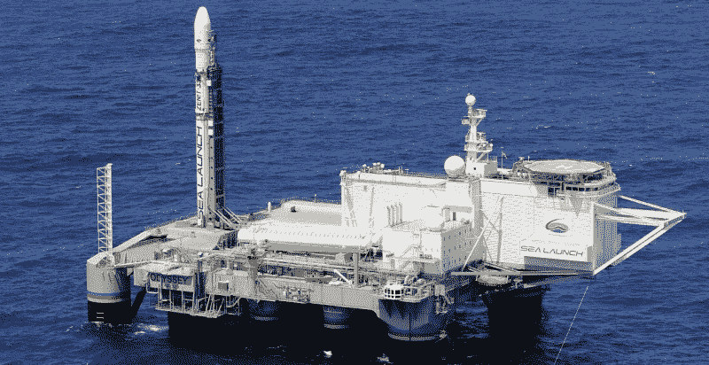
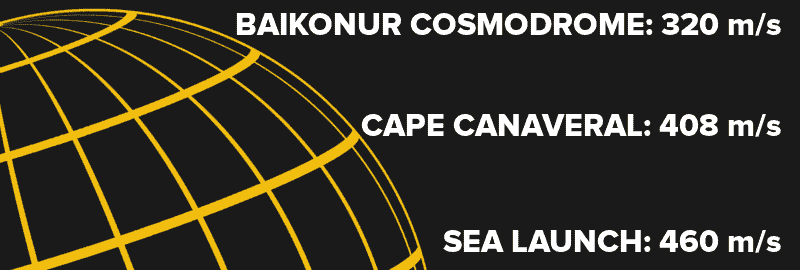

# 未来火箭的浮动太空港

> 原文：<https://hackaday.com/2020/09/14/floating-spaceports-for-future-rockets/>

虽然 SpaceX 的 Starship 早期原型在该公司的德克萨斯州测试设施中定期爆炸，但整个项目一直在以惊人的速度向前发展。首席执行官埃隆·马斯克认为，高耸的航天器将是在火星上建立可持续人类殖民地的关键，在短短几年内，它已经从 CGI 渲染发展到飞行硬件。即使用传统的火箭术语来说，这也很快了，但是星舰几乎没有任何人敢称之为传统的。

An early Starship prototype being assembled.

几乎深空探测器的每一个部件要么是技术上的飞跃，要么是对常规的偏离。其革命性的全流式分级燃烧发动机是同类中首次飞行的，非常复杂，以至于航空业的其他公司在几十年前就放弃了制造它们。为了支持快速重复使用，Starship 光滑的机身放弃了挑剔的碳纤维，代之以更坚硬(更重)的不锈钢；自太空时代开始以来，这种材料就没有被用于制造火箭。

然后是它的巨大尺寸:当 Starship 安装在其匹配的超重型助推器上时，它将比标志性的土星五号和美国宇航局即将推出的太空发射系统更高更重。在升空时，助推器的 31 台猛禽发动机将产生令人难以置信的 16，000，000 磅推力，在地面释放出可怕的压力波，这对任何靠得太近的人来说都是致命的。

这就引出了一个有趣的问题:你能在哪里安全地发射(和降落)如此巨大的火箭？即使在理想的情况下，你也需要让人们远离发射台几公里，但是如果最坏的情况发生了呢？如果单引擎原型机起火是一回事，但是如果一个装满燃料的星际飞船堆栈在发射台爆炸，产生的火球将具有相当于几千吨 TNT 炸药的能量。

多亏了伊隆经常在推特上释放的意识流，我们可能有了答案。在回应关于过去从海洋发射轨道火箭的评论时，他漫不经心地提到，一旦开始定期飞行，Starship 可能会从浮动的太空港进行操作:

虽然历史告诫我们不要对伊隆的社交媒体评论看得太深，但从海洋中发射星际飞船的潜在优势有点太多了，不能不考虑。特别是因为这是一项经过验证的技术:他提到的天顶火箭从其独特的浮动垫成功进行了 30 多次轨道发射。

## 最后一枚苏联火箭

天顶火箭开发于 20 世纪 80 年代，旨在取代老化的联盟号和质子号发射器，它们是苏联太空计划的支柱。在尺寸和规格上与 SpaceX 的早期版本猎鹰 9 号相似，液态氧和精炼煤油驱动的 Zenit 将比其前身更便宜，操作更安全。它能够作为大型飞行器的捆绑式助推器，这是与猎鹰 9 号的另一个相似之处，也有望进一步简化苏联的太空后勤。

  Zenit-2  Falcon 9 v1

当然，这从未发生过。在新助推器的所有问题被解决之前，苏联解体了，这个项目陷入了政治泥潭。俄罗斯联邦不仅缺乏资金同时最大限度地运行联盟号、质子号和天顶号，而且还担心在新独立的乌克兰制造的火箭上发射敏感的有效载荷。在 20 世纪 90 年代几次引人注目的失败之后，Zenit 计划几乎被完全取消。

## 一个如果是陆地，两个如果是海上

虽然苏联的解体最终阻止了天顶号取代联盟号和质子号，但它也提供了一些诱人的商业可能性。随着冷战正式结束，来自美国、俄罗斯、乌克兰和挪威的公司组成了一个国际联盟，向商业客户提供 Zenit。不必决定哪个国家将作为火箭的永久基地，这种运载工具的改进版本将从一个自推进的远洋发射台起飞，该发射台最初是一个海上石油钻井平台。这项革命性的新服务被恰如其分地称为海上发射。

Zenit-3SL on Sea Launch’s *Ocean Odyssey* platform.

除了不受任何一个国家束缚的政治方面，从海上发射提供了许多令人信服的优势。首先，万一火箭在发射台上爆炸或者在发射后不久失灵，那就安全多了。考虑到天顶人有些参差不齐的记录，这一点尤其重要。它还允许从地球赤道附近发射，这在上升过程中赋予飞行器更大的切向速度，并直接转化为增加的有效载荷能力。

地球自转提供的初始助推力可以通过将地球在赤道的旋转速度乘以发射场纬度的余弦来近似计算:

虽然赤道海上发射提供的收益与轨道速度(大约 28，000 公里/小时)相比似乎很小，但火箭方程是异常无情的。即使到达轨道所需的加速度有微小的降低，也会使飞行器的更多质量用于有效载荷，而不是推进剂。此外，这意味着前往赤道轨道的有效载荷，如地球同步通信卫星，在与助推器分离后不需要调整它们的倾角。这进一步减少了推进剂的需求，并使卫星更快地进入最终运行轨道，从而延长了使用寿命。

## 中断的实验

1999 年至 2014 年期间，共有 36 枚天顶火箭从 Sea Launch 的浮动发射台发射，其中 32 枚成功将有效载荷送入轨道。最严重的一次失败发生在 2007 年 1 月，当时运载 NSS 8 号卫星的火箭在点火几秒钟后失败，并在一个火球中吞没了发射台。

 [https://www.youtube.com/embed/bTdJOP3fFeA?version=3&rel=1&showsearch=0&showinfo=1&iv_load_policy=1&fs=1&hl=en-US&autohide=2&wmode=transparent](https://www.youtube.com/embed/bTdJOP3fFeA?version=3&rel=1&showsearch=0&showinfo=1&iv_load_policy=1&fs=1&hl=en-US&autohide=2&wmode=transparent)

由于浮动发射台的设计，摇摇欲坠的火箭通过平台上的一个开口坠落并沉没；只对船上的基础设施造成了表面损坏。作为正常操作程序的一部分，发射时没有人员在*海洋奥德赛*平台上，所以没有人员受伤。事故发生仅 6 个月后，该平台被修复并准备好下一次发射。

从技术角度来看，海上发射表明海上发射轨道火箭有明确的前景。该计划经历的少数失败与将火箭运送到赤道的后勤工作或浮动发射台的独特性质毫无关系。海洋奥德赛号上的单一故障也不足以长时间推迟该计划，更不用说完全停止它了。如果说有什么不同的话，那就是 NSS 8 号的爆炸展示了海洋发射在发生灾难性故障时的内在安全性。

不幸的是，Sea Launch 最终还是被当初让它成为可能的同一件事扼杀了:政治动荡。2014 年俄罗斯吞并克里米亚使该国与乌克兰的关系变得紧张，尽管 Sea Launch 公开否认这种情况对他们的运营有任何影响，但几个月后，工作人员被解雇， *Ocean Odyssey* 号及其支援船被封存。

## 公海上的火箭

SpaceX 已经获得了将火箭降落在浮动平台上的丰富经验，这可以说是比从平台上起飞更难的壮举。海上发射项目毫无疑问地证明了这个概念是可行的，只是需要扩大规模。正如埃隆指出的，Starship 和 Super Heavy booster 是比 Zenit 大得多的运载工具，但这并不意味着核心技术需要有任何不同。

Each Starship will be refueled in orbit by multiple tankers.

整个星际飞船的架构是围绕轨道燃料补给的概念建立的，这意味着每次任务实际上将由快速连续的多次发射组成。在去火星旅行的情况下，最多五六次，所有的发射都是在几天之内进行的。

赤道海上发射将有助于尽可能简化这一过程，允许在最短的时间内将最大量的推进剂输送到在轨道上等待的星际飞船。每次飞行的收益不会很多，但 SpaceX 显然在玩长线游戏。至少，这将有助于使这种操作产生的令人难以置信的噪音尽可能远离文明世界。

或者，正如我们过去从 SpaceX 那里学到的那样，这可能永远不会发生。也许建造一个庞大的浮动太空港舰队的成本最终会高到抵消从海上发射中获得的任何优势。在短短的几年里，星际飞船的设计经历了这么多的变化，关于这个未来派的飞船，几乎没有什么是绝对确定的。许多人甚至怀疑它会走到这一步。

但是，即使 SpaceX 不从海洋中发射星际飞船，远洋火箭的概念仍然有希望。俄罗斯航天局 Roscosmos 宣布，他们计划让停滞不前的“海洋奥德赛号”【T2 号】重新启动并运行【T3 号】，这一次只使用国内技术。就像不锈钢火箭一样，海洋发射台似乎正在为新的太空竞赛回归时尚。