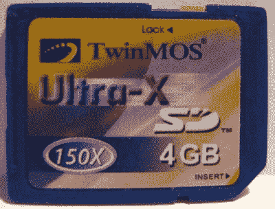
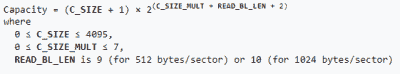
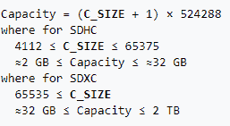
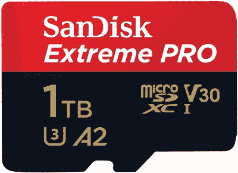
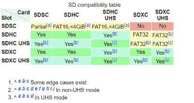

# SD 卡的尺寸确实很重要

> 原文：<https://hackaday.com/2020/09/08/size-does-matter-when-it-comes-to-sd-cards/>

SD 卡于 1999 年首次出现，2000 年第一季度，存储容量高达 64 MB 的 sd 卡开始在商店上架。多年来，随着我们对更多储物空间的需求不断增长，尺寸也慢慢变大。快进到今天，最大的 microSD 卡在一个比普通邮票还小的包装中可以容纳高达 1 TB 的容量。

然而，多年来，达到这一点需要许多微妙的变化。这可能会给试图在旧设备中使用最新卡的用户带来巨大麻烦。为了找出原因，我们需要看看 SD 卡是如何处理存储容量的。

## 初始问题

A rare 4 GB card produced piror to the ratification of SDHC. Compatibility of such cards is limited, as they operate outside of both the earlier or later standard. Image credit: [Wirepath](https://en.wikipedia.org/wiki/File:Sd4gy_crop.jpg)

随着卡跨越 1 GB 的障碍，SD 标准开始出现第一个问题。SD 卡中的存储由簇的数量、每个簇有多少块以及每个块有多少字节决定。该数据由主机从卡特定数据或 CSD 寄存器中读出。CSD 包含两个字段，C_SIZE 和 C_SIZE_MULT，它们分别指定簇的数量和每个簇的块数。

1.00 标准允许最多 4096 个簇，每个簇最多 512 个块，同时假设块大小为每块 512 字节。4096 个簇乘以每个簇 512 个块，乘以每个块 512 个字节，得到一个具有 1 GB 存储的卡。在这个级别上，没有重大的兼容性问题。

The formula used to calculate SD card capacity in version 1.01 of the standard.

1.01 标准做了一个看似很小的改变，允许块大小为每块 512、1024 甚至 2048 字节。添加了一个额外的字段来指定 CSD 中的最大块长度。官方标准中 READ_BL_LEN 和 WRITE_BL_LEN 设计的最大长度[可以设置为 9、10 或 11。这将最大块大小指定为 512 字节(默认)、1024 字节或 2048 字节，允许最大卡大小分别为 1 GB、2 GB 或 4 GB。尽管该标准偶尔提到最大块大小为 2048 字节，但官方的原始 SD 标准最高为 2 GB。这可能在很大程度上是由于 SD 卡主要用于 FAT16 文件系统，](https://web.archive.org/web/20131205014133/https://www.sdcard.org/downloads/pls/simplified_specs/archive/part1_301.pdf)[，其本身在常规使用中达到了 2 GB 的限制。](http://www.hjreggel.net/cardspeed/special-sd.html)

突然，兼容性问题出现了。不知道可变数据块长度的早期主机无法识别新卡上可用的更大存储空间。这对于一些试图让 4 GB 卡工作的边缘情况来说尤其成问题。通常，忽略 READ_BL_LEN 字段的早期阅读器会将 2 GB 和罕见的 4 GB 卡报告为 1 GB，注意到正确的簇和块数，但无法识别扩展的块长度。

谢天谢地，这还是在 SD 卡时代的早期，更大的卡还没有进入主流使用。然而，由于 32 位寻址方案，该标准在 4 GB 达到了坚实的大小障碍，进一步的变化指日可待。

## 后来的障碍

2006 年推出了 SD 规范的 2.00 版本。预示着在 SDHC 标准，它承诺卡的大小高达 32GB。从技术上来说，SDHC 被视为一个新的标准，这意味着所有 2GB 以上的卡应该是 SDHC，而 2GB 及以下的卡应该按照现有的 SD 标准执行。

The formula for calculating capacity in SDHC and SDXC cards.

为了实现这些更大的尺寸，SDHC 卡的 CSD 寄存器被完全重新设计。主 C_SIZE 字段被扩展到 22 位，指示簇的数量，而 C_SIZE_MULT 被丢弃，标准假设每个簇的大小为 1024 个块。指示块长度的字段 READ_BL_LEN 被保留，但被锁定为值 9，规定每个块的固定大小为 512 字节。两个先前保留的位用于向主机指示卡类型，标准 SD 卡使用值 0，1 指示 SDHC 格式(或后来的 SDXC)。敏锐的读者会注意到，这可能允许高达 2 TB 的容量。然而，SDHC 标准正式停止在 32 GB。SDHC 还强制要求默认使用 FAT32，对每个文件的大小有严格的 4 GB 限制。在实践中，当在 SDHC 卡上拍摄高质量的长视频时，这是很容易注意到的。摄像机要么创建多个文件，要么在达到 4 GB 文件限制时完全停止录制。

SDXC allows for cards up to 2TB in size, with cards maxing this out almost on the market. In 2018, the SDUC standard was announced, which will allow for sizes up to 128TB.

为了超越这一水平，SDXC 标准适用于大于 32 GB 的卡，最大容量为 2 TB。惩教署登记册已经能够处理这一级别的容量，因此不需要作出任何改变。相反，主要的变化是使用了 [exFAT 文件系统](https://en.wikipedia.org/wiki/ExFAT)。由微软专门为闪存设备创建，它避免了 FAT32 的限制性 4 GB 文件大小限制，并避免了 NTFS 等文件系统的较高开销。

目前的卡容量高达 1 TB，接近 SDXC 规格的极限。当 11 年前宣布该规范时，[《连线》报道称，2 TB 卡“即将推出”](https://www.wired.com/2009/01/two-terabyte-sd/)，这在事后看来可能有点操之过急。不管怎样，[下一个标准，SDUC，将支持高达 128 TB 的卡。很有可能需要兼容性的另一个突破，因为 SDXC 规范中的当前容量寄存器已经达到极限。我们可能不会发现，直到规范提供给更广泛的公众在未来几年。](https://petapixel.com/2018/06/27/sduc-express-memory-cards-to-allow-128tb-storage-and-985mb-s-speed/)

## 问题在哪里

最明显的兼容性问题在于各代 SD 卡之间的主要障碍。1.00 和 1.01 之间的 1 GB 关口，SD 和 SDHC 之间的 2 GB 关口，以及 SDHC 和 SDXC 之间的 32GB 关口。在大多数嵌入式硬件中，这些都是硬屏障，只需要正确大小的卡，否则它们根本不会工作。然而，在台式电脑的情况下，有时有更多的回旋余地。例如， [SanDisk 声称，只要主机操作系统也支持 exFAT，设计用于处理 SDHC 的 PC 读卡器也应该能够读取 SDXC 卡。鉴于低层次标准的相似性质，这并不奇怪。](https://kb.sandisk.com/app/answers/detail/a_id/2520/~/sd%2Fsdhc%2Fsdxc-specifications-and-compatibility)

A handy guide to which cards are compatible with which readers. In practice, individual hosts may have their own confusing limitations.

令人欣慰的是，新的阅读器可以向后兼容旧的卡，但反过来却很少。然而，确实存在一些变通办法，可以让超级用户很好地使用奇怪的组合。例如，用 FAT32 格式化 SDXC 卡通常允许它们代替 SDHC 卡使用。此外，用 FAT16 格式化 SDHC 卡可以允许它们代替标准 SD 卡使用，尽管不能使用它们的全部存储容量。

不过，这些变通办法远非板上钉钉。许多设备都有其固有的局限性，这是由它们自己的硬件和软件的缺陷造成的。一个特别相关的例子是树莓派。由于早期型号的片上系统存在缺陷，除 3A+、3B+和计算模块 3+之外的所有型号都仅限于 256 GB 以下的 SD 卡。从根本上说，对于某些硬件来说，最好的方法是研究什么可行，什么不可行，并以社区的知识为指导。如果做不到，就买一堆卡片，写下哪些有用，哪些没用，然后把结果分享给其他人看。

不幸的是，这个问题不会很快消失。如果有的话，随着卡尺寸的不断增加，旧的硬件可能会被抛弃，因为很难也不可能获得更小容量的兼容卡，这对于公司来说不再经济。已经很难也不可能找到 2 GB 及以下的新卡了。预计复杂的仿真解决方案将出现在重要的边缘硬件上，就像我们今天使用 SD 卡来仿真失效的 SCSI 磁盘一样。