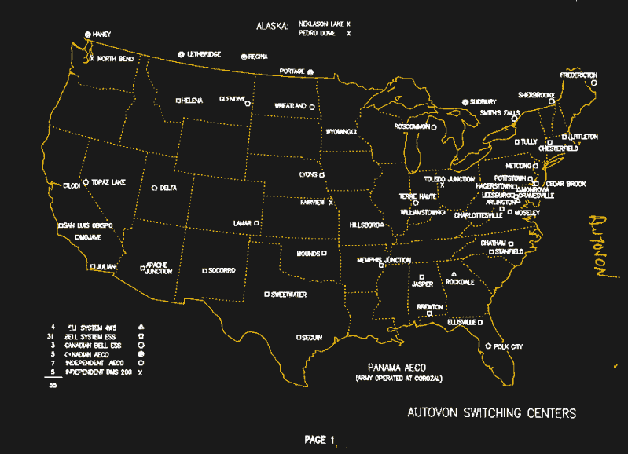
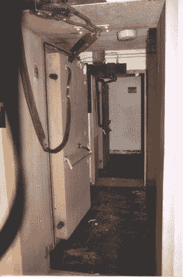
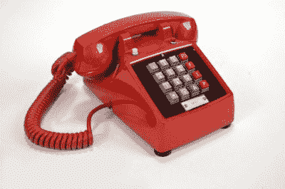

# AUTOVON:适用于军队的电话系统

> 原文：<https://hackaday.com/2020/09/09/autovon-a-phone-system-fit-for-the-military/>

这是一个常见的好莱坞比喻，我们可能都见过:将军，胸前挂满勋章和丝带，盯着大屏幕，屏幕上布满了来袭洲际弹道导弹的荧光痕迹，沮丧地拿起电话，忧郁地说道，“给我接总统。”我们坐在椅子的边缘，思考着必须把坏消息告诉老板是什么样的感觉，我们非常清楚他的反应将会点燃整个世界。

像这样的场景之所以有效，是因为我们怀疑现实生活中的版本可能在冷战期间上演了数十次，而且在正式结束后可能有一两次。这种场景也让我们怀疑，军事和政治领导人掌握的技术远远优于消费者可以获得的技术，其中最主要的是特殊的通信网络，这些网络提供了我们当时只能梦想的功能。

事实证明，美国军方在冷战期间确实拥有不同于其平民同行的更好的电话能力。但正如我们将看到的，后来被称为 AUTOVON 的网络的增强能力并不是来自更好的技术，而是更多地来自复制现有的公共交换电话网络，并使用良好的工程原理，大量的混凝土和少量的偏执狂来保护它。

## 平行线

世界上的军队一直是技术的早期采用者，渴望将最新的科学和技术进步用于国防和政治力量投射的双重任务。通信技术尤其如此，电报、电话和无线电通信在 19 世纪中期到 20 世纪初迅速被军队采用，美国军队当然也不例外。

20 世纪 30 年代之前，美国军事基地之间的大多数连接都是专线，并在一定程度上利用了日益增长的公共交换电话网络。但是，随着第二次世界大战的动员和随后的冷战时期导致军队的地理足迹的大规模扩张以及用户数量的增加，军事规划者看到了依赖民用电话系统的愚蠢，即使在当时也经历了自己的成长烦恼。到 20 世纪 60 年代初，很明显，专用于军队的电话系统是国家安全的优先事项。

后来被称为 AUTOVON 或自动语音网络的设计者面临一个难题。当时正在进行大规模扩建的民用长途电话网络，几乎正是他们为军方提供的服务。但他们也知道公共电话网络的局限性，在国家紧急状态下，恐慌的民众匆忙打电话联系亲人，军事规划者肯定会在这种压力下崩溃。这使得军方无法利用现有网络，因此决定建立第二个长途电话网络，专用于军事用途，但在体系结构上与民用网络相似，并增加了军方所需的功能。

Map of AUTOVON stations in the continental US, c. 1970\. Note the healthy distance between AUTOVON stations and major population centers. Source: [A Secret Landscape: America’s Cold War Infrastructure](https://coldwar-c4i.net/).

就像它本质上复制的 AT & T 长途线路系统一样，AUTOVON 被设计成一系列横跨全国的长途线路。但是，尽管民用系统被设计为从一个城市跳到另一个城市，并为最大数量的付费用户提供服务，AUTOVON 却使用了所谓的“回避路由”来建立一个加固的网络。

They weren’t fooling around. Blast doors on the AUTOVON bunker in Pottstown, PA. Source: [Long-Lines.net](http://long-lines.net/places-routes/PottstownPA/index.html).

AUTOVON 交换站被安全地放置在任何主要人口中心的核攻击范围之外，以确保它们的生存能力。例如，宾夕法尼亚州的 Pottstown 被选为从纽约到洛杉矶的洲际路线上的 AUTOVON 交换站点。它通过同轴线和微波线路与位于西南 35 英里处的费城的重要海军设施相连。

AUTOVON 站点之间的连接主要通过地下同轴电缆进行。这种电缆大部分直接埋在地下，而不是用混凝土包裹，因为这被认为足以保护电缆免受精确攻击。然而，混凝土管道被用来保护 AUTOSEVOCOM 或自动安全语音通信网络的部分，这是一个平行的军事通信网络，旨在只通过加密的流量。

许多 AUTOVON 主站，如前面提到的 Pottstown 站，都配备了巨大的地下空间来容纳所有的电话开关设备。埋葬这些建筑是为了保护它们免受各种灾难，尽管结构的细节清楚地表明了设计者的想法。这些建筑通过装有加固防爆门的竖井与地面相连，有巨大的通风风扇和过滤器来提供正压，柴油发电机可以提供半兆瓦的电力来维持设施的运行。此外，所有设备都安装在减震弹簧上，AUTOVON 站点本来是抵御核攻击的好地方。

## 闪光灯，闪光灯，闪光灯

除了它的回避路由和主要站点的加固掩体之外，AUTOVON 网络几乎与当时的民用电话网络相同。像它的民用对应物一样，它是一个电路交换网络，这意味着它被设计成在发送者和接收者之间建立一个固定的物理路径，并根据需要维持它。因此，它使用了与民用系统相同的开关设备，最初使用的是自 20 世纪 40 年代以来一直在使用的纵横制开关设备。后来，纵横制交换装置被替换为电子开关，这使得 AUTOVON 的一些特殊功能闻名于世。

“Get me the president.” An AUTOVON phone in “Hotline Red” with the extra column of Touch-Tone keys. Source: [AUTOVON.org](https://autovon.org).

电路交换民用网络的缺点之一是，一旦连接建立，它就一直保持连接，直到一方或另一方终止连接。然而，出局电路是一种有限的资源，一旦所有的电路都被使用，电话就无法接通。在紧急情况下，让一名士兵打电话回家给他的爱人不会阻止一名基地指挥官收到来自五角大楼的命令，因此设计了一个优先和优先处理电话的系统。

该方案被称为多级优先和抢占，或 MLPP，提供了五个优先级别。最低优先级是*例程*，它包含了大部分 AUTOVON 流量。上面是*优先级*，接下来是*立即*、*闪光*，最后是*闪光超控*，理论上只有得到总统直接许可的人才能使用。AUTOVON 手机使用特殊的 16 键按键键盘上的第四列按钮访问 MLPP 系统。[使用四个额外的按钮](https://hackaday.com/2019/04/24/house-training-a-military-ta-1024a-field-telephone/)，通过在拨打其余号码之前按下相应的键，为呼叫分配一个较高的优先级别。例程级调用没有键，因为这是系统默认设置。

如果一个呼叫被指定了一个优先级，但没有可用的出局电路，MLPP 系统会搜索一个优先级较低的呼叫占用的电路，并立即断开它。通话参与者会听到一种特有的快速忙音，让他们知道自己被撞了。如果一个去话优先级呼叫的号码正在进行优先级较低的呼叫，则原来的连接会被断开，让优先级较高的呼叫通过。

## 数据包来了

AUTOVON 的建设始于 1963 年，该系统于 1966 年在全国各地的军事基地投入使用。三年后，AUTOVON 开关站在欧洲、日本、韩国、中东和加勒比海地区建成。最终，该系统中有大约 70 个站点，为美国军队和世界各地的盟军提供大部分非安全通信。

但即使最初的系统仍在推出，高级研究计划局的一个小项目正在进行中，这将为 AUTOVON 的最终灭亡埋下种子。这个项目就是 ARPANET，第一个真正的分组交换网络，它将引领互联网的发展，让几乎所有关于 AUTOVON 的东西都过时了。不过，AUTOVON 的最后几块产品还需要近 30 年才能退役，这不仅证明了电路交换网络的持久力，也证明了伟大工程的持久力。