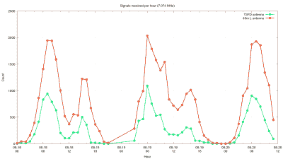

# 将短波天线与 RTL-SDR 和 Python 进行比较

> 原文：<https://hackaday.com/2020/09/05/comparing-shortwave-antennas-with-rtl-sdr-and-python/>

测量天线的绝对性能需要大量昂贵的设备和专业设施。对于实际应用，尤其是构建天线时，比较相对性能更加实际。使用廉价的 RTL-SDR 加密狗和 Python，[Eric Urban]能够[比较两种短波/高频天线的性能](http://www.hydrogen18.com/blog/comparing-shortwave-antennas-with-python.html)，并记录整个过程。

所讨论的两个天线是单频带倒 L 型和更小的宽带 T3FD 天线。[Eric]首先在几天内收集每个人的性能数据，通过低通滤波器连接到具有 RTL-SDR 的独立 PC。这些被设置为接收 FT8 传输，这是一种流行的数字业余无线电模式，允许[Eric]完全自动化数据收集。软件接收器 GQRX 将信号转换为音频，然后通过管道传输到 WSJT-X 进行解调。

 每个接收到的 FT8 传输的数据被记录到一个日志文件中。[Eric]还修改了 GQRX 和 WSJT-X，为他提供了自动改变频率所需的所有遥控功能。在两种天线设置之间，记录了超过 100，000 次 FT8 传输。使用记录的数据和 Python，他比较了接收到的传输的数量、距离和发射机的方向，使用了许多 FT8 传输中包含的位置信息。当两个天线接收到相同的传输时，比较信噪比。

从所有这些数据中，[Eric]能够了解到，在测试的四个频段中的三个频段上，倒 L 形天线的性能优于 T3FD 天线。他还发现，倒 L 型的人似乎对某一特定方向“听不见”。尽管测试并不完美，但令人印象深刻的是[Eric]能够用低成本的硬件收集到如此多的实用数据。

我们最近报道的一些其他 DIY 天线包括用于地球同步业余无线电中继器的混合螺旋天线、偏心偶极天线和由衣架制成的定向天线。因此，前进并尝试驯服射频的黑魔法吧！