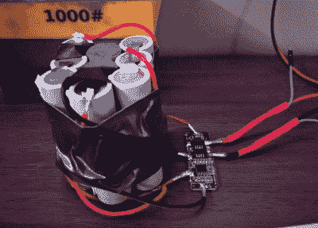

# 构建开源 ThinkPad 电池

> 原文：<https://hackaday.com/2020/09/02/building-an-open-source-thinkpad-battery/>

如果你有一台已经用了几年的笔记本电脑，你可能会考虑换块电池。这意味着你也知道多少合法的 OEM 包成本相比，可疑的易贝克隆。你经常可以买到两三块山寨电池，价格和一块真正的电池一样，但它们的寿命都没有原装电池长。如果它们能正常工作的话。

这就是为什么[Alexander Parent]决定走更少人走的路，并且[scratch 为他的 ThinkPad T420](https://beta.aceparent.me/#/battery)定制了电池。通过对电池组如何与计算机通信进行逆向工程，他推断他将能够开发出一种开源固件，至少可以像第三方运行的固件一样工作。从声音上看，这并不是一个很高的标准。从一个更实际的角度来看，这也意味着他将能够创造一个比商业上可获得的更高容量的电池组。

 一个逻辑分析仪连接在一个第三方电池和一个备用 T420 主板之间，允许【亚历山大】捕捉两者之间所有的 SMBus 对话。在那里，他编写了一些模拟电池的 Arduino 代码作为概念验证。他被一个未记录的 CRC 校验拖慢了一点，但最终他能够拿出一个相当成熟的固件，甚至允许你为你的包提供一个定制的供应商名称和型号。

代码被转移到 ATtiny85 上，一个分压器连接到其中一个引脚，这样它就可以读取电池组电压。[Alexander]说他的固件仍然不能很好地报告剩余的实际电池容量，但对于他的目的来说已经足够了。他想出了一个简单的 PCB 设计来容纳 MCU 和支持组件，最终他计划将它放在一个 3D 打印的外壳中，实际上可以插入他的 T420 的背面。

这个项目显然仍处于相对早期的阶段，但我们非常有兴趣看到[亚历山大]把它进行到底。ThinkPad 一直以来都是黑客们最喜欢的笔记本电脑，我们想不出有什么机器比它更配得上一个完全开放的硬件和软件电池组。