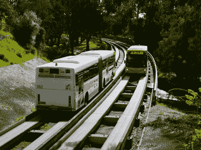
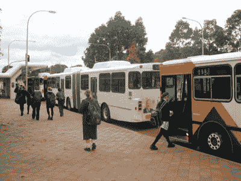
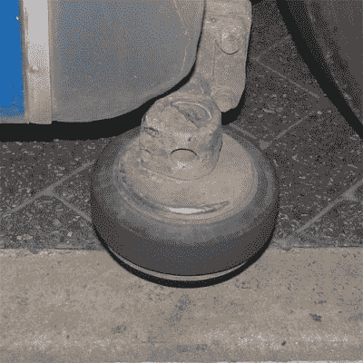
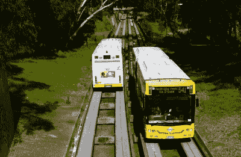

# 地铁公交道——大众的模糊交通

> 原文：<https://hackaday.com/2020/09/10/the-o-bahn-busway-obscure-transit-for-the-masses/>

在世界各地，政府和城市规划者长期以来一直在为交通问题而斗争。让人们及时到达他们需要去的地方是让一个城市成为舒适、有吸引力的居住地的关键。就公共交通而言，这通常包括公路上的公共汽车和铁路上的电车和火车。

然而，在澳大利亚的阿德莱德市，事情变得有点混乱。坐落在一个河谷中的是一个被称为 O-Bahn 的特殊交通网络，公共汽车在混凝土轨道上行驶，司机甚至可以把手从方向盘上拿开。这个系统在世界范围内仍然是一个稀罕物，它是由一场完美的需求冲突风暴催生的。

## 环境的孩子

20 世纪 70 年代，南澳大利亚政府发现自己陷入了困境。面对东北郊区激增的人口，需要更大容量的新交通线路将人们带到中央商业区。20 世纪 60 年代的最初计划呼吁在城市各处修建更多的高速公路来解决这个问题。面对公众的强烈反对，1970 年通过了一项立法，在整整十年内禁止修建任何新的高速公路，迫使政府考虑替代方案。

O-Bahn buses passing at speed near Stephens Terrace. Buses formerly reached speeds up to 100 km/h on the network; [this was dropped to 85 km/h in 2012](https://indaily.com.au/news/2013/10/28/is-the-o-bahn-track-nearing-end-of-life/), adding 20 seconds to the average run. Credit: Lewin Day

尽管计划被搁置，一条从城市延伸到东北的土地走廊已经被征用，用于高速公路建设。这一点被保留下来，并委托进行研究，以确定适合该地区需求的最佳交通解决方案。“东北阿德莱德公共交通评论”建议轻轨或公共汽车道是最好的解决方案。

最初的计划是用一条轻轨电车线将东北部连接起来，这条轻轨电车线将连接从市区到西部的格莱内尔格的现有电车线。然而，阿德莱德市对该计划提出了抗议，认为将现有电车线向东延伸会破坏该市精心规划的结构。计划通过在地下运行部分线路来纠正这一点，这大大增加了成本，该提议被搁置。

就在这个时候，德国埃森的公交导向系统引起了州政府的注意。旨在通过允许公共汽车共享电车隧道来帮助减少拥堵，它开始是一个示范，后来发展成为 [Spurbus 网络。](https://de.wikipedia.org/wiki/Spurbus)该系统提供了比轻轨更低的成本和更高的灵活性，避免了分割城市以接入现有轻轨网络的需要。如果阿德莱德以不同的方式规划其现有的重型或轻型铁路网络，O-Bahn 可能不会被考虑进去。然而，早在 20 世纪 80 年代初，这是一个在众多困难选择中的简单解决方案。

## 它开起来就像在铁轨上一样

Articulated buses are commonly used on the O-Bahn Busway. Credit: [Beneaththelandslide](https://commons.wikimedia.org/wiki/File:Obahn_students_klemzig.jpg), copyrighted free use

O-Bahn 是围绕路边导向公交道的概念设计的，这是一种实践中很少实施的公共交通系统。事实上，它的名字来源于德语单词 bus(*【omnibus】)*和 path ( *bahn)的组合。*

与行驶在铁轨上的火车或行驶在普通道路上的公共汽车不同，O-Bahn 由一条公共汽车行驶的混凝土轨道组成。为了在不影响安全的情况下使道路尽可能的窄，轨道有很大的路缘石。然后，公共汽车配备了导向轮，当公共汽车在轨道上时，导向轮沿着路缘石行驶并控制转向。

Close-up of the rubber guide wheel used to steer the bus when riding the O-Bahn track. Credit: [Beneaththelandslide](https://commons.wikimedia.org/wiki/File:Obahn_guide_wheel.jpg), copyrighted free use

引导式公交道概念有许多引人注目的好处，尤其是轻轨。公共汽车由轨道引导，不需要转向，也不需要在普通道路上看到的宽阔车道。这使得 O-Bahn 母线槽的建造空间比实际空间小得多，同时还允许双向行驶。

此外，预制混凝土轨道比铺设传统铁路轨道更便宜，也更容易建造。在轨道上行驶的车辆只需要很小的改动就可以安装导向轮；几乎任何客车都可以轻松实现这一点。专用轨道使公交车能够保持高速，而不是像其他道路车辆一样陷入拥堵。但是，额外的好处是，由于该系统依赖于轻度改装的公交车，这些车辆可以提供双重功能，既可以在普通道路上行驶，也可以在 O-Bahn 轨道上行驶。这使得服务可以利用高速专用网络，然后无缝过渡到郊区街道，将乘客送到目的地，而无需换乘。

然而，这个系统也有一些缺点。公共汽车往往不如火车耐用，需要更多的定期更换和维护。此外，火车通常具有更高的载客量，每天能够处理更多的乘客。最后，司机们总是有趣地尝试驾驶普通客车在轻轨上行驶——通常是出于意外。

尽管有许多警告信号，每年仍有一到四名驾车者发现自己被困在赛道上。通常情况下，[赛车会落入赛道中央](https://www.facebook.com/7NEWSAdelaide/videos/car-stuck-on-the-o-bahn/497047354033966/)，或者侧着结束，阻碍两个方向的交通。没有已知的未经授权的民用车辆通过轨道到达 O-Bahn 站的成功尝试；这位作者和许多其他人都梦想有一天能实现这样的壮举。要做到这一点，一辆高骑车辆是必不可少的——安装在哈克尼路入口的重型污水收集器可以将普通客车的油底壳撕开。

## 艰难的比较

该系统经常被比作[快速公交系统(BRT)](https://en.m.wikipedia.org/wiki/Bus_rapid_transit) ，这是一种高效的系统，为公交车提供专用通行权和其他功能，以提高服务质量。然而，O-Bahn 的特殊轨道避免了几十年来扼杀 BRT 的问题——随着时间的推移，当地市政当局开始取消单独的公交专用道，将它们重新用于一般交通。这很快就扼杀了 BRT 系统的效率，而且这种情况经常发生，它有一个名字——BRT creep—[,还有自己的维基百科文章。](https://en.m.wikipedia.org/wiki/Bus_rapid_transit_creep)

The system carries an estimated 31,000 riders each day on average, and has been the most consistent public transport network in the post-privatization years since the 1990s. Credit: Lewin Day

然而，O-Bahn 确实有许多共同点——高速、物理上分离的轨道，以及专门的“站”而不是“站”。然而，O-Bahn 可以从 BRT 手册中学到的一件事是场外费用支付。目前，与阿德莱德地区的所有其他公共汽车一样，购票和验证是在上车时进行的。这可能会在交通高峰期间造成重大延误。不幸的是，考虑到 O-Bahn 与公交网络其他部分的集成，实现这一点是不切实际的。

总的来说，O-Bahn 为阿德莱德地区提供了很好的服务，尽管这个想法并没有在全球范围内流行起来。公交车速度很快，大部分时间都很准时，多年来对该系统进行了持续投资，包括 2015 年新隧道建设对城市交通的重大改善。该系统很可能在未来几十年继续为该地区服务。当混凝土铁轨的维护成本低廉，而且随时可以购买新的公共汽车时，没有哪个政府有理由拆除铁轨，代之以铁轨。虽然有轨电车肯定会感觉有点花哨，一条成熟的铁路线会是一个重型解决方案，但沿着混凝土轨道飞行的公共汽车是一个古怪的概念，而且没有什么比这更阿德莱德了！