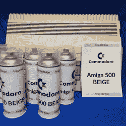

# 复古喷漆:阿米加米色、准将色和雅达利灰色

> 原文：<https://hackaday.com/2020/09/01/retrocomputing-spray-paints-amiga-beige-commodore-and-atari-grey/>

【retro hax】多年来一直提供老式的计算机指导，其中一部分指导是这样的:有时使用油漆作为修复的一部分是不可避免的。但是，与复古硬件单调配色的日子已经一去不复返了，这要归功于[retrohax]提供定制混合喷漆，有[阿米加 500 米色](https://retrohax.net/shop/amiga/spray-paint-amiga-500-beige/)、 [C-64 米色](https://retrohax.net/shop/commodore/spray-paint-commodore-64c-and-64g-beige/)和[雅达利 ST/SE 灰色](https://retrohax.net/shop/atari/spray-paint-atari-xe-st-grey/)。(由于运输限制，目前只能在波兰境内送货，但[retrohax]正在寻找更好的解决方案。)

作为使这些复古颜色可用的伴侣，还有一个简短的如何正确准备和喷漆电脑机箱以获得最佳效果的指南，它稍微谈到了复古硬件配色的挑战，以及如何混合定制油漆使生活变得更容易。黑客们可能重视凑合使用任何可用的东西，但我们也能体会到拥有完全适合这项工作的材料或工具的价值。

我们并不是每天都能看到有人混合定制的喷漆颜色，但是现成的选择并不总是奏效。另一个从头开始制作特殊材料的例子是[专门为激光切割拼图设计的定制胶合板](https://hackaday.com/2017/10/22/seeking-and-making-the-best-plywood-for-laser-cutting-puzzles/)，这样做是因为现成选项带来的麻烦不值得争论。