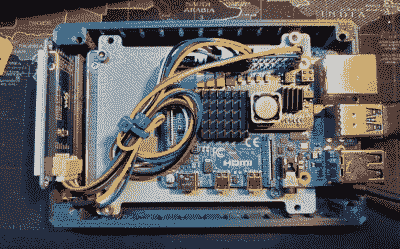

# 一个适合你的树莓 Pi 服务器的液晶盒

> 原文：<https://hackaday.com/2020/09/01/a-cyclopic-lcd-case-for-your-raspberry-pi-server/>

如果你有一个需要托管的个人网站或几百千兆字节的文件，可以使用一个集中的存储位置，与你一直试图找到一个家的路边奔腾 4 盒子相比，树莓 Pi 的小尺寸和极高的能效使它成为一个令人信服的服务器选择。你需要的只是放点东西进去。

 当然，从你的 3D 打印机里挤出来的 Pi 盒子设计并不缺乏，但我们最近发现自己[特别喜欢这个由【肯·西格勒】](https://www.thingiverse.com/thing:4542328)设计的独特盒子。它不仅小巧时尚，还带有一丝未来派风格，还包括一个前置的两英寸 240 x 320 IPS 显示屏，通过 SPI 连接到 Pi。至少，这给了你一种在启动时看到所有那些漂亮的引导信息的方法，[但是用一点代码](https://hackaday.com/2018/03/21/making-pictures-worth-1000-words-in-python/)，它可以给你提供各种系统静态和状态信息。

虽然液晶显示器显然是这里的明星，但这款机箱还有其他一些不错的功能，值得您考虑。例如，顶部的磁性风扇过滤器。将 Pi 直接放在 SSD 上方的堆叠布局也有助于实现相对紧凑的最终产品。

不过有一点要注意的是[Ken]使用的是以太网供电，这意味着箱子上没有专门的电源插孔。这是一个很容易添加到你自己的版本中的特性，但是自然不是每个人的网络都有合适的装备。在这种情况下，除了[编辑 STL 文件](https://hackaday.com/2018/05/16/3d-printering-when-an-stl-file-is-not-quite-right/)的正常烦恼之外，添加一个 STL 文件应该不会太麻烦，而不必*真的*在印刷塑料中开辟道路。