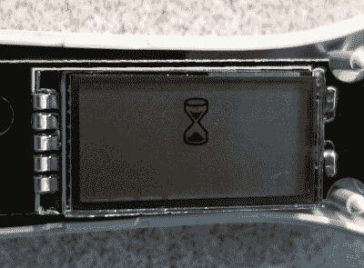

# 数字怀孕测试使用发光二极管来读出字里行间的意思

> 原文：<https://hackaday.com/2020/09/09/digital-pregnancy-tests-use-leds-to-read-between-the-lines/>

[Foone]几周前看到一条推文，声称数字怀孕测试是一种欺骗。常规的廉价测试有一个吸收带，沿着塑料的长度延伸，一端露出来收集尿液。几分钟后，根据尿液中人绒毛膜促性腺激素(HCG)的存在，中间的一个小塑料窗口将显示一条线、两条线或一个加号或减号。

 [事实证明，至少有两个数字测试出来有完全相同的东西，但步骤更多](https://threadreaderapp.com/thread/1301707401024827392.html)。它们没有窗口，而是包含了解释线条的电路，并用简单的英语将结果发布到一个小屏幕上。它甚至可以通过闪烁一个小小的 RTFM 图标来告诉你是否做错了。

[Foone]的拆卸揭示了一个 CR1616 硬币电池，一个 8 位微控制器，和一个小光电晶体管设置，使 led 发光并读取入射光。可惜微操是 mask ROM 版本，所以【Foone】无法[重新编程运行 Doom](https://www.reddit.com/r/nextfuckinglevel/comments/ini2aw/doom_on_a_pregnancy_tester/) 。

最初的推文作者可能不是唯一一个认为数字测试应该更准确的人。我们认为准确性声明更多的是从等式中去除疲惫和/或无能的人类变量。如果测试为你解释了结果，那么就不会弄错结果，这在技术上是更高程度的准确性。但是如果你有疑问，你可以从医生那里得到一个测试。

关于所有这些测试的电子垃圾方面有一些讨论——生产一个微控制器只是为了在上面撒尿并扔掉它是一种耻辱。当然，你可以这么看，但与许多电子垃圾不同，这些是工具。不幸的是，这是业界对更高精确度的想法，但我们应该期待什么呢？只是测试尿液中是否存在荷尔蒙。解读结果取决于观众。我们可能应该感到惊讶的是，他们把成本降低到两个 7 美元。

很多人选择等一段时间再开始传播消息。[有了带蓝牙功能的验孕棒，大家就可以一起发现了](https://hackaday.com/2016/01/14/the-stork-looks-different-than-we-thought/)。

感谢[的提示](https://twitter.com/Foone/status/1301713156822032385)，【杰伊】！