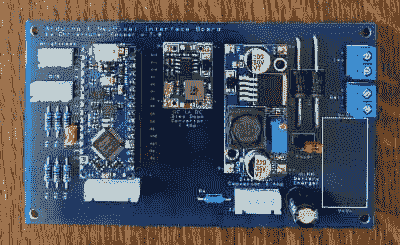

# 数字克里比奇板保存分数，婚姻

> 原文：<https://hackaday.com/2020/09/16/digital-cribbage-board-saves-scores-marriage/>

当[Cooper]告诉他的父母他将重新开始他的电子产品习惯时，他最不希望的事情就是在这个过程中挽救他父母的婚姻。但是他一扔下这个消息，他们就提出了一个特殊的要求:给我们造个东西来代替多功能手动克里比奇板。太暧昧，引发太多争论。

 克里比奇是一种纸牌游戏，根据手牌得分。传统上，分数是用钉子挂在木板上，木板上有两到三组 60 个孔。[为了建造一个数字克里比奇板，【ccooper】决定用链接在一起的 RGBW 矩阵来表示一个区域上的位置](https://www.hackster.io/ccooper/digi-crib-a-digital-cribbage-board-cfc18c)。

这四个矩阵由 Arduino Nano Every 运行，将显示父母通常玩的三种评分方案中的一种。一组八节 AA 电池确保妈妈和爸爸可以在明亮的日光下玩耍，仍然可以看到发光二极管。休息后，你可以在演示中看到亮度如何与太阳匹敌。定制板的代码和 Gerber 文件在那里，如果你想为自己做一个，或者知道另一个需要拯救的婚姻。

每场比赛都应该有完整的记录。[如果你更喜欢 RPG 游戏，看看这个由堆叠的 FR4 板制成的惊人的 stat 追踪器](https://hackaday.com/2020/08/19/building-the-scoreboard-of-your-imagination/)。

 [https://www.youtube.com/embed/3PRLyg-8i9E?version=3&rel=1&showsearch=0&showinfo=1&iv_load_policy=1&fs=1&hl=en-US&autohide=2&wmode=transparent](https://www.youtube.com/embed/3PRLyg-8i9E?version=3&rel=1&showsearch=0&showinfo=1&iv_load_policy=1&fs=1&hl=en-US&autohide=2&wmode=transparent)

通路〔t0〕adafruit〔t1〕