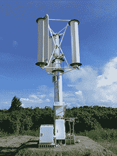
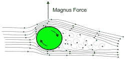
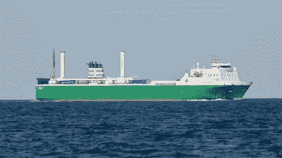
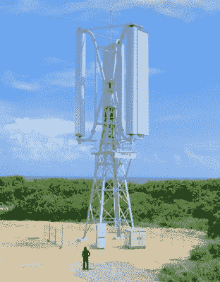

# 抗台风涡轮机能承受狂风

> 原文：<https://hackaday.com/2020/10/07/typhoon-tough-turbines-withstand-wild-winds/>

人们真的开始感觉到，气候变化问题就像一块巨石从陡峭的山坡上滚下来，我们面临着试图逆转它的西西弗式的任务。虽然我们确实需要尽快将地球上的大部分能源转换为清洁、绿色的能源，但这种部署应该是战略性的。你知道，在阳光充足的地方安装太阳能电池板，在多风的地方安装风力涡轮机。在很大程度上，我们已经在这么做了。

A test unit in Okinawa, Japan. Image via [Challenergy](https://challenergy.com)

与此同时，还有一些自然灾害需要应对，其中一些因气候变化而恶化。东亚和东南亚国家经常受到台风的威胁，台风会带来强烈的狂风。一旦风暴过去，它们会留下大片长时间的停电。

研究表明，这些风暴多年来越来越强，导致这些地区现有电力系统更频繁地中断。风力发电是一个理想的解决方案，风暴已经席卷了整个地区，摧毁了传统的电力输送。只要涡轮机本身能够经受住挑战，它们就可以在其他电力供应中断时为微型电网供电。

## 引发台风？

不幸的是，你在平原上看到的传统三叶片风力涡轮机经不起台风的可怕力量。但是垂直轴风力涡轮机可以。虽然它们已经存在了很多年，但它们可能最终找到了自己的位置。

一家名为 Challenergy 的日本初创公司希望正面迎接台风的挑战。[他们建造了一个垂直轴风力涡轮机，它不仅能抵御台风级的风力，还能充分利用这些风力。这些涡轮机不是像辐条或花瓣一样水平放置的叶片，而是通过利用马格努斯效应收集风的垂直圆柱体。](https://www.bbc.com/future/article/20200903-the-wind-turbines-standing-up-to-the-worlds-worst-storms)

The Magnus effect, illustrated. Image via [Wikipedia](https://en.wikipedia.org/wiki/Magnus_effect)

## 给它加点旋转

如果你曾经让一个乒乓球旋转，或者投出一个曲线球，你已经让马格努斯效应开始运动了。1852 年，德国物理学家海因里希·古斯塔夫·马格纳斯首次记录了这一可观测的现象。

马格努斯注意到，旋转物体的路径会因其周围空气的压力差而偏离，这种压力差是由旋转引起的。如果没有尾旋，这种偏离预期弧线的轨迹就不会出现，所以这种偏离标准的现象现在被称为马格努斯效应。

Challenergy 的涡轮机有三个汽缸，由一个电机驱动旋转。电机对圆柱体周围的风产生马格努斯效应，并旋转涡轮机以产生能量。

A Norsepower cargo ship outfitted with rotor sails. [Science](https://www.sciencemag.org/news/2017/09/spinning-metal-sails-could-slash-fuel-consumption-emissions-cargo-ships#)

## 垂直整合

正如我们所说，垂直风力涡轮机本身并不新鲜。几十年来，它们一直被用于为船只和飞机提供动力，[我们甚至推出了一些 DIY 版本](https://hackaday.com/?s=vertical+turbine)。不过，对于这种应用来说，神奇之处在于台风带来的高速风。

除了可以在台风肆虐的地区长期使用，Challenergy 的涡轮机还有几个优点。气缸可以适应任何风向，气缸上有挡板，可以调节以编程马格努斯效应的水平。它们的运转速度比传统涡轮机慢十倍，但结果是，它们的噪音更小，对鸟类的威胁也更小。

从技术上来说，不，它们不像普通的三叶刀那样高效，因为它们需要大约 10%的能量投入来驱动马达。当台风来袭时，回报就来了——市民可以立即获得应急电力，而不必等待几天或几周。

Challenergy turbines are shorter than traditional turbines for now. Image via [The Asahi Shimbun](http://www.asahi.com/ajw/articles/photo/28552286)

## 尺寸重要吗？

Challenergy 的涡轮机高达 20 米，比日本传统涡轮机 80 米高的塔架要短得多。你可以在下面的无人机镜头中看到不同之处。

Challenergy 的涡轮机最大发电量为 10 千瓦，而螺旋桨涡轮机的最大发电量为 3 兆瓦。但是他们并不真的需要很高才能驾驭台风或者对人们有很大的用处。即便如此，该公司正计划制造一个 50 米高的版本，能够输出 100 千瓦的功率。

安装在日本冲绳石垣岛的一台 Challenergy 涡轮机已经有机会证明它的勇气。台风“米塔格”于 2019 年 10 月袭击了日本，涡轮机的传感器记录的风速接近 100 英里/小时(160 公里/小时)，仍低于该公司表示它们设计承受的 156 英里/小时(251 公里/小时)。

Challenergy 创始人兼首席执行官清水厚受到了 2011 年导致福岛核电站三次熔毁的海啸的启发。从那以后，日本政府开始远离核能。清水认为，一场台风产生的电力可以为日本提供 50 年的电力，尽管尚不清楚需要多少台涡轮机，也不清楚它们将如何储存能量。或许是液态空气电池？

目前，菲律宾政府已经签署购买 7 台 Challenergy 的涡轮机，以便用太阳能和柴油发电机制造微型电网。时间会证明一切，我们急切地想知道这个国家一旦运转起来会怎么样。

 [https://www.youtube.com/embed/FZY72pKNzI8?version=3&rel=1&showsearch=0&showinfo=1&iv_load_policy=1&fs=1&hl=en-US&autohide=2&wmode=transparent](https://www.youtube.com/embed/FZY72pKNzI8?version=3&rel=1&showsearch=0&showinfo=1&iv_load_policy=1&fs=1&hl=en-US&autohide=2&wmode=transparent)

