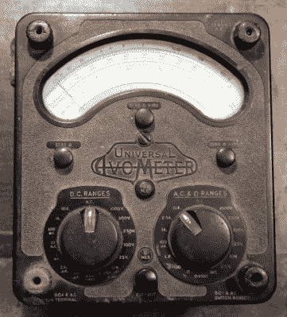
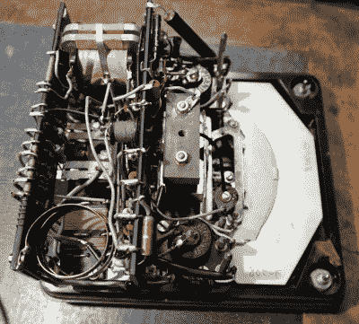
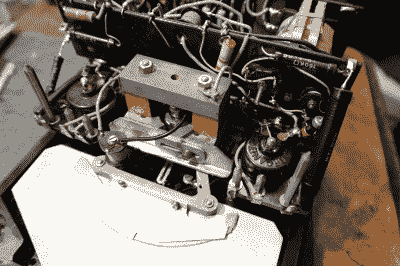

# AVO 8 万用表颂歌

> 原文：<https://hackaday.com/2020/10/27/ode-to-an-avo-8-multimeter/>

我要搬家了，正在把我所有的东西打包进储物箱，然后在接下来的一年里消失在一个黑暗的房间里。也许我可以成为我经常听说的那些数字游民中的一员，在阳光明媚的海滩上发布我的日常故事，而金鱼鱼群则在啃咬我的脚趾。但是在这个略显潮湿的英国秋天，一箱又一箱一生都沉浸在科技中的东西需要分类和整理。我到底为什么要保留三台 20 世纪 70 年代早期的飞利浦 N1500 VCR 系统录像机！(放心吧，那些都找到好归宿了。)

## 向我的一个老朋友问好

Instantly recognisable, the AVO 8

当我收拾我的长凳时，我偶然发现了一个万用表。我有相当多的万用表，[这不是我第一次写关于这些不可或缺的仪器的](https://hackaday.com/2020/09/24/in-praise-of-the-dt830-the-phenomenal-instrument-you-probably-dont-recognise-for-what-it-is/)，但是这个有点特别。

这是我年轻时的宝贝，英国最古老的测试设备:AVO 8。在 20 世纪的大部分时间里，这是一款无处不在的万用表，可以在各种电气和电子车间中找到，直到今天，它仍然是同类产品中质量最高的一款。

这是一个相对较大的胶木盒子，大小约为 190 毫米 x 170mm 毫米 x 100mm 毫米，它的双旋转选择器开关和观察针的窗口可以立即识别，形成了一个典型的圆弧肾形。

我米最早的祖先出现在 20 世纪 20 年代，第一台 model 8 出现在 50 年代初。我的是一辆 Mk III，它的仪表机芯内侧用铅笔写的日期告诉我，它是 1965 年 11 月制造的，我大约在 1991 年从雷丁的[斯图尔特那里买来翻新的，但生产一直持续到 2008 年最后一辆 Mk VIII 下线。令我感到羞愧的是，我的 AVO 有点脏，也许我最近没怎么用它，但当我拿起它时，所有用它修理坏了的电视机和在无线电中进行乐观实验的记忆都涌了回来。如果有一种工具能把我和年轻的未来电子工程师联系起来，那就是它。](http://www.stewart-of-reading.co.uk/)

## 一种非常不同的计量方法

为了充分欣赏 AVO 8，是时候拆机了，看看高质量的模拟万用表是如何制造的，以及在喷气式飞机时代的黎明，这些东西是如何设计的。拆卸它非常容易，几个螺钉允许移除仪表上方一侧的电池盒盖，并且仪表两侧的六个螺钉松开以允许胶木盆从正面移开。

They don’t make ’em this way any more: inside the Avo.

首先值得一瞥的是电池盒，里面有两个不同电阻范围的电池。一个是我们熟悉的 D 电池，另一个是 BLR121，这是一种奇怪的 15 V 电池，曾用于助听器和相机闪光灯等设备。这种电池[仍然可以从专业供应商](https://cellpacksolutions.co.uk/products/battery-packs/cell-pack-solutions-avo-8-multimeter-blr121-battery/)处获得，但另一种选择是加入一个小开关调节器来产生所需的电势。电池盒以及高压端子通过一系列黄铜支架与电表的其余部分接触，当外壳关闭时，这些支架与弹性金属指接合，电池外壳的背面安装有高压降压电阻。

把注意力转向仪表本身，我们马上就进入了另一个时代的电子世界。仪表机芯的满量程偏差为 50 μA，这是一个非常重要的事情，其磁体本身就比许多现代面板仪表的整体还要大。视差镜是一块固定在秤背面的大玻璃镜，手感很好。

Now *that’s* a meter movement!

rotaty 开关没有使用你可能会想到的标签和雨刷方法，而是依赖于一组你可能在老式继电器中看到的弹性铜指触点，这些触点由旋钮机构后部的凸轮推下。底部是一个实质性的切断机制，作为工程质量的证明，它的锁闩有一个红宝石轴承，否则你可能会在腕表中看到。

开关和断路器上方是一对绝缘棒，既可用作布线的焊接标签阵列，也可用作线绕电阻器和分立元件的支撑。还有一个用于交流范围的变压器，以及一个由黄铜带线圈制成的大电流分流电阻。打开工作台上的仪表，周围充满了酚醛树脂的美妙的旧电子产品气味，突然我有一种冲动，想再一次研究上世纪 50 年代的真空管电视。

很明显，AVO 仍然是一个非常高质量的仪器，并且在进入第六个十年后仍然是一个有用和精确的万用表。我感到内疚，因为我为了一个便宜一个数量级的数字仪表而忽略了它。那么，为什么它还留在货架上呢？一个显而易见的答案可能是，作为模拟电表，其 20kω/V 的灵敏度无法与其数字竞争对手的高阻抗相匹配，但这可能不是真正的原因。携带一个轻巧的手持设备比一个中等大小的积木更有吸引力。这就是现代化的真正好处:小型化。我会试着在板凳上多使用 AVO，因为它是一种神奇的乐器。但是它会重新成为我的主要仪表吗？大概不会。毕竟有时候停留在 2020 年比停留在 1950 年更好。