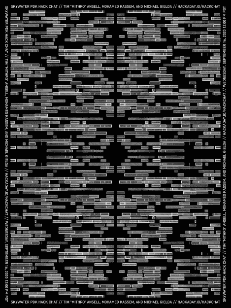

# 天行者 PDK 黑客聊天

> 原文：<https://hackaday.com/2020/09/14/skywater-pdk-hack-chat/>

加入我们太平洋时间 9 月 16 日星期三中午的 CNC 与[蒂姆“米罗”安塞尔](https://hackaday.io/hacker/93504-tim-ansell)、[穆罕默德·卡西姆](https://hackaday.io/hacker/16999-mohamed)和[迈克尔·吉尔达](https://hackaday.io/hacker/1012253-michael-gielda)的[空中飞人 PDK 黑客聊天](https://hackaday.io/event/174186-skywater-pdk-hack-chat)！

我们已经看到在过去十年左右的时间里，制造业民主化取得了令人难以置信的进展。曾经需要庞大的、垂直整合的产业和庞大的工厂来处理的事情，现在通常都可以在台式数控机床和 3D 打印机上完成。开源软件已经将数百万开发者的智慧转化为工具，这些工具可以与工业界使用的工具相媲美，甚至经常超过它们。使用这些工具，并结合按需印刷电路板生产和合同组装服务，你可以很容易地把自己变成一个合法的制造商。

不过，这种推动制造业向常规的乔和约瑟芬靠拢的模式只能到此为止。你的设计很大程度上被限制在一家或另一家大制造商生产的芯片上，这意味着几乎任何人都可以提出同样的东西。多亏了第一个可制造的开源工艺设计套件 [SkyWater PDK](https://github.com/google/skywater-pdk) ，这一切都改变了。借助 PDK 的工具，任何人都可以为 SkyWater foundry 的 130 纳米工艺设计芯片。最棒的是。它是免费的——就像啤酒一样。没错，从今年 11 月开始到 2021 年，你可以免费获得一个开源芯片。

我们确信这一消息会引发一系列问题，所以谷歌的软件工程师 Tim Ansell，化名为“mithro ”,会顺便来 Hack Chat 讨论细节。和他一起的还有首席技术官兼 efabless.com 联合创始人穆罕默德·卡西姆，以及蚂蚁金服[业务发展副总裁迈克尔·吉尔达](https://antmicro.com/)。他们将共同回答您关于这一激动人心的发展的问题，并向我们展示如何将您的愿景变为现实。

 我们的黑客聊天是 [Hackaday.io 黑客聊天群发消息](https://hackaday.io/messages/room/2369)中的社区直播活动。本周，我们将于太平洋时间 9 月 16 日星期三中午 12:00 坐下来讨论。如果时区让你和我们一样困惑，我们有[一个方便的时区转换器](https://www.timeanddate.com/countdown/generic?iso=20200916T12&p0=224&msg=SkyWater+PDK+Hack+Chat&font=cursive)。

点击右边的那个发言气泡，你会被直接带到 Hackaday.io 上的黑客聊天群，不用等到周三；随时加入，你可以看到社区在谈论什么。

