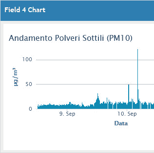

# 这个气象漫威的天气警告和尘埃探测

> 原文：<https://hackaday.com/2020/09/14/weather-warnings-and-dust-detection-from-this-meteorological-marvel/>

我们喜欢用各种不同的方法来获取天气信息，但是你有没有尝试过构建自己的传感器套件来为你收集数据呢？[Giovanni ' cyb 3 rn oid ' Bernardo]需要监控 WiFi 覆盖范围之外的孤立位置。他的希望之光是一个与 LoRa 模块耦合的 ESP32 控制器，将数据传输到可以访问云的远程站。

 除了无线电之外，他还在基站中安装了大量传感器[来读取温度、气压、湿度和微尘](https://www.settorezero.com/wordpress/wepart-stazione-monitoraggio-meteo-polveri-sottili-particolato/)。为什么监测灰尘是气象数据收集的一部分？颗粒物对空气质量有着巨大的影响，这是呼吸疫情期间人们非常感兴趣的事情。对于那些野火附近的读者来说，量化你的空气质量(包括室内和室外)肯定是感兴趣的。[Giovanni]正在使用 SDS011 空气质量传感器[,并且在这一部分有一篇很长的报道](https://www.settorezero.com/wordpress/il-sensore-sds011-e-le-polveri-sottili/)。它使用风扇推动空气通过基于激光的传感机制。

在基站，实时读数显示在有机发光二极管屏幕上，但你也可以通过手机像热点一样连接到 ESP32。如果您安装了存储卡，它会将读数缓存在一个永久更新的 CSV 文件中。在常规操作中，LoRa 模块将遥测数据覆盖到其姐妹单元，该单元充当 Wifi/LoRa 桥，因此任何人都可以在 [ThingSpeak](https://thingspeak.com/channels/1107465) 上实时查看仪表和图表。

我们想对[cyb 3 rn oid]大加赞扬，因为它看到了有害尘埃的严重影响，并制作了一些可以提醒人们的东西。我们不想[给任何人的游行](https://hackaday.com/2018/12/25/the-umbrella-that-tells-you-the-weather/)泼冷水，但是有时候[最好呆在里面](https://hackaday.com/2019/10/19/storm-cloud-lamp-brings-the-weather-inside/)。