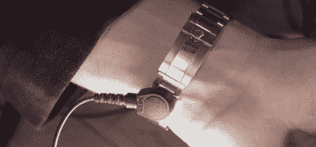

# 劳力士成为世界上最贵的 ESD 表带

> 原文：<https://hackaday.com/2020/09/19/rolex-becomes-worlds-most-expensive-esd-strap/>

对于使用敏感电子设备的人来说，防静电 ESD 腕带是实验室环境中的必备用品。它们是一种简单的保护装置，通常不需要再考虑。然而，[丹尼尔·波格丹诺夫]认为他们可以变得更时尚一点，并着手设计更花哨的设计。

第一步是看一看普通的 ESD 腕带。通常，它们由一个固定在佩戴者手腕上的带子组成，带有一个用于连接接地线的金属螺柱。接地线包含高电阻，以限制放电电流，避免佩戴表带时出现难看的高能短路。

The metal stud is attached to a replacement link on the ROLEX’s strap, making the modification neat, tidy, and reversible.

在对基础知识有了很好的理解后，[Daniel]开始修改卡西欧计算器手表进行练习。在将金属螺柱焊接到表壳上失败后，第二次使用导电环氧树脂的尝试非常成功。手表可以连接到接地带上，静电放电测试仪证实了该设备正在工作。

但不幸的是，永久修改借来的劳力士不是一个选项。相反，[丹尼尔]将他的工作限制在一个可以插入表带的替换链节上。连接到接地带，豪华手表还成功通过了基本的静电放电测试。

[Daniel]指出，虽然这是一个有趣的实验，但使用正确评级的安全设备是最好的。此外，他指出，劳力士可能比卡西欧更糟糕，原因很简单，金属表带的手表在处理电子产品时更容易导致短路。当然，如果你不喜欢手表，[考虑用戒指代替](https://hackaday.com/2020/03/12/one-anti-static-ring-to-delight-them-all/)。休息后的视频。

 [https://www.youtube.com/embed/f3nBl2DrAEA?version=3&rel=1&showsearch=0&showinfo=1&iv_load_policy=1&fs=1&hl=en-US&autohide=2&wmode=transparent](https://www.youtube.com/embed/f3nBl2DrAEA?version=3&rel=1&showsearch=0&showinfo=1&iv_load_policy=1&fs=1&hl=en-US&autohide=2&wmode=transparent)

