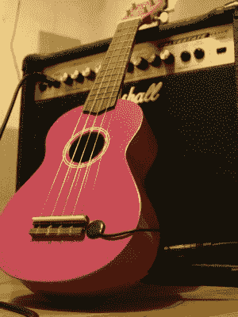
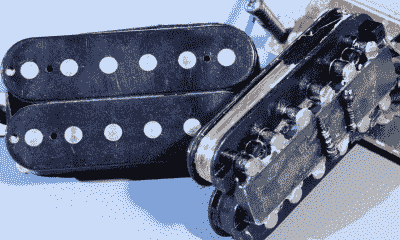
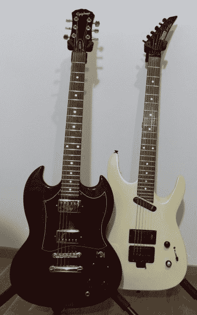
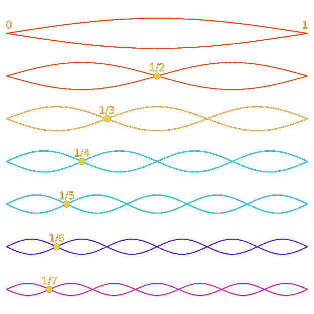
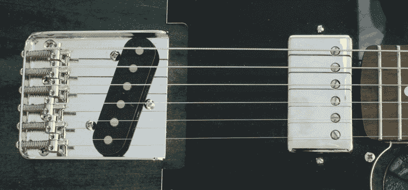
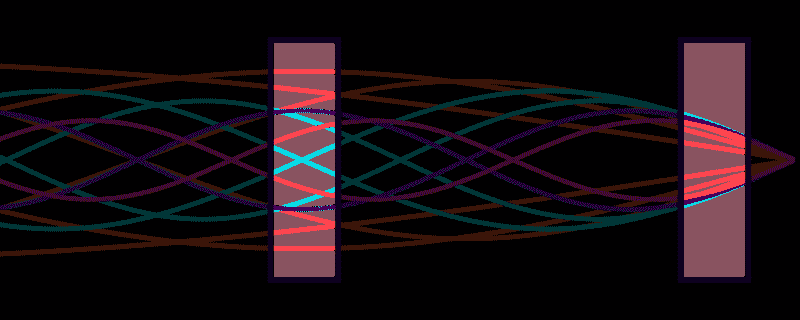
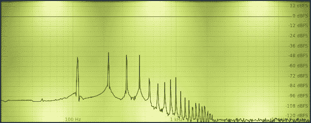
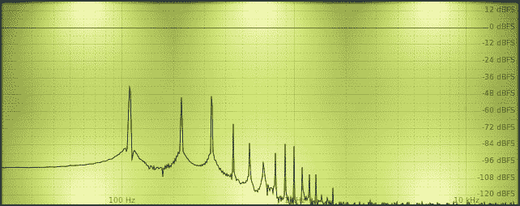
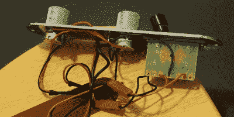
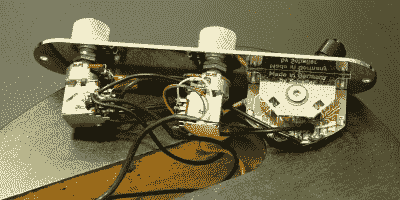

# 斧头黑客:你的电吉他的新声音从什么让他们滴答作响开始

> 原文：<https://hackaday.com/2020/09/22/axe-hacks-new-sounds-for-your-electric-guitar-beginning-from-what-makes-them-tick/>

创作音乐是任何黑客的完美爱好，我们在这里遇到的音乐黑客和自制乐器的数量让这一点变得非常明显。这是一个很好的匹配:你可以完全进入工程模式，因为音乐最终“只是”应用物理，或者干脆忽略所有的理论，通过简单地做任何感觉正确的事情来采取艺术方法。最佳点当然是介于两者之间——扎实掌握一些音乐理论基础不会有坏处，但过多的过度思考最终会造成伤害。

将电子或编程等最喜欢的消遣与创作音乐结合起来的明显选择是在电子音乐领域，尽管构建合成器的声音很有吸引力，但我会选择下一个最好的东西:电吉他。尽管电吉他很受欢迎，但它的巨大潜力很少被充分利用。当寻找那种特殊或独特的声音时，每个人似乎都只关注放大器设置和效果踏板，而吉他本身被视为宇宙赐予我们的不可改变的物体，具有所有注定的神奇特征。拨动拾音器开关，如果我们感觉特别愉快，就让那个音盆旋转一下，就这样。

事情是这样的，吉他的电气系统——或者说布线——在它的库存形式中简单得令人厌烦和普通。当然，这是一个安全的选择，足够好地完成工作，但有这个完全不同的音调变化和个人可控性的世界锁在里面，所有它真正需要的是一个螺丝刀和烙铁来释放它。此外，这可能是一个有趣的应用领域，可以深入到简单的模拟电子产品中，所以即使吉他还不是你喜欢的东西，也可能会刺激你的创造力。如果你更喜欢低音，好吧，让我无知地声明一下，低音只是一把更长的吉他，弦更粗，调得更低，这意味着接下来的一切几乎都适用于低音，即使我谈论的是吉他。

然而，为了修改某些东西，理解它是如何工作的是有帮助的。所以今天，我们将只关注电吉他的基础，也就是说，它们的内部是什么，以及是什么定义和影响了它们的音色。但是不要担心，一旦我们掌握了基础知识，我们就可以在下一次讨论有趣的部分了。

## 电吉他:拾音器和电位计

想必每个人都见过电吉他，知道它们长什么样，但并不是每个人都一定玩过电吉他或关心它们实际上是如何工作的。为了保持物理学的简单性，电吉他的工作原理是移动一个铁磁物体——琴弦——穿过一个固定的磁场——拾音器——它从琴弦的振动中产生一个电信号——实际的声音——然后通过音量和音调控制发送到吉他的输出插头。从这里，信号可以被放大并修改成任何可以想象的形状和形式，这就是放大器设置和效果踏板接管的地方。

Piezo Pickup Heavy Metal Ukulele

铁磁性部分在这里是至关重要的，所以为了让这个工作，你需要钢弦，这就是为什么你不会在电吉他上找到尼龙弦。嗯，至少很少，尽管除了这里描述的*磁性拾音器*之外，还有其他类型的拾音器不依赖于磁通量:*光学拾音器*使用相同的概念，但在琴弦穿过光时拾取它的振动，以及*压电拾音器*拾取琴弦所附着的身体的振动。后者通常出现在弓弦乐器和原声吉他中，但如果需要，您也可以专门为钢弦原声乐器购买磁性拾音器。

那么什么是磁性拾音器呢？本质上，它只是一个大电感，通常在中到高个位数亨利范围内，由磁芯周围的数千个铜线绕组构成。为了给每根弦增加更多的焦点，增加了圆形的*极片*，赋予它们典型的外观。极片或者由钢制成并附在底部的条形磁铁上，或者是杆状磁铁和唯一的磁性部件。有时它们被制成螺丝来单独调节每根弦的高度，有时它们是固定的等长(*平杆*或固定的变长(*错杆*)。然后还有*轨道拾音器*使用单个金属叶片而不是单个电极。如果两者都不可见，它们就被简单地覆盖了。

Humbucker pickups showing the exposed copper wire, its bar magnet, and the pole pieces

铜线绕组的数量、线的规格和磁性材料(通常是陶瓷或铝镍钴合金)及其数量相互影响，决定了其输出信号强度和频率响应，以及由此产生的声音。缠绕模式本身也会有一些影响，但由于现在大多数皮卡都是机器制造的，它不像早期的手动缠绕皮卡那样是一个很大的变量，在早期，缺陷赋予每个皮卡自己独特的性格(以及为什么会有这样一个神奇的神话围绕着它们)。

至于音量和音调控制，音量控制通常只是一个电位计，一端是拾音信号，另一端是地，输出信号在雨刷上。调至 10，雨刮器获得最大音量的阻力最小，调至 0，信号被丢弃。另一方面，音调控制是另一个电位计，它与一个电容器(当然还有拾音器本身)一起形成一个可变低通滤波器，允许我们切断较高的频率，并在声音到达输出插孔的途中将其变暗。

这基本上是电吉他的要点，但在实践中显然还有更多。毕竟，世界上有成千上万种不同的吉他，这不可能是没有原因的。但是选哪个呢？

## 吉他的角色

The object of desire, and the one that could never live up to it

嗯，可能选择吉他的最大因素就是它的外观。当我 11 岁的时候，我在我表哥放在身边的纸质目录上看到了一个 Gibson SG，那就是一见钟情。事实上，我开始弹吉他的唯一原因就是那把吉他。

在玩了几年原声音乐并攒够钱买了一辆电动车后，当地的商店没有我能承受的价格。我去买了一辆二手的 Hohner ST Lynx 超级跑车。几年后，我又试了一次，这次我很幸运，终于骄傲地拥有了最便宜的 G-310 手机。听起来很棒吗？呃，我得说超级巨星绝对是一流的。但是这有关系吗？绝对不行！对我来说，这是有史以来最好的吉他。

因此，尽管是轶事，但毫无疑问，外观会影响你对吉他的感觉，音色可能是次要的。此外，某些吉他与某些流派相关，其心理影响也不容忽视。最后，无论如何，这都是个人品味的问题，如果你只是不喜欢它，所有关于吉他的理论都不会有意义。这就像昂贵的葡萄酒，只是因为它在纸面上很好，并不意味着你真的会喜欢喝它。

可悲的是，人们往往会将个人品味误认为是对与错的问题，导致不合理的激情和徒劳的争论——但我是谁呢？我们都有过关于空格和制表符、 [vi 和 emacs](https://hackaday.com/2016/07/26/editor-wars/) 或者披萨上的菠萝的争论。

我的观点是，音乐是高度主观的，每个人都必须自己定义什么是对的或错的，什么听起来好，什么不好。也就是说，这仍然是关于修改吉他的音调，所以让我们来看一下定义我们稍后将要改变的音调的因素。

## 论声调的起源

假设我们在一把常规调音的吉他上拨开一根弦，这把吉他是一把 A [2] 和一把*基频*为 110 赫兹的吉他。实际情况是，弦以那个基频振动，同时还有许多额外的、重叠的倍频，所以在这种情况下是 220 赫兹、330 赫兹等等。—振幅变化，称为*谐波*或*泛音*。

The harmonics forming on a vibrating string. Original source: [Wikipedia](https://en.wikipedia.org/wiki/Overtone)

它们的确切混音和实际振幅会根据琴弦张力和您实际弹奏的位置(即手指或拨片的位置以及力度)而有所不同。

琴弦张力与弦规以及吉他的*音阶长度*有关，即*螺母*和*琴桥*之间的琴弦长度(或者说是从螺母到第 12 品的两倍长度，以考虑到由于音准原因长度的轻微变化)。与较短的音阶长度相比，较长的音阶长度需要更大的张力才能达到相同的音高，与较细的音阶相比，较粗的琴弦也需要更大的张力，这也影响了您可以将吉他调音到多高或多低。张力过小，弦会摇摆不定，不会产生任何有用的音调，张力过大，会有东西折断——如果你幸运的话，只是弦而不是吉他的琴颈。

String tensions stated for different gauges based on a 25.5″ scale length and standard tuning

这种无序的谐波混合最终会成为我们实际的信号，进而成为音调，这当然取决于决定其频率响应的拾音器属性。

## 近距离观察皮卡

如前所述，绕组数、线规和磁性材料的组合决定了拾音器的频率响应和输出信号强度。例如，较高的缠绕数往往会抑制较高的频率，从而产生较暗、“较暖”的音调。这可以用更高磁通密度的磁芯材料(铝镍钴 II 与铝镍钴 V 或陶瓷)来解决，以获得具有相同电压水平但更少绕组的信号，这导致了铝镍钴 II 拾音器比铝镍钴 V 具有更暖音调的一般想法。

另一方面，降低线规(例如 44 AWG 对 42 AWG)将使更多的绕组适合相同的物理空间，这也改变了线的总长度，从而改变了信号强度和频率响应。所以它们确实是相互作用的，频率响应很少是线性的。毫不奇怪，结果是有大量的皮卡可供选择。

为了让选择不那么多，我们可以把它们分开一点。区分它们的高级类别是它们是*主动*还是*被动*。它主要定义它们是否需要外部电源才能工作，在这种情况下，需要添加有源电路来过滤和前置放大信号。我在这里会忽略有源拾音器，因为添加有源电子设备感觉有点像作弊，我们还不如直接将整个效果添加到吉他上——这并没有什么错，实际上它本身就是一个很好的主题。

Single coil bridge pickup and humbucker neck pickup on a Telecaster. (Note the slanted pickup discussed later.)

主动或被动，无论哪种方式，皮卡有两个主要品种:*单线圈*和*亨巴克*皮卡。单线圈就像它的名字所暗示的那样:一个缠绕在磁铁上的铜线圈。另一方面，亨巴克由两个串联的线圈构成。为什么是这个名字？因为它们抵消了交流电源的干扰，单个线圈可能会拾取交流电源的干扰。为了实现这一点，线圈以相反的方向缠绕，并面对磁铁的相反极性。这样，当实际信号相加时，外部干扰被相位抵消，本质上类似差分信号。

但是拾音性能只是等式的一部分。

## 位置，位置，位置

由于泛音的节点和波腹沿着琴弦分布，每个泛音的振幅在每个位置都不同，所以我们实际上得到的音调也取决于拾音器在身体上的确切位置。最常见的位置是靠近桥、靠近颈部，以及中间的某个地方(如果有第三个位置的话),因此它们分别被命名为桥、颈部和中间拾音器。

The harmonics overlapped, highlighting the rough location of the neck (left) and bridge (right) pickups

如上图所示，我们将在桥接拾音器上获得最宽、同时也是最一致的变化，具有适中的基频振幅，使它们听起来更亮、更尖。另一方面，颈部拾音器有点复杂，更强调基频，导致整体音色更饱满、更暗，偶尔会有变成泥浆的风险。

Spectrum of the A string on a **bridge** pickup

Spectrum of the A string on a **neck** pickup

这种变化在(非科学收集的)频谱图中是可见的，在颈部拾音中有更多的变化。四次谐波尤其引人注目，因为颈部拾音器通常位于四次谐波节点附近。制造商通常用每个位置的专用拾音器来解释这些差异，混合它们可能会产生有趣的结果。

一个值得注意的特例是*倾斜的*拾音器，如 Stratocaster 或 Telecaster 上的桥式拾音器(如上所示)，其中较高的琴弦在靠近琴桥的地方被拾取，较低的琴弦在稍远的地方被拾取，产生一些更亮、更清晰的高音和更深、更诱人的低音。除非你用左手弹奏右手吉他，在这种情况下，你会有完全相反的感觉，这也是为什么吉米·亨德里克斯有如此独特的声音的一个原因。

所以拾音器和它们的位置对吉他的声音有着非常大的影响，到目前为止，我还遗漏了很多关于它们的细节。不要担心，我们最终会谈到它们，但今天，我们将重点关注对声音的其余主要影响:音量和音调控制。

## 但是，但是，关于…

如果你关注任何关于吉他的讨论，你可能会想知道我什么时候会谈到 tonewood，即在新月期间种植的洪都拉斯南部的红木如何在电吉他上创造出与周三收获的萨尔瓦多西部的红木完全不同的音调，以及该类别中的所有其他东西:不同类型的胶水、饰面和彩色颜料如何影响音调，经典的油包纸电容器声音如何优于现代聚酯， 骨螺母的左腿对右腿，以及如何在第 4087 和 6142 线圈绕组之间扭转比利·吉布斯的胡须给你带来*温暖的复古音色*(可能适用爱伦坡定律)。

Wood is overrated anyway. Source: [Moose ON @ YouTube](https://www.youtube.com/watch?v=ugwYbqLYE94)

无数的论坛讨论、博客帖子和视频都在争论这些是否以及如何影响语气，多年后我们仍然不知道。所以，让我们现实一点，如果一件事需要如此多的关注，密集的实验和无数次盲目的测试和比较，以证明或反驳某件事是否有任何影响，而所有这些努力的主要结果只是更多的人试图证实或否定这些结果，那么对它的整体情况来说，只有一个合乎逻辑的结论:这根本无关紧要。

“吉他手应该有一副枫木般的身材”从来没有人在演出或听真正的歌曲时这样说过。如果你相信某些特定的木材、漆面或电容器优于另一些，那很好，如果你不相信，那也很好。让你开心的事可能是正确的选择。据我所知，听到差异或缺乏差异也可能是遗传的，就像肥皂香菜或臭芦笋一样——讨论当然同样令人愉快。

因此，让我们坚持更相关和有趣的部分。另外，反正都是无源元件容差。

## 旋钮抚弄

如前所述，音量控制是一个电位计，音调控制是一个由带电容的电位计制成的低通滤波器。确切的配置取决于吉他，虽然单个主音量和主音调控制可能是最常见的一种。然而，例如，许多吉布森每个拾音器都有一个专用的音调和音量控制，而 Stratocaster 有一个主音量和一个单独的音调控制，用于颈部和中部拾音器，并有一个共享的电容器。其他人可能会完全放弃音调旋钮，低音经常取代拾音器开关，有利于每个拾音器的专用音量控制。

无论如何配置，电位计的元件值(对于无源拾音器)通常在 250 kOhm 至 1 MOhm 之间，电容值通常在 10 nF 至 100 nF 之间。单线圈拾音器的经验组合是 250 千欧电位计和 47 纳法电容，亨巴克电容分别为 500 千欧和 22 纳法。

Stock wiring of a Telecaster (clone)

为什么会有这种变化？回头看看拾音器的特性，更多的线圈绕组抑制了较高的频率，由于亨巴克器由两个串联的线圈组成，它们自然具有更高的总绕组数。因此，与 humbuckers 相比，单线圈通常产生更明亮、更清脆的声音，这可能是一些人更喜欢的，也是它们存在的原因，尽管它们有嗡嗡声的缺点。因此，不同值组合的想法是为了补偿这一点:通过更彻底地切断高频来避免单个线圈变得过于尖锐，同时通过更逐渐地切断它们来防止亨巴克声音变得过于模糊。

当然，在现实中，事情要复杂一点。但问题是，无论如何，数字不会让你走得太远，因为皮卡制造商对细节不太透明。他们可能会陈述 DC 阻力和使用什么磁铁，但这是它的大部分时间结束。您可能会得到一些粗略的高音、中音和低音图表，以及相对输出信号强度，以便在它们的拾音范围之间进行比较，但您无法在任何数学公式中填充任何内容。不过，这也没有多大意义。首先，在整体布线中有很多其他变量在起作用，更重要的是，数字很难告诉你什么对你来说是好的。

A slightly different wiring

再一次，这一切都归结于个人口味，反复试验是确定答案的方法。它的好处是，在塑造吉他音调的所有组件中，音量和音调控制是我们最容易修改并产生显著影响的组件——而且我们很可能已经拥有了所需的一切。我的意思是，当然，你可以打开拾音器，重新上不同的发条来改变音调(如果这真的是你的事情，[你也许应该让我们知道](https://hackaday.com/submit-a-tip/))或者干脆买个新的。但有时，在正确的位置更换一个电容或增加一个电阻，可能就能让音调变得悦耳。

## 下次

现在，我们已经介绍了电吉他及其音色的基础，下一次我们将开始进行一些真实世界的音色修改。我们将更多地研究一些改变音量和音调控制行为的方法，一些它们一起使用的替代选项，以及如何完全扭曲拾音器布线。

从这个意义上说，请继续关注——但不一定是在 EADGBE。