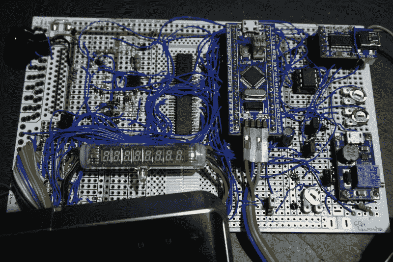

# 卡西欧电脑改造把新酒装进旧瓶子

> 原文：<https://hackaday.com/2020/09/18/casio-computer-rebuild-puts-new-wine-in-an-old-bottle/>

有了大量来自易贝的老式消费电子产品，重温你的光辉岁月应该很容易，对吗？不幸的是，时间的推移意味着找到工具很容易，但找到有用的工具却不容易。当[阿门]获得不是一个，而是两个二手计算器/计算机单元，希望最终有一个工作装置时，情况也是如此。相反，他走进兔子洞[重新设计他自己的电子设备来驱动这里看到的卡西欧 QT-1](https://trochilidae.blogspot.com/2020/09/casio-cq-1.html)。

特别有趣的是替换板的原型制作过程。[阿门]在其核心部分使用了“blue pill”STM 32 微控制器板，并在矩形原型板上对其余电路使用点对点焊接。该电路并不简单，需要一个 23 V 电源来驱动计算机的原始 VFD，一个电池供电的实时时钟(MCP7940)，以及一个 GPIO 扩展器来扫描键盘上的按键。

它工作得很好，但不能被削减以适应情况。解决方案是设计一个 PCB，以适应原来的足迹。现代的内脏仍然需要更多的固件工作和一些调整，如将 23 V 轨稍微提高到 26 V 以获得更好的亮度，但这项工作已经保证了“它活着”的疯狂叫声。

这不是[阿门]的第一次竞技。早在三月份，我们参观了另一个老式卡西欧 refurb，它嗅出了显示协议。