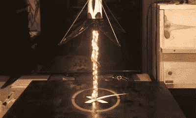

# 猎鹰 9 号灯在客厅着陆

> 原文：<https://hackaday.com/2020/09/18/falcon-9-lamp-is-touching-down-in-the-living-room/>

我们许多人都受到了猎鹰 9 号助推器的视频的启发，它有一栋办公楼那么高，骑着一根火焰柱降落在肯尼迪航天中心或 SpaceX 在海洋中的一个浮动着陆台上。我们并不经常看到科幻小说的幻想在如此短的时间内变成现实，虽然他们可能不会对可重复使用的火箭的实用性感兴趣，但即使是最持怀疑态度的观察者也不得不承认这是一个不可思议的工程壮举。

虽然它不能与实物相提并论，但这款由[迈克尔爵士 II]设计的[1:60 比例的猎鹰 9 灯保证每次你开灯时都能给家里带来一点兴奋感。将可重复使用的助推器的临时模型与一些 RGB LEDs 结合起来，悬停的画面再现了高耸的火箭在其可展开的着陆腿上停止之前紧张的最后几秒钟。我们可以想象，对于在家观看的 SpaceX 工程师来说，这些最后的时刻似乎也是永恒的。](https://hackaday.io/project/174772-spacex-falcon-9r-lamp)

The LED “exhaust” without the fluff.

[迈克尔]引导读者组装猎鹰 9 号模型，它巧妙地使用 2 英寸的白色 PVC 管作为机身。毕竟，当你在五金店花几块钱就能买到一个长长的白色圆柱体时，为什么还要浪费时间和材料去打印呢？

用 Thingiverse 用户[twuelf ing]【T1]的 3D 打印细节装扮起来，再泼上一点油漆，它就成了一个非常令人信服的模型。虽然管道的直径对于声称的 1:60 比例来说不太*合适，但除非埃隆·马斯克来你家闲逛，否则我们认为没人会注意到。*

火箭用一根螺纹钢棒连接到发射台上，在钢棒周围[迈克尔]缠绕了一米长的由 Arduino Uno 控制的 RGB LEDs。使用一些聚酯纤维填料作为扩散器，并编写一些代码来使 led 闪烁，他能够产生一种逼真的“火焰”，看起来像是来自猎鹰 9 号的中心引擎。虽然我们承认它可能不是一个传统意义上的好灯，但它肯定在风格上得到了加分。

我们实际上已经看到过类似的技巧被用于点燃乐高土星五号和阿波罗登月舱的引擎。这种效果的逼真程度令人惊讶，我们希望看到它被更多地使用。我们也希望看到[更多的模型火箭实际悬浮在发射台上方](https://hackaday.com/2020/02/25/levitating-starship-model-comes-in-for-a-landing/)，但是一步一步来。