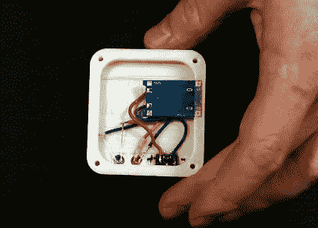

# 为佳能 NB-4L 电池打造 USB-C 充电器

> 原文：<https://hackaday.com/2020/09/23/building-a-usb-c-charger-for-canon-nb-4l-batteries/>

USB-C 最吸引人的一个方面是，它有望成为一个统一的供电系统。您将不再需要为您的手机、相机和笔记本电脑配备单独的电源线；在物理上，它们都将使用 USB-C 连接器，充电器中的电路将知道每个小工具需要多少电量。但事实上，我们都至少有一些旧设备，我们不会仅仅因为它不支持最新的 USB 规范就把它们扔进垃圾桶。

Note the relocated status LEDs.

一个典型的例子是，[Purkkaviritys]改装的老式佳能相机，可以拍摄红外照片。他没有放弃它，而是决定为它的 NB-4L 电池定制一个 USB-C 充电器。由于它们只是单节 3.7 V 锂离子电池，他所要做的就是将它们连接到无处不在的 TP4056 充电器模块，并设计一个 3D 打印的外壳来将所有东西放在一起。

他做了额外的工作，用嵌入 3D 打印外壳的 5 毫米 led 取代了 PCB 上的 SMD 充电指示灯 led，不过如果你很着急，你当然可以跳过这一步。我们设想，如果你用足够亮的颜色打印外壳，你应该能够透过塑料看到原来的发光二极管。

这个项目是另一个证明 TP4056 模块真的非常有用的例子。如果你甚至有可能[想在不久的将来制造一个可充电的小工具](https://hackaday.com/2018/09/03/arduino-powered-portable-function-generator/)，你应该准备好一些这种便宜的电路板放在零件箱里。