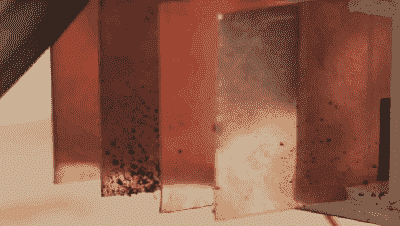

# 道路污染不仅仅来自废气

> 原文：<https://hackaday.com/2020/09/25/road-pollution-doesnt-just-come-from-exhaust/>

来自伦敦帝国理工学院和皇家艺术学院的创新设计工程校友希望提高对我们很少考虑的[道路污染源的认识:](https://www.thetyrecollective.com/)轮胎磨损。仔细想想，很明显。我们的轮胎磨损了，这必须去某个地方，但让我们惊讶的是它发生的速度有多快。一次性塑料是海洋污染的最主要来源，但轮胎微塑料是淘气名单上的下一个。该团队称自己为轮胎集体，他们正在研究一种从源头收集轮胎颗粒的装置。

当你开车时，轮胎会带正电，就像范德格拉夫发电机一样，所以研究小组假设收集废物的最有效方法是在塑料放电的地方安装静电充电板。道路灰尘应该通过，而不是粘着系统，因为它是不带电的。奇怪的是，混合动力汽车在这种污染方面比 100%汽油汽车更危险，因为它们必须支持电池和电动机。

当轮胎粉尘被收集起来时，它不会被倒掉，因为它可以被重新用作[颜料](https://hackaday.com/2020/04/20/measuring-sharpie-thickness-the-ink-itself-not-the-pen/)甚至被提炼回[新轮胎](https://hackaday.com/2019/08/02/hackaday-podcast-029-your-face-in-silver-sand-tires-of-the-future-esp32-all-the-cnc-things-and-sub-in-a-jug/)。他们在实验室环境中收集了 60%的抛出粒子，并且他们正在改进。恶有恶报。