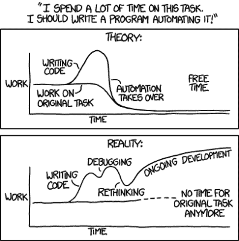

# 黑客代码

> 原文：<https://hackaday.com/2020/09/19/code-for-hackers/>

Mike 和我谈到了我们最近共同完成的两个非常相似的时钟项目:它们都使用 ESP8266 模块通过 WiFi 和 NTP 获取时间，但都失败了。迈克的失败是因为他用不同的 WiFi 凭证拜访不同时区的亲戚，我的失败是因为夏令时让我措手不及。在这两种情况下，我们都硬编码了可以明显改变的东西，但是我们得出了截然不同的结论。

Mike 认为他可以通过一个强制门户来解决他的 WiFi 问题，也许还需要设计一些网络界面来配置时区。非常干净、专业的解决方案。我吗？我在代码中得到了很好的注释，可以在几分钟内找到 UTC 偏移量(或 WiFi creds ),并通过获取 USB 电缆简单地刷新新版本，这是一年发生两次的事情。几乎不值得费心去拼凑一个 web 界面。

There’s an XKCD for everything.

我们无意中遇到了一个跨越硬件和软件世界的难题:灵活性是应该向最终用户公开，还是应该向能够窥视内部或开放源代码的黑客公开？(如果最终用户是黑客呢？)在项目复杂性和易用性方面，权衡是什么？

在这件事上，迈克站在正义和善良的一边，而我是异教徒。我并不总是写可扩展或可重用的代码。我有时会把它写出来，以便在需要的时候快速重新编辑和修补。是不是充满了神奇的数字？当然可以！但我知道它们在哪里，也知道如何改变它们。见鬼，大多数甚至在它们自己的头文件中有很好的记录。你可能很快就能算出来。我的岳父可以调整时区吗？没有。但这不是他的项目。

敢为黑客编码！不要过度概括或过度抽象。少即是多。不要害怕编辑代码。当情况发生变化时，进行调整、编译和重新刷新。毕竟，这是您最初获取代码的方式。

尽管我站在了历史错误的一端，但在这件事上，我是对的。你看，在夏令时再次到来之前，我本可以利用那个我都懒得编码的门户网站，我的儿子上了一年级。从硬件到软件，一切都需要改变。我会用灵活的时间制度编写下一个版本吗？像我需要的那样灵活，但不能更灵活。

This article is part of the Hackaday.com newsletter, delivered every seven days for each of the last 200+ weeks. It also includes our favorite articles from the last seven days that you can see on [the web version of the newsletter](https://mailchi.mp/hackaday.com/hackaday-newsletter-649368). Want this type of article to hit your inbox every Friday morning? [You should sign up](http://eepurl.com/gTMxQf)!