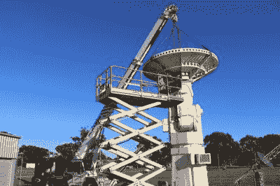

# 从废料堆中保存的历史卫星跟踪器

> 原文：<https://hackaday.com/2020/09/21/historical-satellite-tracker-saved-from-scrap-heap/>

在一些罕见的澳大利亚太空新闻中，阿纳姆兰历史协会已经设法从废料堆中挽救了一个 20 世纪 60 年代和 70 年代使用的卫星追踪器。随着 20 世纪 50 年代和 60 年代太空竞赛的加剧，每个国家都想从这项新技术中分得一杯羹。许多欧洲国家以欧洲发射装置开发组织 [ELDO](https://en.wikipedia.org/wiki/European_Launcher_Development_Organisation) 的形式联合在一起。

澳大利亚是这个项目的合作伙伴，在南澳大利亚的 T2 伍默拉 T3 发射了欧罗巴 1 号和欧罗巴 2 号火箭。最初，英国取消的[蓝条纹](https://en.wikipedia.org/wiki/Blue_Streak_(missile)) IRBM 计划为 Europa-1 提供了第一级，但后来被法国的 *Diamant* 取代。除了德国研制的*Astris*第三级外，法国还提供了科拉莉第二级。

The satellite tracker being dismantled at the South Australian defence base before it was trucked north. (Photo: Arnhemland Historical Society)

欧罗巴 1 号的首次发射发生在 1966 年，火箭表现良好，但雷达站的不准确读数导致火箭被错误地指示自毁。在九次发射中，有四次是成功的，由阿纳姆兰的卫星跟踪器提供跟踪支持。最终，许多技术上的挫折导致了 ELDO 的灭亡，它在 20 世纪 70 年代被并入现在的欧洲航天局，它的主要发射场在法属圭亚那的库鲁。

尽管没有成功，但在伍默拉的早期，欧洲在阿丽亚娜火箭的开发中获得了成功。伍默拉的火箭时代可能还没有结束，美国宇航局[已经宣布 2019 年](https://www.abc.net.au/news/2019-05-31/nasa-to-launch-rockets-from-remote-northern-territory-site/11169960)计划使用伍默拉进行发射。

也许有一天，阿恩赫姆兰会有自己的太空港，展示旧的卫星轨道来回忆那些早期的日子。

[上图:ELDO 卫星跟踪器在 20 世纪 60 年代站在戈夫时是最先进的。(提供:阿纳姆兰历史学会)

(谢谢，大卫)