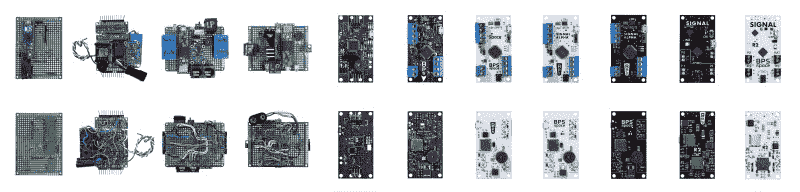

# 高级火箭飞行计算机模型到达星星

> 原文：<https://hackaday.com/2020/10/02/advanced-model-rocket-flight-computer-reaching-for-the-stars/>

当你像乔·巴纳德一样建造和发射各种先进的火箭模型时，你不会想花时间为每种火箭配置建造(和调试)专门的飞行计算机。这个挑战让他创造了 [AVA(全车辆航空电子设备)](https://www.youtube.com/watch?v=qaWvCy2DRSA)，一个令人印象深刻的火箭飞行计算机模型，他打算在他未来的所有火箭上使用。

[乔]的所有火箭都具有主动稳定和制导功能，以及使用各种传感器的综合遥测技术。板上有三个通过 I2C 或 SPI 连接的独立微控制器，每个微控制器都有自己的微型 USB 端口。两个较小的微控制器都是 ATSAMD21s，也用在 Arduino Zero 上。第一个用于 GPS 和惯性导航，并使用来自机载和外部传感器的数据，如两个 IMU(一个是备份)、GPS 和气压计，以估计火箭的位置、速度和姿态，第二个用于遥测，并通过蓝牙调制解调器或远程 900 Mhz 无线电处理所有外部通信。主处理器(MPU)是恩智浦 MK20DX256(也用于 Teensy 3.2)，它从其他微控制器接收数据，并处理所有实时操作和控制输出。

AVA’s predecessors

[Joe]在休息后的视频中非常详细地概述了电路板、其功能以及他的一些设计选择背后的原因。选择大部分传感器和微控制器的部分原因是他的经验。这三个微控制器都有 Arduino 引导加载程序，这也是因为熟悉这个框架。AVA 是[乔]制造的飞行计算机[系列中的第 12 台，很明显，大量的工作和来之不易的经验被投入到设计中。【乔】的视频信息密集得令人难以置信，但仍然很有娱乐性，他在过去几年里取得的进步令人惊叹。AVA 是一个更大项目的一部分，在那里[乔]将尝试垂直降落他的火箭之一。我们已经完成了项目的另一部分，一个升级的发射台](https://bps.space/avionics)。他还试验了名为 *[THOOMP](https://hackaday.com/2020/03/16/silo-launched-model-rocket-goes-thoomp/) 的发射井发射火箭。*

 [https://www.youtube.com/embed/qaWvCy2DRSA?version=3&rel=1&showsearch=0&showinfo=1&iv_load_policy=1&fs=1&hl=en-US&autohide=2&wmode=transparent](https://www.youtube.com/embed/qaWvCy2DRSA?version=3&rel=1&showsearch=0&showinfo=1&iv_load_policy=1&fs=1&hl=en-US&autohide=2&wmode=transparent)

