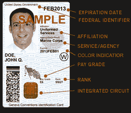
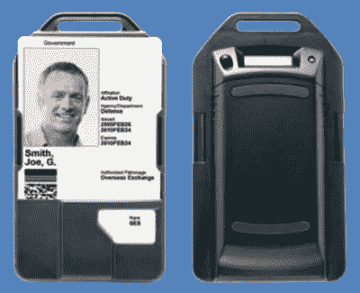
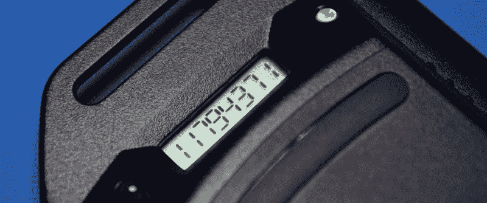
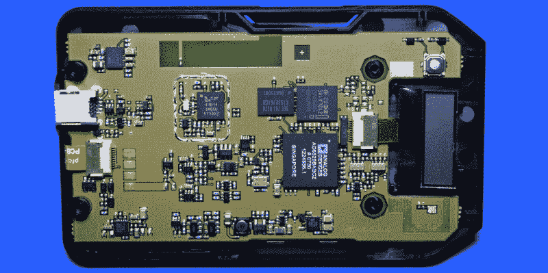
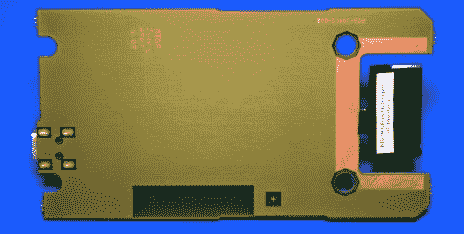
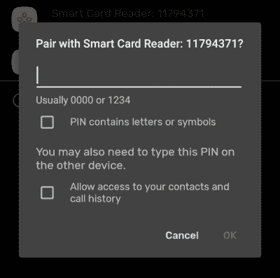

# 拆卸:黑莓智能卡读卡器

> 原文：<https://hackaday.com/2020/09/28/teardown-blackberry-smart-card-reader/>

在史蒂夫·乔布斯展示第一代 iPhone 的几年前，黑莓已经是移动专业人士的必备配件。当时，没有人担心在移动设备上看电影或玩最新的游戏，他们只是想要一种安全、快速的方式在旅途中收发电子邮件。为此，黑莓是王者。

快进到今天，这家公司只是一个曾经的空壳。他们甚至不再费心制造自己的硬件。在过去的几年里，他们选择与一系列越来越不知名的制造商合作，生产一些乏善可陈的 Android 手机，这样他们仍然有东西可以卖给他们日益减少的用户群。有人对德州初创企业 OnwardMobility 正在开发的新 5G 黑莓手机感到兴奋吗？你之前知道它在计划中吗？

A DoD Common Access Card

但是这篇文章不是关于黑莓手机的。这是一个与消费者更不相关的东西:黑莓智能读卡器。从技术上来说，这款小设备并不依赖于同名手机，但 Research In Motion(最终更名为 BlackBerry Limited)以其最受欢迎的产品品牌来销售这款设备是有道理的。尽管如你所料，如果你需要一个专用的智能卡读卡器，你几乎可以肯定你拥有的黑莓手机可以使用软件。

对于那些可能不知道的人来说，这里的智能卡是包含在 ID 卡中的双因素身份验证令牌。这些卡被国防部等组织广泛使用，在那里它们被称为普通访问卡，要求你在登录安全的计算机系统之前将你的 ID 卡插入读卡器。这种时尚的设备作为便携式阅读器销售，可以通过 USB 或蓝牙连接到计算机。通过附带的挂绳挂在脖子上，电池供电的读卡器允许卡本身留在用户的身上，同时仍然可以被附近的设备读取。

平民将认识到现代“芯片和密码”借记卡和信用卡的基本技术，但我们从来没有为了登录而将其中之一插入我们的笔记本电脑。可以肯定的是，BlackBerry 智能卡阅读器从来不是为普通家庭计算机用户设计的，它是卖给有严格安全要求的公司和组织的；这些地方很可能已经在使用黑莓手机了。

当然，时代和技术在变。这些设备曾经每台 200 美元，被大量购买以分发给信任的人员，但现在几乎一文不值。即使在新的和未开封的条件下，他们可以有低至 10 美元的易贝。对于这个价格，它当然值得一窥内部。也许黑客社区甚至可以为这些曾经的尖端设备找到新的应用。

## 赛博朋克配件

黑莓智能卡读卡器看起来就像我期待的那种未来军事力量用作身份验证设备的东西，其设计不知何故既简单又激进。如果有人告诉我这东西是机械战警或 T2 法官德雷德的道具，我会相信。

Promotional shot, circa mid 2009.

至少这个版本是这样的。看起来硬件改变了很多次，每一个看起来都很不同，没有人会分不清哪个是哪个。从物流的角度来看，可以肯定这是故意的。我们看到的样本是 2009 年发布的第二版。

智能卡插入设备前面的凹槽中，这使它保持安全，同时仍然完全可见。实际上只有芯片本身所在的卡的下部被覆盖。

在阅读器的前面没有任何类型的控制或指示器。乍一看，你甚至会认为它是某种被动的卡持有者。这也是问题的关键。如果它被闪烁的 led 和指示器覆盖，国防承包商就不会整天戴着它，[只有现代黑客才喜欢那种东西](https://hackaday.com/2018/08/20/badgelife-the-hardware-demoscene/)。

背面有一个小液晶显示器，一个三色 LED 和一个按钮。轻按该按钮可打开蓝牙收音机，并在液晶屏上显示 PIN 码，同时按住该按钮可重置设备。没有电源按钮，只要电池没有耗尽，这款设备就会一直开着。虽然过了一会儿，它会进入某种睡眠模式，并在液晶显示器上显示“关闭”。

The Reader’s Bluetooth PIN is a bit more secure than the traditional 0000.

## 专为企业打造

取下电池盖后面的四个 T6 螺丝后，BlackBerry 智能卡读卡器很容易拆开。甚至没有任何螺丝头上的防篡改标签，坦率地说，对于一个高安全性的设备来说，这让我感到惊讶。

在里面，我们看到了一个简洁的 PCB 设计，甚至没有一丝丝印标记来帮助我们找到方向。没有明显的编程头或调试点。如果曾经有一个电路板布局说“内部没有用户可维修的部件”，这将是它。有趣的是，虽然显然有一个地方可以安装，但环绕 CSR 41B14 蓝牙芯片组的射频屏蔽并没有安装。

展会的明星似乎是 ADI 公司的 AD6529BABCZ，但我无法找到任何关于这款芯片的文档。但我确实提到了 AD6528，这是一款用于手机和 PDA 的 GSM 基带处理器。

起初我以为这是不相关的，但仔细观察芯片的一些特性，就会发现它与智能卡阅读器有着有趣的相似之处。AD6528 采用 32 位 ARM7 处理器，内置片上 RAM、显示接口和集成 USB 支持，并提供各种低功耗模式。当然，它也支持与 SIM 卡接口，SIM 卡本身与智能卡中使用的芯片非常相似。AD6528 的尺寸和封装也与 AD6529 相匹配。

鉴于这些事实，我们可能会考虑专门针对这种高安全性应用定制的 AD6528 版本。当你试图向国防部出售一种设备时，制造一种新的芯片几乎是不可能的。这个版本的芯片甚至可能已经被提升到工业或军事/航空等级。

在 AD6529 旁边有一个[英特尔 320W30 闪存芯片](https://www.rocelec.com/part/INTPH28F320W30TD70)，它可能持有该设备的固件，还有一个[三星 K1S32161CD SRAM 芯片](https://www.findchips.com/detail/K1S32161CD-BI700/2372-Samsung%20Semiconductor?quantity=1)。

## 保持整洁

毫无疑问，黑莓智能读卡器最令人印象深刻的特点是它有多薄，尤其是考虑到它的设计和制造时代。这部分是因为 PCB 背面完全没有任何东西，这使得它可以尽可能紧地抵住外壳内部。

    

仔细观察芯片接口，还可以看出设计者是如何避免在器件上放置实际的电源开关的。当卡完全插入读卡器时，按下一个微型开关。我们没有在 VeriFone 925CTLS 支付终端的芯片阅读器内看到这个[，因为没有理由关闭硬件。但在电池供电的设备中，当卡不存在时让硬件休眠的功能将大大增加运行时间。](https://hackaday.com/2019/07/08/teardown-verifone-mx-925ctls-payment-terminal/)

说到电池，如果他们没有使用当代黑莓手机使用的 1150 毫安时 C-S2 电池，他们可以让黑莓智能卡读卡器变得更薄，尽管考虑到他们的客户可能已经从他们的手机中储备了电池，这是一个聪明的决定。

## 将它投入使用

实际上，这个设备内部的组件在这一点上都太陈旧了，如果你想尝试智能卡，除了芯片接口本身，没有太多东西可以利用。这个外壳可能会被重复使用，它已经有了黑莓 C-S2 电池的接口和电池盒。但是，除非你正在构建一个 DIY 智能卡阅读器，否则我不确定这种外壳设计还能适用于什么。

Oddly, the PIN code is given in the device name.

至少可以说，试图对它进行重新编程是很棘手的。首先，驱动它的芯片上似乎没有任何公开数据。更实际的是，没有编程头的迹象，试图移除 BGA 闪存芯片并手动读取固件超出了大多数黑客的意愿。

那么我们可以照原样使用它吗？不幸的是，这看起来也不是很好。当通过 USB 连接时，读卡器似乎不被现有的开源智能卡库(如 PCSClite )支持。我可以在扫描蓝牙设备时看到阅读器，但迄今为止，我还无法成功地与它配对。

该设备的 Windows 软件正式支持 XP 和 Vista，因此如果你能找到它的副本，[你可以在虚拟机上运行它，并用 Wireshark](https://hackaday.com/2020/08/20/exotic-device-gets-linux-support-via-wireshark-and-rust/) 嗅探 USB 数据包，以开发出一个现代的开源驱动程序。但是除了接受一个有趣的挑战之外，这没有什么意义；你可以买到一个新制造的智能卡阅读器，价格大约相当于这些古董中的一个。

虽然我很痛苦地说，我不认为你可以用黑莓智能读卡器做什么令人兴奋的事情。或许值得挑选一些来补充你的反乌托邦赛博朋克角色扮演，但仅此而已。不过，如果你真的想出了什么东西，[我们很乐意听听。](https://hackaday.com/submit-a-tip/)