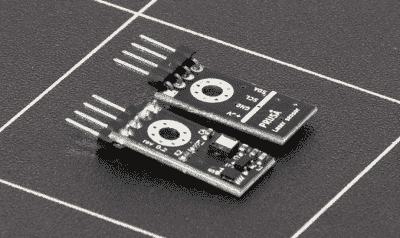
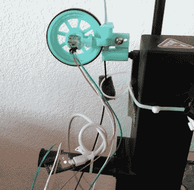
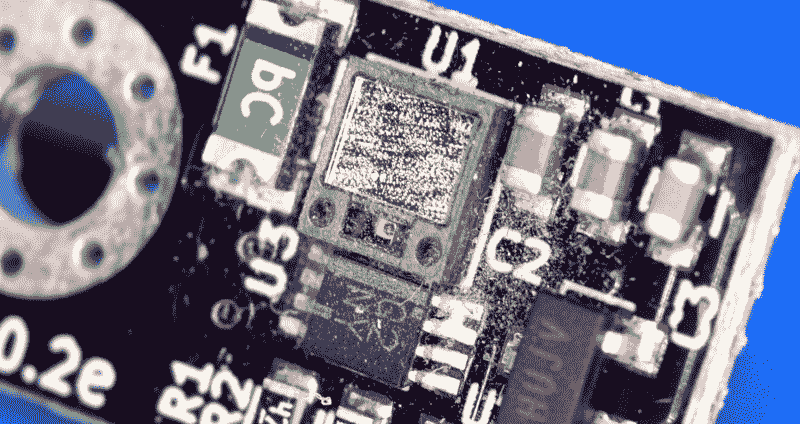
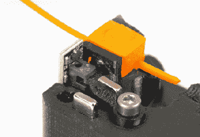

# Prusa I3 MK3S 和两个传感器的故事

> 原文：<https://hackaday.com/2020/10/08/the-prusa-i3-mk3s-and-a-tale-of-two-sensors/>

当 Prusa i3 MK3 在 2017 年发布时，它被宣传为“非常智能”,这要归功于打印机中令人印象深刻的传感器数量。这次更新并不是为了提高 MK2 的打印质量，而是为了让机器更容易使用，更可靠。有一个用于恢复停电期间停止的打印的系统，一个温度计，以便固件可以补偿感应床传感器中的热漂移，所有冷却风扇上的 RPM 检测，以及先进的 Trinamic 步进驱动器，可以检测打印机何时打滑或卡住。

The optical filament sensor of the Prusa i3 MK3.

但最令人兴奋的升级是新的灯丝传感器。Prusa i3 MK3 使用类似于鼠标中的光学编码器，可以检测细丝何时被插入挤出机。这使得固件可以在灯丝耗尽时暂停打印，这一功能在此之前在消费级桌面 3D 打印机上基本上是闻所未闻的。不仅如此，光学编码器还能检测出细丝是否真的在通过挤压机。

从理论上讲，这意味着 MK3 可以感应到一些问题，如挤出机堵塞或细丝路径中的缠结阻止了线轴的展开。市场上的任何其他消费型 3D 打印机都会继续愉快地运行，没有意识到它实际上并没有挤出任何塑料。但是 MK3 将能够看到灯丝停止工作并提醒用户。光学细丝传感器的功能代表了桌面 3D 打印的一次小革命，与 MK3 中的其他仪器相结合，有望消除打印失败的痛苦。

快进到 2019 年 2 月，以及[Prusa i3 MK3S](https://blog.prusaprinters.org/original-prusa-i3-mk3s-and-mmu2s-release-sl1-and-powder-coated-sheets-update_29599/)的发布。这种相对较小的打印机更新收集了 MK3 生产过程中的所有增量调整，并没有真正增加任何新功能。虽然它删除了一个:MK3S 删除了 MK3 中使用的光学编码器传感器，并随之删除了感知细丝运动的能力。用户将不得不决定是否保留检测堵塞和缠结的能力值得放弃更新提供的所有其他改进。

但是为什么呢？在这三年中发生了什么，使得 Prusa Research 决定放弃他们旗舰产品的巨大可用性改进？答案是一个有趣的现象:即使是最聪明的工程解决方案在现实世界中也不总是如预期的那样工作。

## 不干涉的方法

当然，Prusa Research 并不是第一个试图解决堵塞灯丝检测问题的人。MK3 发布时，黑客们已经拼凑出他们自己的解决方案很多年了，但是他们中的大多数人使用了一种更直接的方法。最常见的方法是简单地将一个轮子推向线轴或灯丝本身，通过旋转编码器或霍尔效应传感器可以很容易地检测到它的旋转。

A DIY wheeled filament sensor.

但这种想法的问题是，它对细丝施加了额外的阻力，这可能会导致挤压率的变化，最终影响打印质量。追求完美挤出的用户正是因为这个原因开发了各种低阻力线轴支架。在系统中增加阻力，即使可以检测到停滞的灯丝，对许多用户来说也是行不通的。

这种光学传感器的美妙之处在于，它可以“看到”灯丝何时移动，而无需实际接触它。再说一次，普鲁萨研究公司没有提出这个想法。已经有人尝试过[在细丝进入挤压机](https://hackaday.com/2016/02/05/filament-thickness-sensors-what-are-they-and-what-are-they-good-for/)时对其进行目视检查，尽管目标通常是补偿细丝粗细的变化。

Prusa Research *所做的是*提出了一种低成本的开放式硬件传感器，它结合了这些既定的想法，创建了一种精确的非接触式细丝速度传感器。按理说，你会认为现在地球上的每一家 3D 打印机制造商都会生产出自己的这种小传感器，并将其安装到入门级机器上。

如果传感器真的像预期的那样工作，他们最终肯定会这么做的。

## 被科学蒙蔽了双眼

需要澄清的是，Prusa i3 MK3 中的光学灯丝传感器确实工作正常。如果没有的话，他们不会把机器运出去。它甚至工作得相当好…大部分时间。但它有几个相当严重的问题，只有当用户花了一些时间使用这台机器时，这些问题才真正变得明显。即使在 MK3S 发布及其传感器的物理移除之前，许多用户也只是选择在固件设置中关闭光学传感器，因为这些问题变得太普遍而无法忽视。

第一个也是最明显的问题是，传感器有时很难看到浅色细丝，半透明细丝的情况更糟。对于许多用户来说，这本身并不是一个大问题；快速浏览一下 Thingiverse，你会发现大多数 3D 打印机用户一开始都坚持使用黑色、蓝色或红色灯丝。但随着用户在 MK3 上投入更多时间，并开始使用不太常见的颜色，很明显，在打印机的眼中，并非所有的灯丝都是平等的。

不幸的是，第二个问题使问题更加复杂。虽然很明显有人试图将传感器嵌入挤出机机身，但灰尘仍然设法进入。在某种程度上，这是不可避免的，因为挤出机的齿轮在工作时总是会产生一些塑料粉尘。官方维护程序[建议用户留意挤出机齿轮](https://help.prusa3d.com/en/article/i3-printers-regular-maintenance_2072)周围的灰尘和颗粒堆积，但没有提到检查传感器。虽然在不拆开整个挤出机的情况下移除传感器并进行清洁并不十分困难，但这并不是人们所说的用户友好。这肯定不是你心血来潮要做的事情，尤其是在维护指南中没有提到的情况下。

Optical filament sensor from the author’s Prusa i3 MK3\. Note debris accumulation after two years.

一段时间后，这层灰尘会开始影响传感器观察灯丝的能力。你偶尔遇到的问题开始变成每天都会发生的事情。您可能会注意到，将长丝插入挤出机并不总是会触发自动装载功能，需要您手动操作。在最坏的情况下，打印机可能会突然决定灯丝已经消失，并停止打印。如果你和它在同一个房间里，这已经够烦人的了，但是如果你在一夜之间或者在你不在家的时候做长时间的打印，这可能是对时间的巨大浪费。

## 从头再来

修改维护程序，让用户每隔几个月移除并清洁光学传感器，可能会有所帮助，但坦率地说，这充其量只是一种权宜之计。显然，传感器无法应对这一挑战。即使在理想的条件下，精确度也不够高，并且它在本来是一个重要的方面引入了一个弱点。它必须消失。但是什么会取代它呢？

The new sensor in action.

最终，Prusa Research 做出了妥协。MK3S 中的传感器仍然是光学的，但这次它不是在看灯丝。当细丝被插入挤压机时，它推回一个小金属球，这个小金属球反过来移动一个杠杆，从而阻断一束光。当细丝不再推动球时，两个相反的磁铁的力使杠杆回到原来的位置。

由于没有弹簧或机械开关会磨损，新的传感器预计会比原来的版本耐用得多。同时，施加在灯丝上的压力很轻且足够稳定，不会对打印质量产生任何影响。

显而易见的缺点是，传感器无法判断灯丝是否在移动，只能判断它是否实际存在。因此，如果加热头堵塞或线轴堵塞，细丝会在挤压机内摩擦，印刷就会失败。但这并不意味着普鲁萨已经放弃解决问题；该公司已经决定，对付堵塞和阻塞的最好方法是自己生产物理公差更高的灯丝。理论是，如果饲料材料是适当的大小和配方，将没有理由打印机窒息。

对于更大的 3D 打印社区来说，很遗憾 Prusa 的高级细丝传感器没有成功。尽管失败了，但它确实是一堂重要的工程课。这提醒我们，有时最简单的方法确实是最好的，仅仅因为一个硬件在您的测试台上工作并不意味着它将在日常使用的现实中生存。