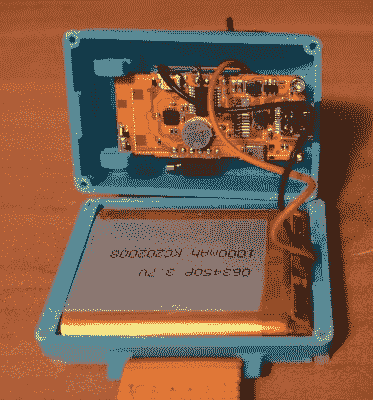
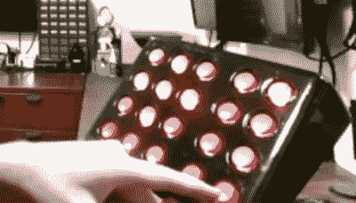

# UCPLA 梦之队打造的 Roku 和通用键盘手势控制器

> 原文：<https://hackaday.com/2020/10/06/gesture-controller-for-roku-and-universal-keyboard-built-by-ucpla-dream-team/>

今年 Hackaday 奖最酷的部分是与四个非营利组织合作，这些组织概述了要解决的现实世界挑战，作为该奖的一部分。为了实现这一点，梦之队挑战赛启动了一个为期两个月的设计和建造项目，小组成员每人获得 6000 美元的津贴，全职从事特定的建造工作。

梦之队项目的工作已经开始，今天我们来看看[洛杉矶联合脑瘫协会(UCPLA)的项目，该项目不仅为患有这种疾病的人设计并制造了一个通用遥控器](https://hackaday.io/project/173454-2020-hdp-dream-team-ucpla)，而且还竭尽全力确保“通用”被嵌入到软件和用户体验中，就像它被嵌入到硬件本身一样。休息之后，请加入我们，近距离观看该项目，并观看该团队的演示视频。

## UCPLA 梦之队挑战赛

首先，一些背景。脑瘫是一种永久性的运动障碍，通常在幼儿中发现。它会导致各种症状，包括肌肉僵硬或无力、协调问题或震颤，症状会随着时间的推移而变化。对于如此广泛的影响，可能很难设计和实现有效的工具来覆盖这个社区，这使得这个构建成为一个有趣的挑战。

Internals of the gesture-based input device an control Roku devices.

UCPLA 团队致力于构建两个原型设计。第一个是基于手势的遥控器，第二个是自适应通用遥控器。两者都有更容易与数字世界互动的预期目的。市场上大多数旨在帮助脑瘫患者的遥控器不容易适应不同需求的人，选择有限，或者太贵。作为概念验证，UCPLA 团队希望遥控器能够轻松地与 Roku 设备接口，同时确保任何构建都可以扩展，并在未来轻松适应其他数字技术。原则上，他们会记住将来对其他平台的可扩展性，但是用 Roku 迈出第一步是短期内可以达到的目标。

基于手势的遥控器经历了多次设计迭代，以测试其在现实世界中的可行性。它使用微控制器和加速度计来测量运动，然后像鼠标一样将运动报告给计算机。因为它有效地模仿了鼠标，所以第一个原型测试包括用它在画板上画图，然后在一些迷宫中导航。从这些测试中学到了很多经验，团队能够利用这些经验建造第二个原型。这款手机顶部有一个大按钮，增加了功能，还配备了更大的电池，可以在两次充电之间持续 6-8 小时。

构建手势遥控器是一回事，但确保它的可伸缩性和对目标受众的易用性则完全是另一回事。来自 UCPLA 的团队竭尽全力确保该设备可以集成到一个能够控制大量应用程序的设备中心，而不是一次只允许设备控制一个应用程序的单一路径使用。这允许手势遥控器旁边使用其他用户界面，并且这些设备可以同时控制各种各样的应用程序。它还为多个接口更容易地控制同一设备开辟了可能性。对于中枢，他们选择了运行 HassOS 的 Raspberry Pi，这是一个专注于家庭助理的操作系统。

 这个构建的第二部分是自适应遥控器，它也将能够与他们的中枢系统集成。这种遥控器最初是一个定制的键盘，配有一个小屏幕，可以充当“备忘单”，这样用户就可以在任何特定的时刻看到按键的功能。想法是功能可以快速改变，但团队最终在第一轮测试后从构建中删除了屏幕，以支持在遥控器上更直接的功能映射。这里的重点仍然是可扩展性，因此确保设备可以连接到许多不同的智能设备，而不仅仅是 Roku，也是该版本的一个重要设计考虑因素。基于第一组原型的经验，当前的迭代是一个 20 按钮的遥控器，带有背光的大红色按钮，当按下时还包括触觉反馈。遥控器与红外发射器相连，无需通过遥控器本身就能轻松控制电视。

## 适应性是整个比赛的关键

值得注意的是，在这些构建中有许多设计选择，允许设备适应用户，而不是用户必须适应使用设备。这在这个社区很重要，因为脑瘫患者的情况因人而异。例如，手势遥控器可以进行校准，以在任何具有最大控制力或运动范围的身体部位上工作，包括头部，并且这两种遥控器都可以轻松适用于任何具有互联网(甚至红外或无线电)连接的智能设备。

虽然设计团队在两个月的时间限制内专注于与 Roku 集成，但这些设备还有许多未来的扩展计划。这两款遥控器都计划进行许多改进，包括电池升级和软件调整，以将设备一次充电时间延长至 10 小时，按钮设计的更新包括增加一个紧急按钮，并可能增加一个操纵杆，以便更容易地切换模式。他们还计划解决一些可穿戴性问题，因为很多人可能不喜欢连续十个小时佩戴手势遥控器这样的设备。

UCPLA 在这两个遥控器上做得非常好，作为南加州最大的脑瘫团体，他们拥有丰富的知识和经验来帮助指导这些建设，以帮助尽可能多的人。虽然两个月的窗口关闭了，但我们期待着这款硬件的进一步迭代，因为只有在这样一个坚实的基础上才能做得更好。

 [https://www.youtube.com/embed/rIYxKddAZQE?version=3&rel=1&showsearch=0&showinfo=1&iv_load_policy=1&fs=1&hl=en-US&autohide=2&wmode=transparent](https://www.youtube.com/embed/rIYxKddAZQE?version=3&rel=1&showsearch=0&showinfo=1&iv_load_policy=1&fs=1&hl=en-US&autohide=2&wmode=transparent)

The [HackadayPrize2020](https://prize.supplyframe.com) is Sponsored by: