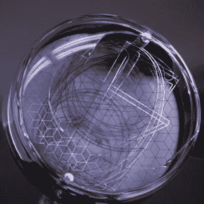

# 达利博·法尼的超大型原型推动了尼克斯队的发展

> 原文：<https://hackaday.com/2020/09/28/state-of-the-art-for-nixies-gets-a-boost-from-dalibor-farnys-supersize-prototype/>

从不拒绝挑战的手工 Nixie 管制造商[Dali bor farn]一直在为一个不知名的客户承担他称之为“H 项目”的 121 根谢妮管的庞大阵列。那有什么特别的？我们提到过每个谢妮大约有一个三明治盘子那么大吗？

 事实上，早在 5 月份，我们就在[每周链接综述中首次提到了 H 项目。](https://hackaday.com/2020/05/10/hackaday-links-may-10-2020/)那时候【达利博】刚刚接受了这个项目，知道这需要从头开始发明这些超大的尼西人的一切。直径 150 毫米，这将是有史以来最大的 Nixies。显像管的设计令人想起早期电视历史中的旧光电摄像管，或者可能是旧示波器中的 CRT。

自 5 月以来，[Dalibor]已经完成了大部分设计工作，并解决了许多内部组件中的错误。但正如下面的视频所示，他还有一段路要走。关于他的正常建造过程的一切都必须按比例放大，所以许多步骤，像阳极杯的化学处理，都有些笨拙。他还发现，阴极上的安装孔的直径不正确，需要一些值得握紧的手动校正。玻璃吹制工的车床工作既令人紧张又令人着迷；建造的每一步似乎都充满了某种危险。

可悲的是，这个原型没能组装起来——管子的玻璃表面出现了裂纹。但以往的专业，[达利波]泰然处之，并将从这次尝试中学习。鉴于他已经将谢妮的艺术付诸实践，我们相信这些大管子最终会走到一起。

 [https://www.youtube.com/embed/BnV98v7IQns?version=3&rel=1&showsearch=0&showinfo=1&iv_load_policy=1&fs=1&hl=en-US&autohide=2&wmode=transparent](https://www.youtube.com/embed/BnV98v7IQns?version=3&rel=1&showsearch=0&showinfo=1&iv_load_policy=1&fs=1&hl=en-US&autohide=2&wmode=transparent)

