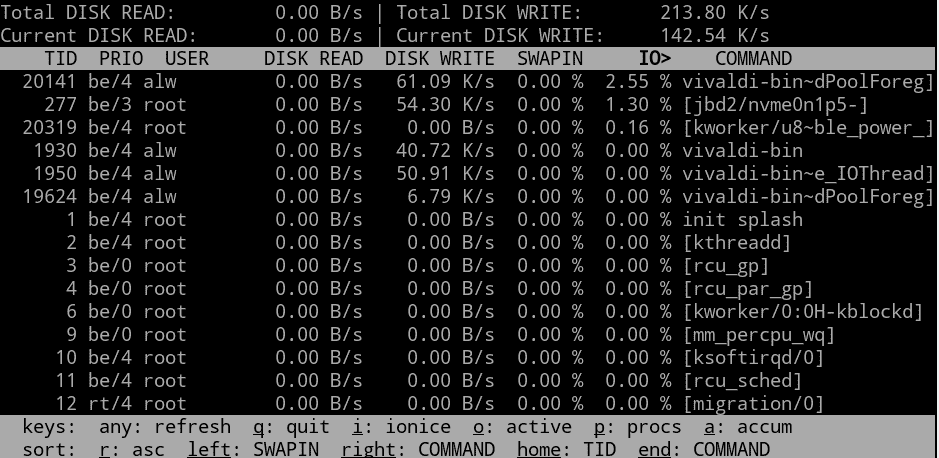
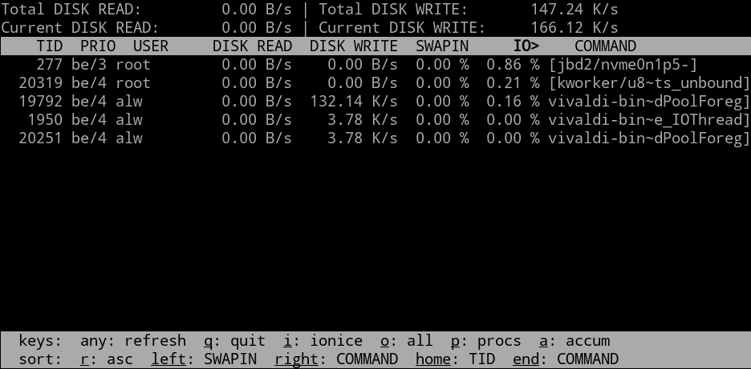
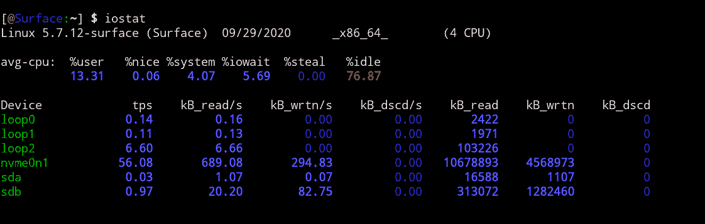
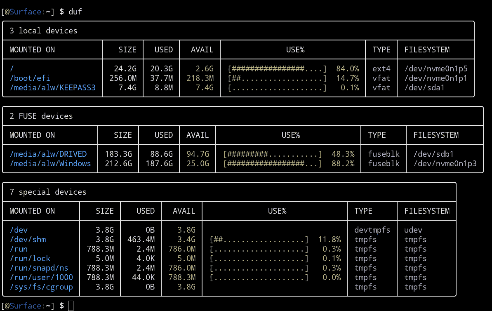
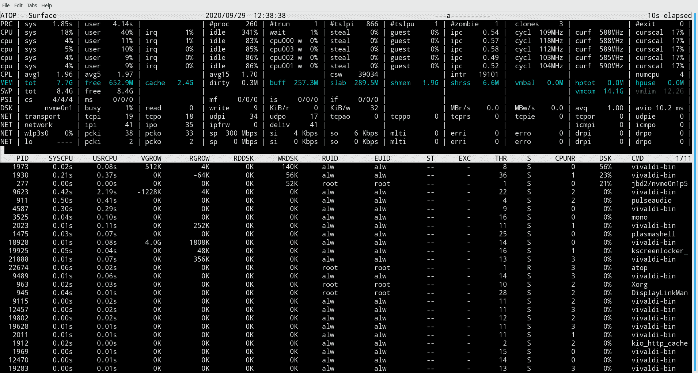

# Linux Fu:监控磁盘

> 原文：<https://hackaday.com/2020/11/05/linux-fu-monitor-disks/>

如果您想快速查看 Linux 系统的进程负载，可以使用`top`或者稍微好一点的`htop`。但是，如果您想要快速了解磁盘系统的运行情况，该怎么办呢？有一些工具你可以使用，其中一些远不如`top`那么常见。

## 首先，iotop

与`top`最相似的是`iotop`。该程序向您显示文件系统的总磁盘读写数和当前磁盘读写数，还向您显示谁消耗了最多的磁盘 I/O。该屏幕看起来很忙:

[](https://hackaday.com/wp-content/uploads/2020/09/iotop.png)

给你个提示。如果你看屏幕的底部，有一些键盘命令。O 键将隐藏所有不活动的进程(或者显示它们，如果它们被隐藏的话)。这使得输出易于管理:

[](https://hackaday.com/wp-content/uploads/2020/09/iotop2.png)

您可以使用`-o`命令行选项获得相同的效果。注意，其他键盘命令允许您选择线程而不是进程，更改显示选项，以及设置进程的`ionice`优先级。

## 有 iostat

如果您对每个设备的这类数据比每个进程或线程的更感兴趣，请尝试`iostat`。它也显示了一些进程信息，但都很好地进行了总结:

[](https://hackaday.com/wp-content/uploads/2020/09/iostat.png)

这个命令只运行一次，并给出一个结果。如果希望定期重复，可以添加报告间隔时间和可选的执行次数。如果这样做，您可能还想添加`-t`选项来获得时间戳。

```
iostat -t 5
```

不过，这会导致输出滚动，所以如果您正在进行监控，您可能更喜欢:

```
watch -n 5 iostat
```

使用-x 标志可以获得更多统计信息，而-z 标志将抑制没有数据的设备。

## 遇见 duf

你可能在你的系统上找不到`duf`，但是你可以从 [GitHub](https://github.com/muesli/duf) 安装它。的确，您可以从 df 和其他一些命令中获得相同的结果，但是`duf`创建了易于阅读的输出:

[](https://hackaday.com/wp-content/uploads/2020/09/duf.png)

有命令行选项可以隐藏设备、控制输出宽度以及以不同方式对数据进行排序。您还可以设置最大输出宽度。使用`--help`选项了解更多信息。

## 用 lsof 列出打开的文件

如果你想知道哪些文件是打开的，那是`lsof`的工作。该命令提供了很多信息，并且在运行的系统上通常有很多打开的文件，所以通常会添加一个文件名或者用一个`grep`来缩小范围。

请记住，通配符在这里不起作用。所以下面的命令只显示谁打开了/home/alw 目录。它不显示/home/alw 中有任何内容打开的进程:

```
lsof /home/alw
```

不过，您可以使用`-d`或`-D`选项来改变这种行为。小写变体在顶层查找目录和文件。`-D`选项进行全面的递归。如果您想通过用户 ID、命令名等进行查找，还有很多其他选项。

## 奖励回合:顶上

`top`的另一个替代者是`atop`。虽然不是严格意义上的磁盘监控工具，但它确实显示了每个进程的磁盘使用情况和一些总体统计数据。程序通常启动时，会在顶部显示一些摘要信息，包括给出磁盘信息的`DSK`。顺便说一下，这些线条在接近 100%利用率时会变色。底部的线条类似于您在`top`中看到的。

[](https://hackaday.com/wp-content/uploads/2020/09/atop1.png)

您可以使用`d`命令来显示磁盘视图。在任何视图中，`D`都会按磁盘使用情况排序。一个有用的工具。

## 像 Linux 上的任何东西一样…

像 Linux 中的其他东西一样，有许多其他方法可以获得这类信息。我们之前已经看过一些[专用监控](https://hackaday.com/2017/11/09/linux-fu-system-administration-made-easier/)和管理工具。如果你想了解更多关于`htop`中的字段(通常是`top`或`atop`中常见的)，这里有[一个很棒的视觉向导](https://hackaday.com/2020/01/30/understand-linux-htop-visually/)。