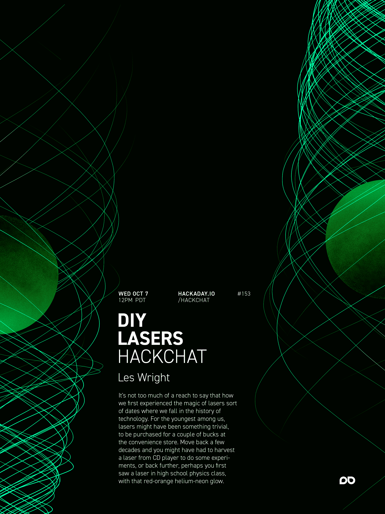

# DIY 激光黑客聊天

> 原文：<https://hackaday.com/2020/10/05/diy-lasers-hack-chat/>

加入我们太平洋时间 10 月 7 日星期三中午与 Les Wright 的 [DIY 激光黑客聊天](https://hackaday.io/event/174841-diy-lasers-hack-chat)！

说我们第一次体验到激光的魔力是在科技光谱的哪个阶段，这并不为过。对于我们当中最年轻的人来说，激光可能是微不足道的东西，只需在便利店花几美元就能买到。回到几十年前，你可能不得不从 CD 播放器中获取激光来做一些实验，或者回到更远，也许你在高中物理课上第一次看到激光，它发出氦-氖管的暖橘红色光芒。

但是把事情追溯到几十年前，如果你想玩激光，你必须自己造一个。这是一个受欢迎的小众爱好，有一群专业的业余物理学家，他们四处搜寻不太可能需要的部件:红宝石棒、石英玻璃管和奇异的染料。将它们与高压电源、由改装的冰箱压缩机制成的真空泵和自制的光具座结合在一起，如果星星排成一行，这些部分可以被哄着产生一个辉煌的强烈的光爆发，这通常不会像一个终身激光成瘾者那样吸引它的创造者。

我们不确定莱斯·赖特属于哪个阵营，但从他不断增长的 YouTube 频道的内容来看，我们可以说他已经迷上了激光。最近，我们看了看[他的高性能氮激光器](https://hackaday.com/2020/08/09/how-about-a-nice-cuppa-tea-laser/)，他一直在用它作为[可调谐染料激光器的基础。一路上，他必须摆弄高压电源、示波器，偶尔还会摆弄一两个机器人。](https://www.youtube.com/watch?v=-ny_-Y1MpRY)

Les 会在 Hack Chat 上停下来谈论他实验室里发生的一切，重点是他的激光实验。带着你关于 DIY 激光的问题加入我们，顺便来学习一些可能帮助你抓住激光的窍门。

 我们的黑客聊天是 [Hackaday.io 黑客聊天群发消息](https://hackaday.io/messages/room/2369)中的社区直播活动。本周，我们将于太平洋时间 10 月 4 日星期三中午 12:00 坐下来讨论。如果时区让你和我们一样困惑，我们有[一个方便的时区转换器](https://www.timeanddate.com/countdown/generic?iso=20201007T12&p0=224&msg=DIY+Lasers+Hack+Chat&font=cursive)。

点击右边的那个发言气泡，你会被直接带到 Hackaday.io 上的黑客聊天群，不用等到周三；随时加入，你可以看到社区在谈论什么。

 