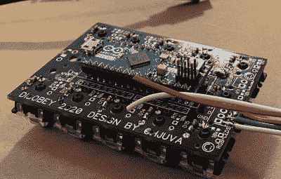

# 3D 打印视频终端拨 C 为赛博朋克

> 原文：<https://hackaday.com/2020/10/01/3d-printed-video-terminal-dials-c-for-cyberpunk/>

这款*受银翼杀手*启发的通信终端[是为在芬兰举行的 2020 年黑客大会而设计的，不仅仅是为了装饰](https://www.thingiverse.com/thing:4610186)。这是一个互动游戏的一部分，要求与会者将他们的会议徽章连接起来，并用设备前面的功能键盘“呼叫”不同的角色。

[Purkkaviritys]负责设计该设备的 3D 打印外壳，他说需要一整卷 2 公斤的细丝才能打印出来。不幸的是，他没有参与电子方面的事情，所以我们没有太多关于内部的信息，除了它由 Raspberry Pi 4 供电，具有超像素 4.0 显示屏，并使用以太网供电，所以它可以在 con 上轻松设置，只需一根电缆。

A look at the custom keypad PCB.

键盘是一种定制的输入设备，使用 Arduino Micro 和 Cherry MX Blue 开关，带有 3D 打印的键帽，以获得厚重的付费电话外观和感觉。[Purkkaviritys]提到键盘还负责控制内置在终端两侧的 RGB LED 灯条，并且 Raspberry Pi 切换 Caps、Scroll Lock 和 Num Lock 键的状态以选择不同的照明模式。

自然，我们希望看到更多关于这种美丽是如何组合在一起的信息，但鉴于它是为这样一个特定的目的而建造的，它不像你真的需要复制原始配置。多亏了[Purkkaviritys]你有 STL 文件来打印我们自己的辉煌的赛博朋克外壳副本，你现在要做的就是[弄清楚如何用它打视频电话](https://hackaday.com/2020/09/23/teleconferencing-like-its-1988-connecting-vintage-hardware-to-zoom/)。

 [https://www.youtube.com/embed/F_yRSMCXndU?version=3&rel=1&showsearch=0&showinfo=1&iv_load_policy=1&fs=1&hl=en-US&autohide=2&wmode=transparent](https://www.youtube.com/embed/F_yRSMCXndU?version=3&rel=1&showsearch=0&showinfo=1&iv_load_policy=1&fs=1&hl=en-US&autohide=2&wmode=transparent)

